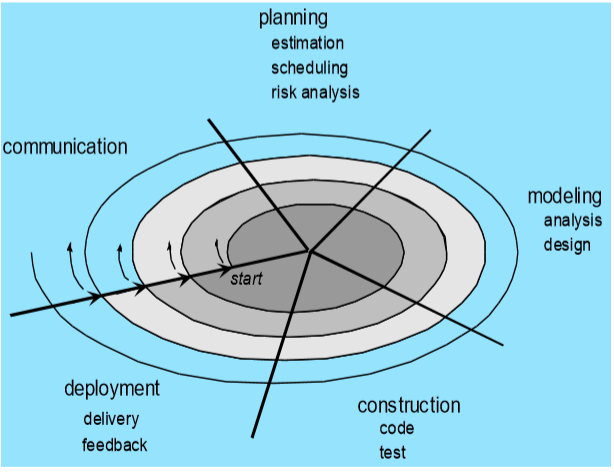
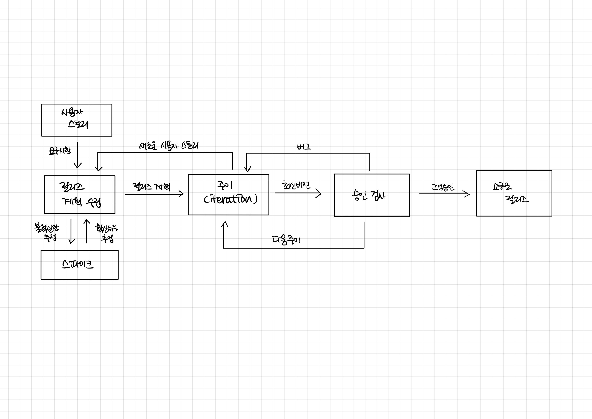

# 1-1 요구사항 확인
## 소프트웨어 생명 주기(software life cycle) 
 - 소프트웨어 착상, 개발에서 사용에 이르기까지 일련의 시간적인 경과를 가리킴.
 - 명확하게 단계를 나누어 고품질 시스템을 만들어 고객의 요구사항 충족이 목적
 - 하나의 소프트웨어의 수명 기간, 소프트웨어의 고안, 개발에서 운용과 보수에 이르는 일련의 경과 기간.
 - 소프트웨어 개발 방법론의 바탕으로서, 개발을 위한 정의, 운용, 유지보스 등의 과정을 단계별로 나눔
 - 각 단계별 활동, 결과에 대한 산출물로 표현

## 소프트웨어 개발의 단계  
  1. 요구사항 분석 (requirement)
  2. 설계 (design)
  3. 구현 (implementation)
  4. 시험 (testing)
  5. 유지보수 (maintenance)

## 대표적인 생명주기 모형
- 폭포수 모형
- 프로토 타입 모형
- 나선형 모형
- 애자일 모형  
  
1. **나선형 모형**
    - 나선을 따라 돌듯 `여러 번의 소프트웨어 개발 과정을 거쳐 점진적으로` 완벽한 최종 소프트웨어를 개발하는 모형 ( 보헴이 제안 )
    - 개발 중에 발생가능한 위험을 관리하고, 최소화하는 것이 목적
    - 누락되거나 추가된 요구사항을 첨가하여 진행가능, 정밀하고 유지보수 과정 필요x

    
    1. 계획 및 정의
    2. 위험 분석
    3. 공학적 개발
    4. 고객 평가 (1~4 반복)
   
2. **폭포수 모형**
    - 이전 단계로 돌아가기 x. 각 단계에서 확실하게 매듭짓고 철저한 검토와 승인을 통해 다음 단계로 진행
    - 가정 오래되고 폭넓게 사용된 전통적인 생명주기 모형 (고전적 생명 주기 모형이라고도 함)
    - 두 개 이상의 과정 병생 x
    - 산출물의 결과 중요함
    - 순서
        1. 타당성 검토
        2. 계획
        3. 요구 분석
        4. 설계
        5. 구현
        6. 시험
        7. 유지 보수
    - 언제 사용?
      - 요구사항을 합리적으로 이해 시 / 요구사항이 명확하고 합리적 일시 
      - 선형적인 방식에서 배포를 통해 통신을 할 때 (선형 순차 모델)
      - 변화가 매우 적은 프로젝트     
    - 장점과 단점
        - 장점: 
          - 단순한 선형모델
          - 단계별로 정형화된 기법 - 체계적 문서화 가능
          - 프로그램 진행 상황 명확히 파악 가능
        - 단점:
            - 요구사항을 완벽히 작성 필요
            - 변경 수용 어려움
            - 시스템 동작을 후반에 확인 가능
            - 대형 프로젝트 부적합
            - 지나친 문서화
            - 위험 분석 결여
            - 일정 지연 가능성 큼  
              
3. **프로토타입 모형**
    - 실제 개발될 소프트웨어의 견본품(prototype)을 만들어 최종 결과물 예측
    - 견본품은 추후 과정에서 골격이 됨
    - 사용자와 시스템사이 인터페이스에 중점을 두어 개발
    - 폭포수 모델의 단점 보완 (개발 완료 후 오류가 발견되면 대처가 가능)
    - 순서
      1. 요구 수집
      2. 빠른 설계
      3. 프로토타입 구축
      4. 고객 평가
      5. 조정
      6. 구현
    
4. **애자일 모형**
    - 고객 요구사항 변화에 유연,민첩하게 대응 위해 일정한 주기를 반복하면서 개발하는 모형
    - 고객과 소통에 초점을 맞춘 **방법론을 통칭** 하는 것
    - 스프린트 or 이터레이션 이라는 짧은 개발 주기, 반복주기 마다 고객 피드백 수용, 문서를 통한 개발이 아님
    - 
    - 개발 주기에는 고객이 우선순위를 부여 (이거 부터 만들어주세요, 저거부터 만들어 주세요 ...)
    - 대표적인 개발 모형 :  
        **1. 스크럼**
         - 작은 목표를 짧은 주기로 점진적, 경험적 제품을 지속적으로 개발
         - 스크럼의 주요 개념
           - 5~9명의 소규모팀의 스프린트라고 불리우는 업무 주기 반복
           - `제품 책임자(product owner)` 가 관리하는 `해야 할 일들의 목록(product backlog)` 에서  
             `개발팀` 은 `스프린트 동안 해야 하는 일들을 스스로 결정`, 완수하여 매 스프린트 마다 결과물(increment)를 산출  
             `스크럼 마스터(scrum master)`  는 팀이 목표 달성위한 자원을 지원, 장애 요소 제거, 조율하며 프로세스를 이끔  
             제품책임자는 제품이해도가 높고, 요구사행을 책임지고 의사 결정할 사람으로 선정      

         - 스크럼 개발 프로세스
           1. `스프린트 계획 회의` : 제품 백로그 중 이번 스트린에서 수행할 작업 대상으로 단기일정 수립하는 회의
           2. `스프린트` : 실제 개발 작업을 진행하는 과정, 보통 2~4주 정도의 기간 내
           3. `일일 스크럼 회의` : 모든 팀원이 매일 15분 동안 진행상황을 점검하는 회의, 남은 작업 시간은 소멸 차트(burn-down chart) 표시
           4. `스프린트 검토 회의` : 부분 또는 저체 완성 제품이 요구사항에 잘 부합하는지 테스트하는 회의
           5. `스프린트 회고` : 정해놓은 규칙 준수 여부 및 개선할 점을 확인하고 기록
         - 스크럼 추구 가치
           1. `용기` : 문제가 있으면 말하고 일을 더 잘할 수 있는 환경 요구, 자신의 신념 설득, 도전적 시도 등등
           2. `집중`
           3. `약속(헌신/책임)` : 팀의 목표달성을 위해 헌신
           4. `존중` : 팀원을 존중
           5. `투명성/개방성` : 프로젝트의 모든 내용을 공개
           

      1. XP(eXtreme Progeramming)
         - 요구사항에 유연하기 대응하기 위해 개발 과정의 반복을 극대화 하는 방법
         - `짫고 반복적 개발주기 , 단순한 설계, 고객의 적극적 참여를 통해 빠르게 개발을 목표`
         - `xp개발 프로세스 :`
            
            - `이터레이션` : 주기, 실제 개발 작업을 진행하는 과정, 보통 1~3주 정도
            - `승인검사` : 인수 테스트 : 하나의 이터레이션 안에서 부분 완료 제품이 구현되면 수행하는 테스트
            - `유저스토리` : 사용자의 요구사항, 형식이 없고 간단한 문장임(ex 사용자는 로그인을 한다.). 사용자 입장에서 적혀야 한다.
            - `스파이크 솔루션` : 유저 스토리가 만들어지면 그 중 어려워보이는 문제에 대해 스파이크 솔루션을 만든다. 스파이크 솔루션이란 요구사항에 대한 핵심기능만 구현한 간단한 프로그램. 이를 만들면 보이지 않던 문제를 더 잘 발견할 수 있다.
         - xp의 5가지 핵심 가치
           1. 의사소통
           2. 단순성
           3. 용기
           4. 존중
           5. 피드백  
           >의단용존피
         - 주요 실천 방법(practice)
           1. `Pair Programming짝 프로그래밍` : 다른 사람과 함께 프로그래밍 수행함으로써 개발에 대한 책임을 공동으로 나눠 갖는 환경 조성     
           2.` Collective Ownershop공동코드소유` : 개발 코드에 대한 권한과 책임을 공동으로 소유. 유닛테스트를 통해 결함 발견시 필요하면 누가 어떤 코드든지 고친다. 
           3. `Test-Driven Development(테스트 주도 개발)` : 개발자는 코드 작성 전 테스트 케이스를 작성해 무엇을 해야할지 정확한 파악  
           유닛테스는 자주 실행할 수있게 자동화 되어야함 .  자동화된 테스팅 도구 사용 
           1. `Whole Team전체 팀` : 개발에 참여하는 모든 구성원(고객 포함)은 각자 자신의 역할이 있고 책임감을 가져야 함
           2. `Continuous Integration계속적인 통합` : 모듈 단위로 개발된 코드들은 하나의 작업이 마무리될 때마다 지속적으로 통합한다.
           3.` Refactoring리팩토링` : mvc 나 mvvm같이 확장성을 고려한 디자인 설계하고 그런 방식으로 코드를 리팩토리해야 하는 활동을 의미. 프로그램을 쉽게 수정하여 빠르게 개발 위함.
           4. `Small Releases소규모 릴리즈` : 배포 단위를 줄어 배포를 빠르게 함 즉, 짧게 여러번 배포. 고객의 요구사항에 신속한 대처가 가능.
       

      1. 칸반(Kanban)
      2. Lean
      3. 기능 중심 개발(FDD:Feature Driven Development)  

## 소프트웨어 공학
- 소프트웨어 위기를 극복하기 위해 연구된 학문
- 소프트웨어의 품질과 생산성 향상을 목적
- 소프트웨어 공학의 기본 원칙
  1. 현대기술 지속적 적용
  2. 품질 유지위해 지속적 검증
  3. 개발 관련 사항 명확한 기록 유지 

--- 
## 데이터베이스 관리 시스템
- DBMS 관련 요구사항 식별 시 고려사항
    1. 가용성(항상 서비스할 수 있는 시스템을 가용성이 높은 시스템이라고 함)
    2. 성능
    3. 기술 지원
    4. 상호 호환성
    5. 구축 비용
    >가기구 성산
---
## 웹 애플리케이션 서버(WAS)
- 동적인 컨텐츠를 처리하기 위한 `미들웨어`
- 웹 애플리케이션 서버 관련 요구사항 식별 시 고려사항
  1. 가용성
  2. 기술 지원
  3. 성능
  4. 구축 비용
  >dbms에서 상호 호환성만 빠짐  
---
## 오픈 소스
- 누구나 사용할수 있게 소스를 공개한 소프트 웨어
- 요구 사항 식별 시 고려 사항
  1. 라이선스의 종류
  2. 사용자 수
  3. 기술의 지속 가능성 
