# 1-1 요구사항 확인
## 소프트웨어 생명 주기(software life cycle) 
 - 소프트웨어 착상, 개발에서 사용에 이르기까지 일련의 시간적인 경과를 가리킴.
 - 명확하게 단계를 나누어 고품질 시스템을 만들어 고객의 요구사항 충족이 목적
 - 하나의 소프트웨어의 수명 기간, 소프트웨어의 고안, 개발에서 운용과 보수에 이르는 일련의 경과 기간.
 - 소프트웨어 개발 방법론의 바탕으로서, 개발을 위한 정의, 운용, 유지보스 등의 과정을 단계별로 나눔
 - 각 단계별 활동, 결과에 대한 산출물로 표현

## 소프트웨어 개발의 단계  
  1. 요구사항 분석 (requirement)
  2. 설계 (design)
  3. 구현 (implementation)
  4. 시험 (testing)
  5. 유지보수 (maintenance)

## 대표적인 생명주기 모형
- 폭포수 모형
- 프로토 타입 모형
- 나선형 모형
- 애자일 모형  
  
1. **나선형 모형**
    - 나선을 따라 돌듯 `여러 번의 소프트웨어 개발 과정을 거쳐 점진적으로` 완벽한 최종 소프트웨어를 개발하는 모형 ( 보헴이 제안 )
    - 개발 중에 발생가능한 위험을 관리하고, 최소화하는 것이 목적
    - 누락되거나 추가된 요구사항을 첨가하여 진행가능, 정밀하고 유지보수 과정 필요x

    
    1. 계획 및 정의
    2. 위험 분석
    3. 공학적 개발
    4. 고객 평가 (1~4 반복)
   
2. **폭포수 모형**
    - 이전 단계로 돌아가기 x. 각 단계에서 확실하게 매듭짓고 철저한 검토와 승인을 통해 다음 단계로 진행
    - 가정 오래되고 폭넓게 사용된 전통적인 생명주기 모형 (고전적 생명 주기 모형이라고도 함)
    - 두 개 이상의 과정 병생 x
    - 산출물의 결과 중요함
    - 순서
        1. 타당성 검토
        2. 계획
        3. 요구 분석
        4. 설계
        5. 구현
        6. 시험
        7. 유지 보수
    - 언제 사용?
      - 요구사항을 합리적으로 이해 시 / 요구사항이 명확하고 합리적 일시 
      - 선형적인 방식에서 배포를 통해 통신을 할 때 (선형 순차 모델)
      - 변화가 매우 적은 프로젝트    <br>
    - 장점과 단점
        - 장점: 
          - 단순한 선형모델
          - 단계별로 정형화된 기법 - 체계적 문서화 가능
          - 프로그램 진행 상황 명확히 파악 가능
        - 단점:
            - 요구사항을 완벽히 작성 필요
            - 변경 수용 어려움
            - 시스템 동작을 후반에 확인 가능
            - 대형 프로젝트 부적합
            - 지나친 문서화
            - 위험 분석 결여
            - 일정 지연 가능성 큼  
              
3. **프로토타입 모형**
    - 실제 개발될 소프트웨어의 견본품(prototype)을 만들어 최종 결과물 예측
    - 견본품은 추후 과정에서 골격이 됨
    - 사용자와 시스템사이 인터페이스에 중점을 두어 개발
    - 폭포수 모델의 단점 보완 (개발 완료 후 오류가 발견되면 대처가 가능)
    - 순서
      1. 요구 수집
      2. 빠른 설계
      3. 프로토타입 구축
      4. 고객 평가
      5. 조정
      6. 구현
    
4. **애자일 모형**
    - 고객 요구사항 변화에 유연,민첩하게 대응 위해 일정한 주기를 반복하면서 개발하는 모형
    - 고객과 소통에 초점을 맞춘 **방법론을 통칭** 하는 것
    - 스프린트 or 이터레이션 이라는 짧은 개발 주기, 반복주기 마다 고객 피드백 수용, 문서를 통한 개발이 아님
    - 
    - 개발 주기에는 고객이 우선순위를 부여 (이거 부터 만들어주세요, 저거부터 만들어 주세요 ...)
    - 대표적인 개발 모형 :  
        **1. 스크럼**
         - 작은 목표를 짧은 주기로 점진적, 경험적 제품을 지속적으로 개발
         - 스크럼의 주요 개념
           - 5~9명의 소규모팀의 스프린트라고 불리우는 업무 주기 반복
           - `제품 책임자(product owner)` 가 관리하는 `해야 할 일들의 목록(product backlog)` 에서  
             `개발팀` 은 `스프린트 동안 해야 하는 일들을 스스로 결정`, 완수하여 매 스프린트 마다 결과물(increment)를 산출  
             `스크럼 마스터(scrum master)`  는 팀이 목표 달성위한 자원을 지원, 장애 요소 제거, 조율하며 프로세스를 이끔  
             <span style="color:green">제품책임자는 제품이해도가 높고, 요구사행을 책임지고 의사 결정할 사람으로 선정</span>      

         - 스크럼 개발 프로세스
           1. `스프린트 계획 회의` : 제품 백로그 중 이번 스트린에서 수행할 작업 대상으로 단기일정 수립하는 회의
           2. `스프린트` : 실제 개발 작업을 진행하는 과정, 보통 2~4주 정도의 기간 내
           3. `일일 스크럼 회의` : 모든 팀원이 매일 15분 동안 진행상황을 점검하는 회의, 남은 작업 시간은 소멸 차트(burn-down chart) 표시
           4. `스프린트 검토 회의` : 부분 또는 저체 완성 제품이 요구사항에 잘 부합하는지 테스트하는 회의
           5. `스프린트 회고` : 정해놓은 규칙 준수 여부 및 개선할 점을 확인하고 기록
         - 스크럼 추구 가치
           1. `용기` : 문제가 있으면 말하고 일을 더 잘할 수 있는 환경 요구, 자신의 신념 설득, 도전적 시도 등등
           2. `집중`
           3. `약속(헌신/책임)` : 팀의 목표달성을 위해 헌신
           4. `존중` : 팀원을 존중
           5. `투명성/개방성` : 프로젝트의 모든 내용을 공개
        <br>  


      1. XP(eXtreme Progeramming)
         - 요구사항에 유연하기 대응하기 위해 개발 과정의 반복을 극대화 하는 방법
         - `짫고 반복적 개발주기 , 단순한 설계, 고객의 적극적 참여를 통해 빠르게 개발을 목표`
         - `xp개발 프로세스 :`
            
            - `이터레이션` : 주기, 실제 개발 작업을 진행하는 과정, 보통 1~3주 정도
            - `승인검사` : 인수 테스트 : 하나의 이터레이션 안에서 부분 완료 제품이 구현되면 수행하는 테스트
            - `유저스토리` : 사용자의 요구사항, 형식이 없고 간단한 문장임(ex 사용자는 로그인을 한다.). 사용자 입장에서 적혀야 한다.
            - `스파이크 솔루션` : 유저 스토리가 만들어지면 그 중 어려워보이는 문제에 대해 스파이크 솔루션을 만든다. 스파이크 솔루션이란 요구사항에 대한 핵심기능만 구현한 간단한 프로그램. 이를 만들면 보이지 않던 문제를 더 잘 발견할 수 있다.
         - xp의 5가지 핵심 가치
           1. 의사소통
           2. 단순성
           3. 용기
           4. 존중
           5. 피드백  
           >의단용존피
         - 주요 실천 방법(practice)
           1. `Pair Programming짝 프로그래밍` : 다른 사람과 함께 프로그래밍 수행함으로써 개발에 대한 책임을 공동으로 나눠 갖는 환경 조성     
           2.` Collective Ownershop공동코드소유` : 개발 코드에 대한 권한과 책임을 공동으로 소유. 유닛테스트를 통해 결함 발견시 필요하면 누가 어떤 코드든지 고친다. 
           3. `Test-Driven Development(테스트 주도 개발)` : 개발자는 코드 작성 전 테스트 케이스를 작성해 무엇을 해야할지 정확한 파악  
           유닛테스는 자주 실행할 수있게 자동화 되어야함 .  자동화된 테스팅 도구 사용 
           1. `Whole Team전체 팀` : 개발에 참여하는 모든 구성원(고객 포함)은 각자 자신의 역할이 있고 책임감을 가져야 함
           2. `Continuous Integration계속적인 통합` : 모듈 단위로 개발된 코드들은 하나의 작업이 마무리될 때마다 지속적으로 통합한다.
           3.` Refactoring리팩토링` : mvc 나 mvvm같이 확장성을 고려한 디자인 설계하고 그런 방식으로 코드를 리팩토리해야 하는 활동을 의미. 프로그램을 쉽게 수정하여 빠르게 개발 위함.
           4. `Small Releases소규모 릴리즈` : 배포 단위를 줄어 배포를 빠르게 함 즉, 짧게 여러번 배포. 고객의 요구사항에 신속한 대처가 가능.
    <br>  


      1. 칸반(Kanban)
      2. Lean
      3. 기능 중심 개발(FDD:Feature Driven Development)  

## 소프트웨어 공학
- 소프트웨어 위기를 극복하기 위해 연구된 학문
- 소프트웨어의 품질과 생산성 향상을 목적
- 소프트웨어 공학의 기본 원칙
  1. 현대기술 지속적 적용
  2. 품질 유지위해 지속적 검증
  3. 개발 관련 사항 명확한 기록 유지 

--- 
## 데이터베이스 관리 시스템
- DBMS 관련 요구사항 식별 시 고려사항
    1. 가용성(항상 서비스할 수 있는 시스템을 가용성이 높은 시스템이라고 함)
    2. 성능
    3. 기술 지원
    4. 상호 호환성
    5. 구축 비용
    >가기구 성산
---
## 웹 애플리케이션 서버(WAS)
- 동적인 컨텐츠를 처리하기 위한 `미들웨어`
- 웹 애플리케이션 서버 관련 요구사항 식별 시 고려사항
  1. 가용성
  2. 기술 지원
  3. 성능
  4. 구축 비용
  >dbms에서 상호 호환성만 빠짐  
---
## 오픈 소스
- 누구나 사용할수 있게 소스를 공개한 소프트 웨어ㅋ
- 요구 사항 식별 시 고려 사항
  1. 라이선스의 종류
  2. 사용자 수
  3. 기술의 지속 가능성 

---
## 요구사항
- 소프트웨어가 어떤 문제를 해결하기 위해 제공하는 서비스에 대한 설명, 정상적으로 운영되는데 필요한 제약조건이다.
- 소프트웨어 개발이나 유지 보수 과정에서 필요한 기준과 근거 제공
- 개발 참여하는 이해관계자들 간의 의사소통 원할하게 도움 (가시적으로 보이기에)
- 요구 사항의 종류
  1. `기능 요구사항`
     - 시스템의 기능, 무엇을 하는지에 관련한 요구사항
     - 시스템 입력이나 출력으로 포함되어야 하는 것
     - 데이터를 어떤 저장하거나 연산을 하는지  
     - 반드시 수행해야 하는 기능
     - 사용자가 시스템을 통해 제공받기 원하는 기능

  2. `비기능 요구사항`
     - 품질이나 제약사항에 관련된 요구사항
     - 시스템 장비 구성, 성능, 인터페이스
     - 데이트 구축하기 위해 필요한 요구사항
     - 테스트, 보안 요구사항
     - 품질 요구사항 : 가용성, 정합성(데이터의 값이 일치하는 상태)<details><summary>`정합성이란?`</summary><div markdown="1">`무결성 훼손 예시`  
주문정보 테이블에서 고객번호가 모두 -1으로 입력되어 있고,
고객정보 테이블에도 -1의 값을 갖는 고객이 존재한다. (데이터의 값이 일치한다.)
그러나 고객번호는 반드시 1 이상의 값을 가져야 한다. (데이터의 값이 정확하지 않다.)
이런 상황에는 데이터 정합성은 이상이 없으나, 데이터 무결성은 훼손되었다고 볼 수 있다.  
`정합성 훼손 예시`  
위 예시에서 주문정보 테이블의 고객번호를 -1에서 2로 변경했지만, 고객정보 테이블에는 고객번호가 변경되지 않았을 때, (데이터의 값이 서로 일치하지 않는다.)
데이터 정합성이 훼손되었다고 볼 수 있다.
실생활에서 예시를 들면 '술을 마시고 운전을 했지만 음주운전을 하지 않았다'가 정합성이 지켜지지 않은 것이다. </div></detail>  
- 요구사항 개발 프로세스
- 프로세스 전에는 타당성 조사(Feasibility Study)가 선행
  1. `도출` : 요구사항 수집, 식별 , 기법으로는 인터뷰,설문,프로토타이핑, 유스케이스 등 
  2. `분석` : 요구사항 이해 및 문서화 
     - 사용자의 요구사항 파악, 문서화
     - 요구 타당성 조사, 비용과 일정 제약
     - 요구 사항 명확히 추출하여 목표 설정 
     - `자료 흐름도(DFD; Data Flow Diagram)` : 자료 흐름, 변환 과정, 기능을 도형 중심으로 기술(직선,원,사각형).  
      버블 차트, 자료 흐름 그래프라고도 함  
      자료흐름과 처리 중심이라 구조적 분석 기법 사용 
      - 자료 흐름도의 구성 요소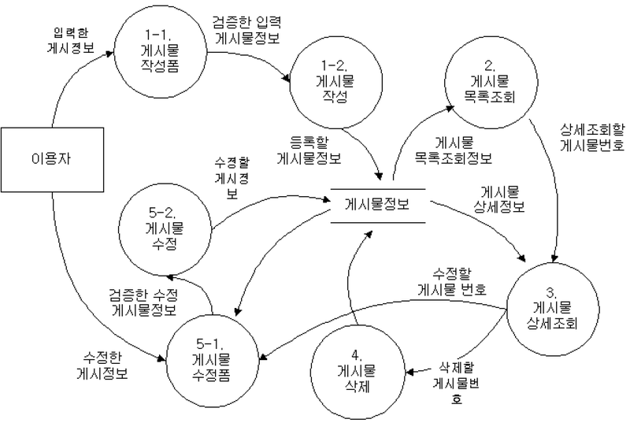
        - `프로세스`
          - 입력된 데이터를 원하는 형태로 변환하여 출력하기 위한 과정. `원으로 표시` 
        - `자료 흐름`
          - 구성요소(프로세스,데이터 저장소, 외부 엔티티)들 간의 오가는 흐름. `화살표로 표시` 
        - `자료 저장소`
          - 데이터가 저장되어 있는 장소(디스크,cd 등). `평생선(=)으로 표시  `
        - `단말`  
          - 시스템과 교신하는 외부 개체, 입력 데이터가 만들어지고 출력데이터를 받음 .`사각형으로 표시`, 프로세스 처리 과정에서 데이터가 발생하는 시작과 종료   
      - 요구사항 분석용 `CASE(Computer Aided Soft Engineering;소프트웨어 생명주기 전반을 지원하는 자동화 도구나 방법론)`
        - 요구사항을 자동으로 분석, 분석 명세서 기술 `도구`
        - `SADT 시스템 정의, 소프트웨어 요구사항 분석, 시스템 소프트웨어 설계 위한 대표적 도구 softtech에서 개발, 블록 다이어그램`  
          SREM(=RSL/REVS),PSL/PSA/TAGS 
      - `HIPO(Hierarchical Input Process Output)`
        - ` 시스템의 분석 및 설계, 문서화에 사용되는 기법`. 시스템 실해 과정인 입력/처리/출력 기능 표현  
        - 하향식 소프트웨어 개발을 위한 문서화 도구
        - `HIPO CHART` : 시스템의 기능을 고유의 모듈로 분할, 이들 간의 인터페이스를 계층 구조로 표현 
          - 가시적 도표 : 시스템의 전체적인 기능과 흐름을 보여주는 Tree형태의 구조도
          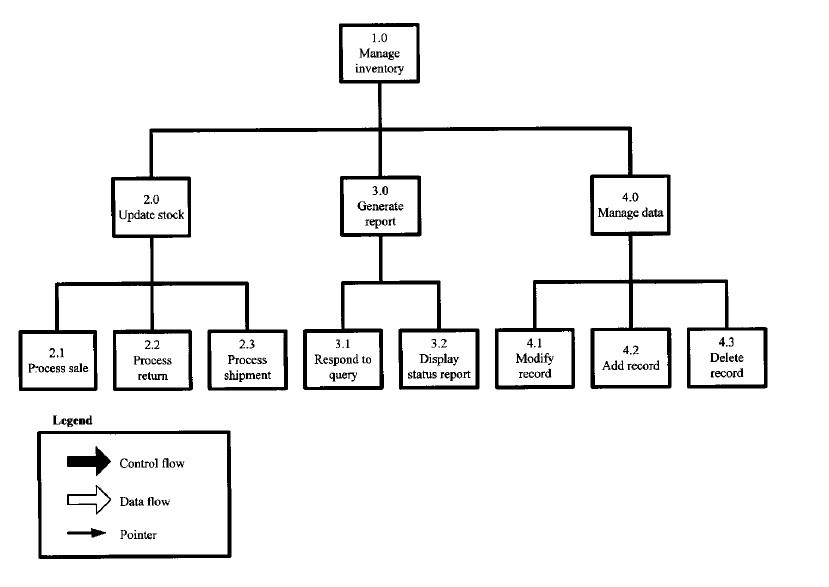
          - 총체적 도표 : 프로그램을 구성하는 기능을 기술한 것으로 입력, 처리, 출력에 대한 전반적인 정보를 제공하는 도표
          - 세부적 도표 : 총체적 도표에 표시된 기능을 구성하는 기본 요소들을 상세히 기술하는 도표총체적 도표와 같은 모양이지만 내용만 좀 더 복잡하게 들어간 형태이다.
  3. `명세(specipication)` : 분석된 요구사항 바탕으로 모델 작성 및 문서화
       - 명세기법  
          ||정형 명세기법|비정형 명세 기법|
          |------|---|---|
          |기능|수학적 원리 기반, 모델 기반|상태/기능/객체 중심|
          |작성방법|수학적기호, 정형화된 표기법|일반명사, 동사 등의 자연어|
          |특정|- 요구사항을 정확하고 간결하게 표현  <br> - 요구사항에 대한 결과가 작성자에 관계없이 일관성 있음 완전성 검증가능<BR> - 표기법이 어려워 사용자이해 어려움|- 자연여 사용으로 일관성 떨어지고 해석 달라질 수 있음 <BR> - 내용 이해 쉬워 의사소통 용이|
          |종류|VDM, Z, Petri-net|FSM,Decision Table, ER모델링|
        - 기능 요구사항 빠짐없이, 비기능은 필요한 것만`
        - 구체적인 명세를 위한 `소단위 명세서` 사용 가능   
         
  4. `확인(validation)` : 요구사항 할당전 명세서가 정확 안전한지 검토
 
  ### 자료 사전  

    자료 흐름도에 있는 자료를 더 자세히 정의하고 기록한 것(메타 데이터)
    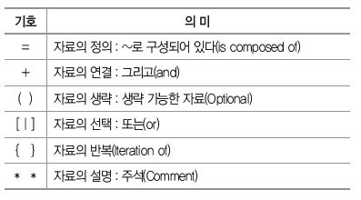

---  

## UML
  - 시스템 개발 과정에서 고객, 개발자 등 의사소통이 원활하게 이루어지도록 표죽화현 객체지향 모델링 언어.
  - UML의 구성 요소
    - 사물(things)
       
    - 관계(relationships)
     
    - 다이어그램
    ### <span style="color:orange">관계 </span>
      1. `연관 관계`
         - 2개 이상의 사물의 서로 관련되어 있는 관계
         - 실선으로 표현
         - 방향은 화살표
         - 양방향은 화살표 생략하고 실선으로만 연결  
          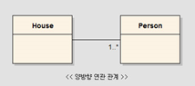  
          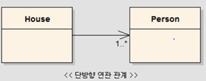  
           *이 단방향 UML House 클래스는 Person 클래스의 존재를 알고 있지만, Person은 House 클래스의 존재를 모른다.
          House 클래스만 Person 클래스에 대한 참조값을 가지고 있고, Person은 House에 대한 어떠한 참조값도 가지고 있지 않는다.*
         - 다중도를 선위에 표기 
      2. `집합 관계(aggregation)`  
       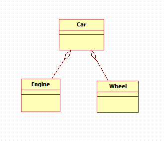
          ```Java 
          public class Car {
          Engine engine;
          List<Wheel> wheels;} //참조 만 함. 바퀴나 엔진은 다른 것으로 교체 가능. 생명주기가 같지 않음
          ```  
           - 하나의 사물이 다른 사물에 포함되어 있는 관계
           - 포함되는 쪽과 포함되는 쪽은 서로 독립
           - 포함하는 쪽에 빈 마름모 표시 
      3. `포함 관계`
         - 집합 관계의 특수한 형태, 포함하는 사물의 변화가 포함되는 사물에게 영향을 끼침
         - 집합관계에서 마름모로 표시하지만 속을 채움. 
         - 포함하는 쪽에서 포함되는 쪽의 생성자 소유
        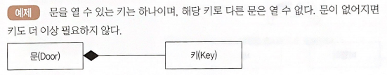  
        
      4. `일반화 관계`
         - 하나의 사물이 다른 사물에 비해 더 일반적이나 구체적인 관계(<span style="color:green">상속이다 but 실체화 관계는 구현이다.</span>)
         - 일반적인 개념이 `부모(상위)` 구체적인 개념은 `자식(하위)`   
          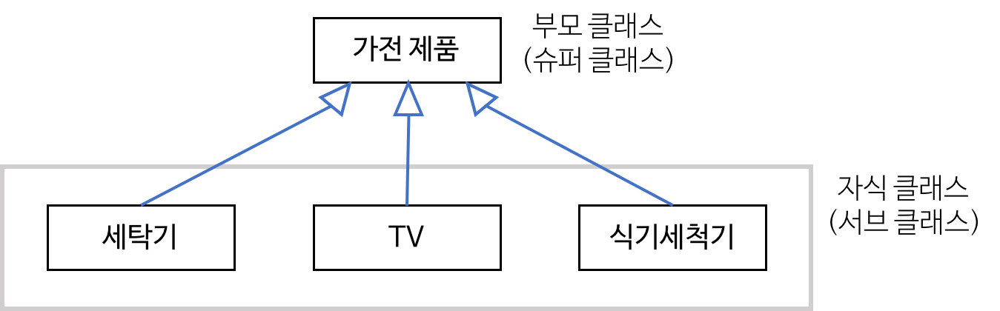
      5. `의존 관계`
         - 연관 관계처럼 사물 사이 연관은 있으나 `서로에게 영향을 주는 짧은 시간동안만 유효` 
         - 소유관계는 아니지만 하나의 변화가 다른 사물에도 영향
         - 일반적으로 한 클래스가 다른 클래스를 매개 변수로 사용 할때
         - 영향을 받는 쪽으로 점선 화살표를 연결해 표현
         - 연관관계는 다른 클래스를 멤버 변수로만 가지고 있지만, 의존 관계는 다른 클래스의 메서드를 가지고 있거나, 다른 클래스를 인자로 받는다.  
         - 이용하는 클래스 쪽에서 사용되는 클래스로 점선 화살표로 연결하여 표현
          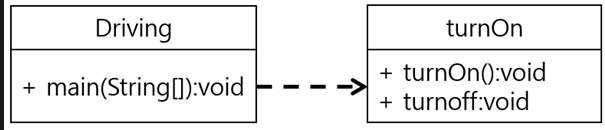  
         
              ```java
              public class Driving {
                  public void main(String[] args){
                    Car myCar = new Car();
                    myCar.turnOn();
                    myCar.turnOff();
                  }
              }

              //

              public class Car{
                public void turnOn(){
                  system.out.println("시동이 켜졌습니다.");
                }
                public void trunOff(){
                  system.out.println("시동이 꺼졌습니다.");
                }
              }
              
                // Driving 클래스는 Car클래스의  메소드에 의존을 한다.
                //이렇듯 한 클래스가 다른 클래스에서 제공하는 기능을 이용하는 의존 관계가 있다.
                ```
      6. `실체화 관계`  
         - 사물이 할 수 있거나 해야하는 기능으로, 서로를 그룹화 할 수 있는 관계
         - 속이 빈 점선 화살표를 연결하여 표현 
         - 인터페이스를 구현 받아 추상 메서드를 오버라이딩(부모의 불완전 행동을 자식이 구현)   
         - 사물에서 기능 쪽으로 속이 빈 점선 화살표로 표현  
          
           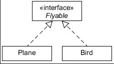
           비행기가 날 수 있다를 구현 한 것이다.  (구현 대상에 화살표 머리가 간다.)

            *<<>> 안에 있는 interface는 스테레오타입을 이용한 것이다.*

  ### <span style="color:orange">다이어그램(UML)</span>
 - `정적 모델링`
   - 주로 `구조적 다이어그램 사용`
     1. `클래스 다이어그램 `  
        - 클래스와 클래스가 가지는 속성 클래스 사이의 관계 표현   
       
            
          |클래스명|
          |---|
          |속성1(Attribute) : 클래스의 상태나 정보  <br>속성2(Attribute)
          |오퍼레이션(Operation) : 클래스의 메소드<br>오퍼레이션2|
  
          제약조건은 중괄호로 표기

     3. `객체 다이어그램`
        - 인스턴스를 특정 시점의 모습들을 표현. 객체와 객체 사이의 관계로 표현, 인스턴스의 상태를 표현한다는 점에서 클래스 다이어그램보다 구체적  
        `럼바우 객체지향 분석 기법` 모델링에서 사용  
         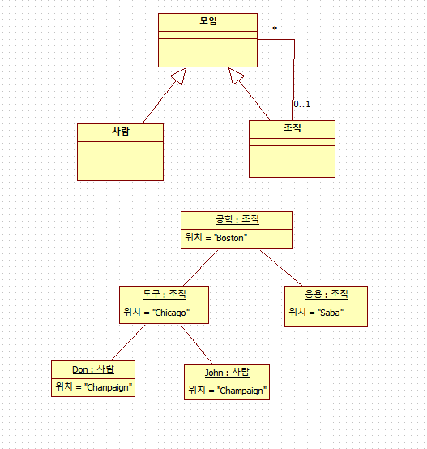  
         이 예시에서는 모임,사람, 조직 클래스 들의 인스턴스(공학,도구,don,john)등을 표현하고 있다.
     4. `컴포넌트 다이어그램(component diagram)`
        - 컴포넌트(실제 구현 모듈) 간의 관계나 컴포넌트간의 인터페이스 표현 . 시스템 구성하는 소프트웨어 조각등의 조직과 종속성을 나타냄.  
        - `구현 단계에서 사용`  
         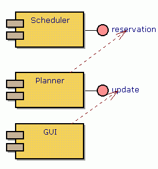  
        - 배치 다이어그램(deployment diagram) 이 물리적인 부분을 나타내는 것과 반대로 소프트웨어적 물리적 단위(라이브러리)의 구성과 연결상태를 나타냄.
     5. `배치 다이어그램(deployment diagram)`
        - 결과물, 프로세스, 컴포넌트 등 물리적 요소 위치 나타냄
        - `구현 단계에서 사용`  
          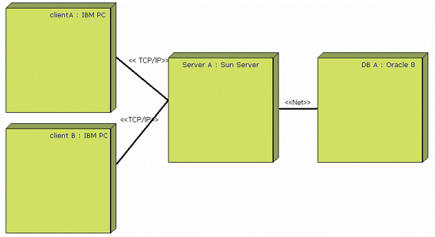  
        시스템의 물리적인 구조, 하드웨어적인 배치 
     6. `복합체 구조 다이어그램`
        - 클래스나 컴포넌트가 복합 구조를 갖는 경우 그 내부 구조 표현 
     7. `패키지 다이어그램  `
        - 유스케이스나 클래스 등의 모델 요소들을 그룹화한 패키지들의 의존 관계를 표현
        - 어떤 구성요소라도 더 높은 수준으로 묶을 수 있도록 해주는 구조  
<br><br> 
  - `동적 모델링`
   
    1. `유스케이스 다이어그램`    
        - 시스템과 사용자의 상호작용 표현
        - 사용자(actor)와 추상적인 기능(usecase)가 있다. 타원형으로 유스케이스를 표현한다.
        - <span style="color:orange">유스케이스 다이어그램의 구성 요소</span>
          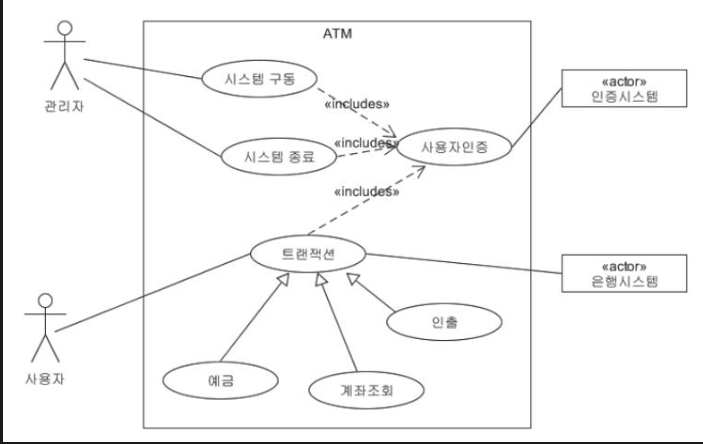
            1. `시스템/ 시스템 범위` -> ATM 부분
            2. `액터` -> 관리자, 사용자 : 시스템과 상호작용하는 모든 외부 요소 . 주로 사람이나 외부 시스템
               - 주액터 -> 졸라맨 : 시스템 사용자. 주로 사람
               - 부액터 -> 네모: 주액터 목적 달성위해 시스템에 서비스 제공하는 외부 시스템. 주로 조직이나 기관 
            3. `유스케이스` -> 동그라미 : 사용자 관점에서 시스템이 액터에게 제공하는 서비스나 기능
            4. `관계` : 액터 <-> 유스케이스, 유스케이스 <-> 유스케이스
               -  연간 관계(Association) : 유스케이스와 액터간의 상호작용
               -  포함 관계(Include): 두 유스케이스 간의 의존성  
                 <span style="background-color:gray; border-radius:3px;">위 예시에서 시스템 구동/종료, 트랜잭션을 하기위해선 사용자 인증이 필요함  
                 이 필요한 과정들을 사용자인증이 포함한다고 볼 수 있음. 부모 방향으로 실선,화살표,<\<include\>>
               - 확장 관계     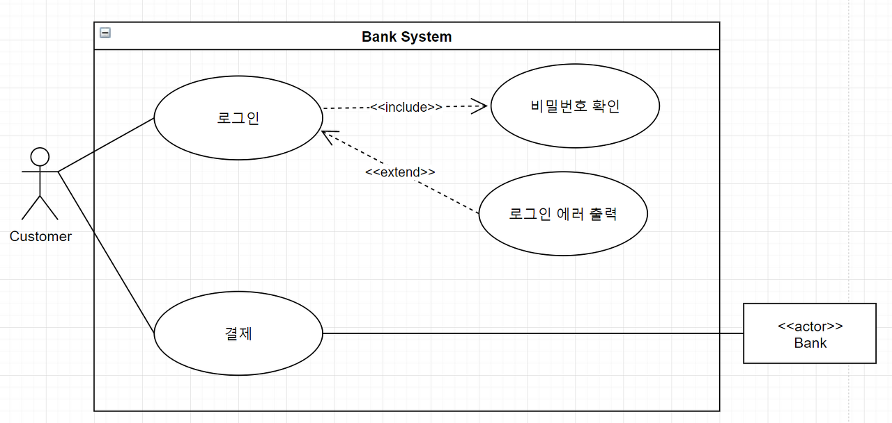  
                  하나의 유스케이스가 실행 될 때 포함 관계에 있는 유스케이스가 `특정 상황에서만 실행` 된다는 의미  
                  기존의 유스케이스를 가리키는 점선화살표 위 <\<extend>> 를 화살표 중앙에 표시.  
                  위 예시에서 사용자는 로그인 작업 때마다 로그인 에러를 출력하진 않음  
                  잘못 입력한 상황에서만 사용 -> 로그인 에러 출력이 로그인과의 확장관계를 가지고있음
               - 일반화 관계  
                  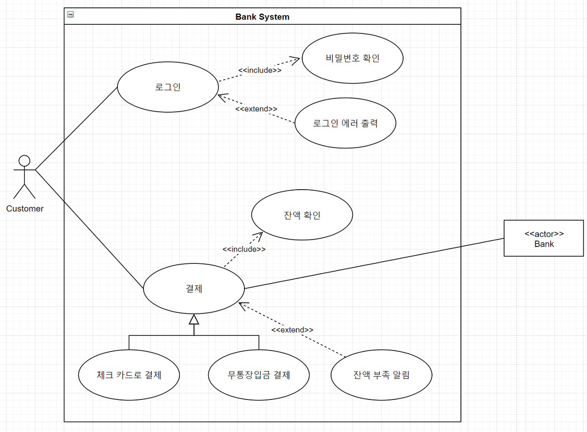  
                  부모 유스케이스와 자식 유스케이스들 간의 `상속관계`
                  부모 유스케이스 방향으로 삼각형 실선 화살표  
                  <span style="color:orange">**확장 관계와 차이**  </span>  
                  부모인 `결제` 케이스와 그 자식인 `체크카드/무통장입금 결제`는 부모의 include 관계를 공유한다.
                  따라서 결제 방법을 무통장입금 or 체크 카드로 하면 결제가 include하고 있는 잔액 확인 usecase를 진행 해야한다.
                  하지만 `잔액 부족 알림`은 `결제`와 extend관계이기에 실패시에만 실행되는 usecase이다.
                  
                  
          
    2. `시퀀스 다이어그램`  
         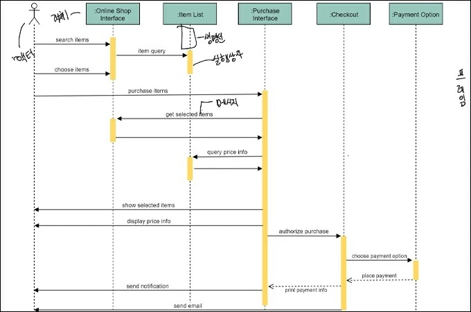
        - 상호작용하는 시스템이나 객체들이 주고받는 `메세지를 표현`
        - `생명선` : 객체가 메모리에 존재하는 기간 x표시까지 생존  
          `액터` : 서비스 요청하는 외부요소  
          `객체` : 메세지를 주고 받는 주체  
          `실행 상자` : 객체체가 메세지를 주고 받으며 구동되고 있음 표현  
          `메세지` : 객체가 상호 작용을 위해 주고받는 메세지
          `객체 소멸` : 객체가 더 이상 메모리에 존재 하지 않음을 표시 "X"자로 표시
    3. `커뮤니케이션 다이어그램`
         - 동작에 참여하는 객체들이 주고받는 메시지와 객체들 간의 연관 관계 표현
         - 시퀀스와 비슷, 커뮤니케이션 다이어그램은 서로간의 연결을 강조하는데 유리, 클래스간의 관계도 표현(시퀀스는 호출의 순서)  
          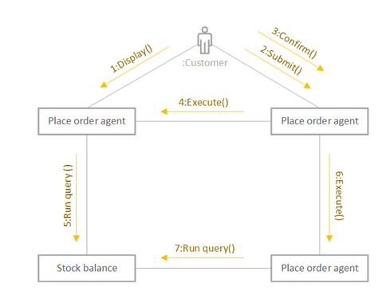
    4. `상태 다이어그램`
       - 이벤트에 의한 반응적인 객체의 상태변화을 표현 한 것
       - `럼바우 객체지향 분석 기법에서 동적 모델링에 활용` 
          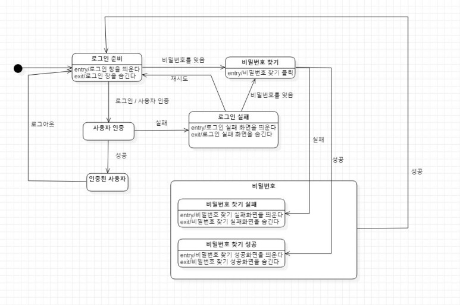
          사각형의 위쪽엔 상태의 이름, 아래 쪽에는 그 상태 돌입/탈출 할때 해야하는 이벤트 기술  
          `화살표` : 상태의 전환  
          `이벤트` : 화살표 위의 메세지. 상태에 변화를 주는 현상. 조건, 외부 신호, 시간 흐름 등  
          `시작,종료 노드` : 활동 다이어그램과 같다.
          
    5. `활동 다이어그램(activity diagram)`  
     
        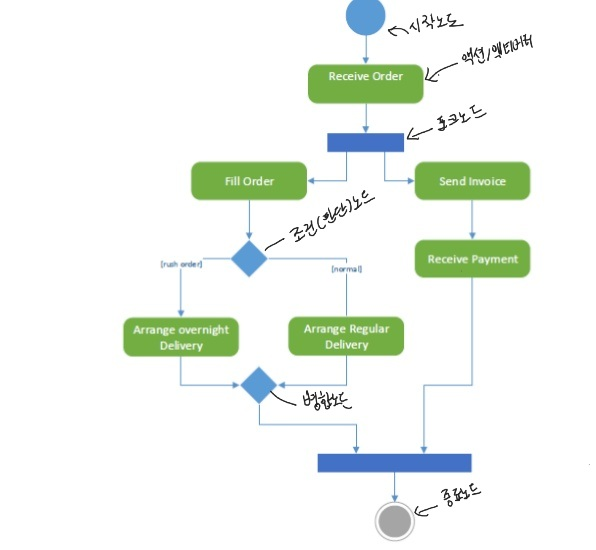
       - 사용자 관점에서 시스템이 어떤 기능을 수행하는지 처리 로직, 흐름을 순서에 따라 표현 
       - 시스템 내부의 여러가지 행위들, 행위의 분기, 분기되는 조건
       - 플로우 차트와는 행위에 따른 객체의 상태를 표기할 수 있다는 점에서 차이가 있다. 
       - `액션` : 더 이상 분해 x 한 단일 작업/ `액티비티` : 몇 개의 액션으로 분리되는 작업    
         `시작노드` : 액션이나 액티비티의 시작 `종료노드` : 액티비티 안의 모든 흐름이 종료  
         `조건(판단) 노드` : 조건에 따라 제어의 흐름이 분리, 들어오는 제어 흐름 하나 나가는건 여러개  
         `병합노드` : 여러 흐름이 하나로 합쳐짐, 들어오는 제어 흐름은 여러 개, 나가는 제어흐름은 하나  
         `포크(Fork)` : 액티비티 흐름이 분리되어 수행. 들어오는 액티비티 흐름은 한 개 , 나가는 건 여러개
         
       <br>  

    7.  `상호작용 개요(interaction Overview Diagram)`
        - 객체들이 주고받는 매시지 통해 상호작용 명세
       <br>
    
    8.  `타이밍` 
        - 객체의 상태 변화와 시간 제약을 명시적으로 표현   
<br><br>

  - 스테레오 타입
    - 기존 uml에서 제공하는 기본요소 외에 추가적인 확장요소
    - `<< >> 사이에 적음`
    - ex) <\<interface\>>  인터페이스 클래스  , <\<abstract\>> 추상화 클래스 -> 꺽쇄안의 말로 추가적인 정보를 명시 할 수 있다.!
   


  
  