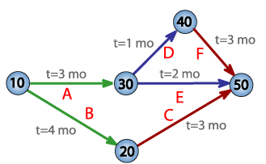

## 객체지향 방법론
- 현실 세계의 개체를 객체로 만들어 객체들을 조립해서 필요한 소프트웨어를 구현하는 방법론
- 구조적 기법의 문제점의 해결책으로 등장  
  1. 요구분석 단계
  2. 설계 단계
  3. 구현 단계
  4. 테스트 및 검증 단계
  5. 인도 간계

## 컴포넌트 기반 방법론(Component Base Design)
- 기존의 시스템이나 소프트웨어를 구성하는 컴포넌트를 조합하여 `하나의 새로운 어플리케이션을 만드는 방법론`
- 컴포넌트를 재사용(Reusability)이 가능해 시간과 노력 절감
  1. 개발 준비 단계
  2. 분석 단계
  3. 설계 단계
  4. 구현 단계
  5. 테스트 단계
  6. 전개 단계
  7. 인도 단계

## 소프트웨어 재사용
- 이미 개발되어 인정받은 소프트웨어를 다른 소프트웨어 개발에 사용하는 것 (ex. 라이브러리, 소픈소스, 표준화된 솔류션)
- 재사용요소 : 전체 프로그램, 부분 코드, 응용된 지식, 데이터 모형, 구조, 테스트 계획, 문서화 방법 등
- `합성중심(Composition-Based` : 전자 칩과 같은 소프트웨어 부품들을 끼워 맞춰 소프트웨어를 완성. 블록 구성 방법   
  ex) 홈페이지를 만들기 위해 게시판 플러그인, 로그인 플러그인, 레이아웃 플러그인 등을 조합하여 사용하면 이는 합성 중심.  
  `생성 중심(Generation-Based)` : 추상화 형태로 써진 명세를 구체화하여  그로그램을 만드는 방법으로, 패턴 구성 방법이라고도 함.  
  ex)ex)코드이그나이터 같은 프레임워크를 도입한다면 생성 중심

## 소프트웨어 재공학
- 기존 시스템을 이용하여 나은 시스쳄 구축, 새로운 기능 추가하여 소프트웨어 성능 향상

## CASE(Computer Aided Software Engineering)
- 소프트웨어 개발 과정에서 사용되는 요구 분석, 설계, 구현, 검사 및 디버깅 과정 전체 또는 일부를 컴퓨터와 전용 소프트웨어 도구로 자동화하는 것\
- 표준화된 개발 환경 구축, 문서 자동화 기능 제공
- 소프트웨어 생명 주기 전 단계의 연결
- 다양한 소프트웨어 개발 모형 지원
- 그래픽 지원

## 하향식 비용 산정 기법
- 과거 유사한 경험 바탕으로 전문 지식이 많은 개발자들이 참여한 회의를 통해 비용을 산정하는 비과학적 방법
- `전문가 감정 기법` : 조직내 두 명 이상의 전문가에게 비용 산정 의뢰하는 기법  
  `델파이 기법` : 전문가 감정 기법에서 객관성을 보완하기 위해 많은 전문가의 의견을 종합하여 산정하는 기법

## 상향식 비용 산정 기법
- 프로젝트의 세부적인 작업 단위별로 비용을 산정한 후 집계하여 전체 비용을 산정하는 방법
    ### **1. LOC(원시 코드 라인 수) 기법**
    - 각 기능의 `원시 코드 라인 수의 비관치, 낙관치, 기대치`를 측정하여 예측치를 구하고 이를 토대도 비용 산정하는 기법  원시코드=source Code
    - 산정 공식  
       `노력(인월)` = 개발 기간 x 투입 인원 = LOC / 1인당 월평균 생산 코드 라인 수 인월? 개발자 1 명이 한달에 개발하는 양을 나타내는 단위  
        `개발 비용` = 노력(인월) x 단위 비용 (1인당 월평균 인건비)  
        `개발 기간` = 노력(인월) /  투입 인원  
        `생산성` = LOC / 노력(인월)
    ### **2. 개발 단계별 인원수 기법**

    ### **3. 수학적 산정 기법** 
    - 상향식 산정기법. 경험적 추정 모형, 실험적 추정 모형이라고도 함
    - 개발 비용 산정의 자동화를 목표
    1. **COCOMO(COnstructive COst MOdel) 모형(basic cocomo)**  
       -  
        LOC에 의한 비용 산정 기법  
        소프트웨어의 규모(LOC)를 예측 후 이를 소프트웨어 종류에 따라 다른 비용 산정 방정식에 대입하여 비용 산정  
        즉, 먼저 완성될 시스템의 규모(Lines Of Code)를 추정하고 이를 준비된 식에 대입하여 소요 인원/월(Man-Month)을 예측  
        비용 산정 결과는 프로젝트를 완성하는 데 필요한 `노력(Man-Month)으로` 나타냄  
        보헴이 제한
        - 조직형(Organic Mode)
          - 기관 내부의 중,소규모의 소프트 웨어
          - 5만(50KDSI) 라인 이하(일괄 자료 처리, 과학기술 계산용, 비즈니스 자료 처리용)
          - 사무 처리용, 업무용, 과학용 응용 소프트웨어 개발에 적합하다.
        - 반분리형(Semi-Detached Mode)  
          - 중간형 소프트 웨어
          - 30만 라인 이하(트랜잭션 처리 시스템, 운영체제, 데이터베이스 관리 시스템)
          - 컴파일러, 인터프리터와 같은 유틸리티 개발에 적합
        - 내장형(Embedded Mode)
          - 초대형 규모의 소프트웨어, 매우 복잡한 시스템을 가지고 있다.    
          - 30만 라인 이상(트랜잭션 처리시스템, 운영체제)
          - 신호기 제어 시스템, 미사일 유도 시스템, 실시간 처리 시스템 등의 시스템 프로그램 개발에 적합
        
    2. **Putnam 모형**
       - 소프트웨어 생명 주기의 전 과정 동안에 사용될 노력의 분포를 예상하는 모형(푸트남 제한)
       - 생명 주기 예측 모형이라고도 함
       - 시간에 따른 함수로 표현되는 Rayleigh-Norden 곡선의 노력 분포도를 기초로 함
         - `SLIM` : Rayleigh-Norden 곡선과 Putnam 예측 모델을 기초로 하여 개발된 자동화 추정도구   
    3. 기능 점수(FP;Functional Point) 모형  
       - 소프트웨어의 기능을 증대시키는 요인별로 가중치부여하고
       - 요인별 가중치(복잡도)를 합산하여 총 기능 점수를 산출하며
       - 총 기능 점수와 영향도를 이용하여 기능 점수(FP)를 구한 후 이를 이용해서 비용을 산정하는 기법
       - 즉, 가지는 기능의 질적 요소(혹은 소프트퉤어 복잡도)를 기준으로 견적을 낸다.
       - 사용자 입장에서 견적을 낸다. 사용자 관점에서는 소프트웨어 기능은 데이터 측면의 기능과 트랜잭션 측면의 기능으로 구분
       - `ESTIMACS` : 다양한 프로젝트와 개인별 요소를 수용하도록 FP모형을 기초로 하여 개발된 자동화 추정 도구
       - `소프트웨어 기능 증대 요인`
         1. 자료 입력(입력 양식) 
         2. 정보 출력(출력 보고서)
         3. 명령어(사용자 질의수,쿼리)
         4. 데이터 파일 
         5. 필요한 외부 루틴과의 인터페이스   
       - 등의 요소로 복잡성을 계산한다.
--- 
## 프로젝트 일정관리 
실제로 프로젝트는 상호간에 관련성이나 의존성이 있는 여러개의 작업으로 구성됨.  
이러한 전체적인 과정을 효율적으로 관리하기 위해 필요하다.
### PERT 차트
 - 프로젝트에서 작업 일정을 수립하고, 작업을 정리 및 계획하는 데 사용하는 툴  
 - 프로젝트 시작일부터 종료일까지 몇 가지 단계로 구성됨
 - 불확실한 프로젝트 일정, 비용 등을 합리적으로 계획하고 관리하는 기법
 - 각각의 작업에 걸리는 시간을 계산함으로써 모든 프로젝트를 끝내는 최소시간을 계산
  
    ADM(Arrow Diagram Method)라고 불리는 차트  
    각 원은 작업내용(이벤트)를 의미하고, 각 작업이 실시되는 것은 화살표로 소요시간과 함께 표현. 이 때 화살표는 `액티비티`  
    각 요소들이 액티비티와 화살표로 연결되어 있다.  
    위의 차트는 `10`이라는 작업에서 시작해 `50`이라는 작업에서 프로젝트가 종료됨  
    이 때 `30` 이라는 작업을 시작하기 위해서는 3개월이 소요됨(t=3 mo)
    `40`이 시작되려면 `30`이 시작 후 1개월이 지나야 함. 각 작업의 의존도 (화살표 방향)과 기간에 따라 작업 순서가 결정 됨  
    위 프로젝트는 최소 7개월이 걸림 a ->d -> f 와 b -> c 가 7개월이 필요하기 때문. 이런 최장 경로를 `주경로;임계경로;크리티컬 패스(ctritical path)`라고 함  
    작업에 소요되는 시간은 세 가지로 예측   
    `1. 낙관적으로 예상한 소요시간(낙관치)`   
    `2. 비관적으로 예상한 소요시간(비관치)`   
    `3. 일반적으로 소요될 것으로 예상되는 시간(정상치)`   
    이를 통해 불확실한 프로젝트 계획 리스크 관리

 

### CPM(Critical Path Method,임계 경로 기법)
- 프로젝트 완성에 필요한 작업을 나열하고 작업에 필요한 소요 기간을 예측하는데 사용하는 기법
- 노드와 간선으로 구성된 네트워크 노드. 노드는 작업, 간선은 작업 사이의 전후 의존 관계를 나타냄
- 퍼트는 시간관리에 중점을 두었다면 CPM은 일정과 더불어 비용까지 관리
- 일정 단축을 위해 추가한 자원은 `직접비용`, 그로 인해 감소되는 비용(시간이 줄어드니)은 `간접비용`
- 직접비용과 간접비용의 감소량이 합이 최소가 되는 기간은 최적점
### 간트 차트
- 프로젝트의 작업들의 시작과 끝을 막대로 
- 시간선(time-line) 차트라고도 함  
  
- 좌측의 y축은 가각의 업무를, 상단 x축은 시간을 의미  
- 도표의 막대는 작업계획과 실제 작업 진행률을 동시에 나타냄  
- 계획과 통제를 동시에 가능, 작업의 계획대비 진행상황과 자원할당이 한 눈에 잘 나타나짐 -> 자원 배치와 인원 계획에 유리
- 작업 간의 관계, 순서, 중요도, 크리티컬 패스 등의 정보는 포함하지 않아 간단한 프로젝트에 적합
 

