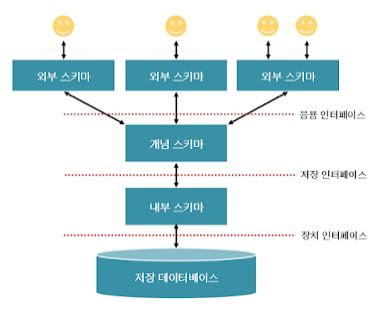

# 데이터전환(Data Migration)
- 운영 중인 기존 정보 시스템에 축척되어 있는 데이터를 `추출(Extract)`하여 새로 개발할 정보 시스템에서 운영할 수 있도록 `변환(Transformation)` 한 후 `적재(Loading)`하는 일련의 과정
- ETL(Extraction, Transformation, Load) 추출, 변환, 적재 과정이라고 함
- 데이터이행(Data Migration), 데이터 이관 이라고도 부름
## 데이터 검증
- 원천 시스템의 데이터를 목적 시스템의 데이터로 전환하는 과정이 정상적으로 수행되었는지 여부를 확인하는 과정
## 오류 데이터 측정 및 정제
- 고품질의 데이터를 운영 및 관리 위해 수행
1. 데이터 품질 분석
2. 오류 데이터 측정
3. 오류 데이터 정제  
# 데이터베이스
공동으로 사용될 데이터를 중복을 배제하여 통합
- 데이터베이스의 구분
  - 통합된 데이터(Integrated Data) : 자료의 중복을 배제한 데이터
  - 저장된 데이터(Stored Data) :  컴퓨터가 접근할 수 있는 저장 매체에 저장된 자료
  - 운영 데이터(Operational Data) : 조직의 고유한 업무를 수행하는 데 반드시 필요한 자료
  - 공용 데이터(Shared Data) : 여러 응용 시스템들이 공동으로 소유하고 유지하는 자료
## DBMS
- 사용자의 요구에 따라 정보를 생성, db를 관리해주는 소프트 웨어
- DBMS의 필수 기능
  1. 정의(Definition) 기능 : 데이터의 타입과 구조에 대한 정의, 이용 방식, 제약 조건등 명시
  2. 조작(Manipulation) 기능 : 데이터 검색, 갱신, 삽입, 삭제 제공
  3. 제어(Control) 기능 : 데이터의 무결성, 보안, 권한 검사, 병행 제어 
## 스키마
 
- 데이터베이스의 구조와 제약조건에 관한 전반적인 명세 기술. 즉 db내에 데이터가 어떤 구조로 저장되는가를 나타냄
- 데이터 사전(Data Dictionary)에 저장됨
- 외부 스키마 (사용자 뷰): 사용자가 정의한 데이터베이스의 논리적 구조
- 개념 스키마 (전체적인 뷰): 데이터베이스의 전체적인 논리적 구조(하나만 존재)  , 보통 스키마라고하면 이것을 지칭, 개체 간의 관계 제약 조건, 접근 권한, 보안 및 무결성에 관련된 규칙을 명세
- 내부 스키마(세스템 설계자 뷰) : 물리적인 저장장치 입장에서 데이터가 저장되는 방법을 기술, 실제 db에 저장될 레코드의 물리적인 구조, 저장 데이터 항목의 표현방법, 내부 래코드의 물리적 순서, 인덱스 유무등 나타냄
## 데이터베이스 설계 순서
1. 요구 조건 분석 : 요구 조건 명세서 작성
2. `개념적 설계 : `
   - 개념 스키마 
   - 트랜잭션 모델링 e-r모델
   - 현실 세계에 대한 인식을 추상적 개념으로 표현
   - 정보 구조화 위한 추상적 개념으로 표현
4. `논리적 설계` : 
   - 목표 dbms에 맞는 논리 스키마 설계, 트랜잭션 인터페이스 설계 
   - 이 단계에서 관계형 db의 경우 테이블을 설계하고 정규화를 거침
   - 컴퓨터가 이해하게 끔 특정 dbms가 지원하는 논리적 자료 구조로 변환(Mapping)시키는 과정
6. `물리적 설계` : 
   - 논리적 구조로 표현된 데이터를 목표 dbms에 맞는 물리적 구조의 데이터로 변환 
   - db의 저장 구조 및 액세스 경로는 db의 성능에 영향을 줌
   - 저장 레코드의 형식, 순서, 접근 경로, 조회 집중레코드 등의 정보를 사용하여 데이터가 컴퓨터에 저장되는 방법을 묘사
1. 구현 : 목표 dbms의 ddl로 데이터 베이스 생성, 트랜잭션 생성
## 데이터 모델
- 현실 세계의 정보들을 컴퓨터에 표현하기 위해 단순화, 추상화하여 체계적으로 표현한 개념적 모형
  - 표시할 요소
    1. 구조(Structure) : 데이터 구조 및 정적 성질 표현
    2. 연산(Operation) : 실제 데이터를 처리하는 작업에 대한 명세, db를 조작하는 기본 도구
    3. 제약 조건(Constraint) : db에 저장될 수 있는 실제 데이터의 논리적인 제약 조건   
## 개체(Entity)
- 데이터베이스에 표현하려는 것, 개념이나 정보 단위 같은 현실 세계의 대상체
- 현실세계에 대해 사람이 생각하는 개념이나 정보의 단위
- 실세계에 독립적으로 존해나는 유형, 무형의 정보로서 서로 연관된 몇개의 속성
## 관계
- 개체와 개체 사이의 논리적인 연결
  - 일 대 일, 일 대 다, 다 대 다  
## E-R 모델
- 개체 와 개체 간의 관계, 현실 세계의 무질서한 데이터를 개념적인 논리 데이터로 표현하기 위한 방법
- 피터 첸에 의해 제안, 개념적 데이터 모델의 가장 대표적인 것 
# 관계형 데이터베이스 
## 릴레이션
-  릴레이션(Relation) : 데이터들을 표의 형태로 표현한 것
-  릴레이션 스키마, 릴레이션 인스턴스로 표현  

  - 튜플
    - 릴레이션을 구성하는 각각의 행
    - 속성의 모임으로 구성
    - 파일 구조에서 레코드와 같은 의미
    - 튜플의 수는 카디널리티(Cardianlity) , 기수, 대응수
  - 속성
    - 데이터를 구성하는 가장 작은 논리적 단위
    - 데이터 항목, 데이터 필드
    - 속성의 수는 디그리(Degree) 또는 차수 ( 차수는 속성의 수와 동일 )
  - 도메인
    - 하나의 애트리뷰트(Attribute)가 취할 수 있는 같은 타입의 원자(Atomic)값들의 집합
## 키 
- 후보키(Candidate Key) 
  - 속성들 중에서 튜플을 유일하게 식별하기 위해 사용되는 속성들의 `부분집합`
  - `유일성(하나의 키 값으로 하나의 튜플만 식별 할 수 있어야함)`, `최소성` 모두 만족  
- 기본키(Primary Key)
  - 후보키 중에서 특별히 선정된 주키(Main Key)
  - 중복 된 값 x
  - 특정 튜픓을 유일하게 식별
  - null 값을 가질 수 없음
- 대체키
  - 후보키가 둘 이상일 때 기본 키를 제외한 나머지 후보키 ( 보조키라고도 함 )
- 슈퍼키
  - 릴레이션 내의 속성들의 집합으로 구성된 키
  - 유일성은 만족하지만 최솟ㅇ은 만족하지 못함
- 외래키(Foreign Key) 
  - 다른 릴레이션의 기본키를 참조하는 속성, 속정 집합
  - 참조 릴레이션의 기본키에 없는 값은 입력할 수 없다.
## 무결성
- 데이터베이스에 저장된 데이터 값과 그것이 표현하는 현실 세계의 실제값이 일치하는 정확성
- 데이터의 정확성, 일관성, 유효성이 유지되는 것
  - 개체 무결성 : 기본키는 Null 이나 중복값을 가질 수 없다.(기본키 제약조건)
  - 참조 무결성 : 외래키 값은 NUll이거나 참조 릴레이션의 기본키 값과 동일해야한다. 즉, 외래 키 값이 참조되는 릴레이션에 존재하거나 NUll 값이여야 한다. (왜래키 제약조건)

## 관계대수
- 관계형 데이터베이스에서 어떻게 질의를 할것인지 명시하는 `절차적 언어`
- SQL의 이론적인 기초
- 피연산자와 연산 결과가 모두 릴레이션이다.
- 질의에 대해 수행해야 할 연산의 순서를 명시한다.
  - ### 연산자
    - select (σ, sigma) 선택
      릴레이션에서 조건을 만족하는 튜플을 선택  
    - project (π, pi)
    - union (∪, union)
    - set difference (-, hypen)
    - cartesian product (×, times)
    - rename (ρ, rho) 
       

