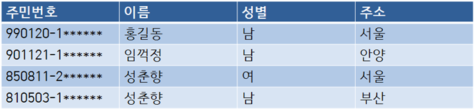

# 데이터전환(Data Migration)
- 운영 중인 기존 정보 시스템에 축척되어 있는 데이터를 `추출(Extract)`하여 새로 개발할 정보 시스템에서 운영할 수 있도록 `변환(Transformation)` 한 후 `적재(Loading)`하는 일련의 과정
- ETL(Extraction, Transformation, Load) 추출, 변환, 적재 과정이라고 함
- 데이터이행(Data Migration), 데이터 이관 이라고도 부름
## 데이터 검증
- 원천 시스템의 데이터를 목적 시스템의 데이터로 전환하는 과정이 정상적으로 수행되었는지 여부를 확인하는 과정
## 오류 데이터 측정 및 정제
- 고품질의 데이터를 운영 및 관리 위해 수행
1. 데이터 품질 분석
2. 오류 데이터 측정
3. 오류 데이터 정제  
# 데이터베이스
공동으로 사용될 데이터를 중복을 배제하여 통합
- 데이터베이스의 구분
  - 통합된 데이터(Integrated Data) : 자료의 중복을 배제한 데이터
  - 저장된 데이터(Stored Data) :  컴퓨터가 접근할 수 있는 저장 매체에 저장된 자료
  - 운영 데이터(Operational Data) : 조직의 고유한 업무를 수행하는 데 반드시 필요한 자료
  - 공용 데이터(Shared Data) : 여러 응용 시스템들이 공동으로 소유하고 유지하는 자료
## DBMS
- 사용자의 요구에 따라 정보를 생성, db를 관리해주는 소프트 웨어
- DBMS의 필수 기능
  1. 정의(Definition) 기능 : 데이터의 타입과 구조에 대한 정의, 이용 방식, 제약 조건등 명시
  2. 조작(Manipulation) 기능 : 데이터 검색, 갱신, 삽입, 삭제 제공
  3. 제어(Control) 기능 : 데이터의 무결성, 보안, 권한 검사, 병행 제어 
## 스키마
 
- 데이터베이스의 구조와 제약조건에 관한 전반적인 명세 기술. 즉 db내에 데이터가 어떤 구조로 저장되는가를 나타냄
- 데이터 사전(Data Dictionary)에 저장됨
- 외부 스키마 (사용자 뷰): 사용자가 정의한 데이터베이스의 논리적 구조
- 개념 스키마 (전체적인 뷰): 데이터베이스의 전체적인 논리적 구조(하나만 존재)  , 보통 스키마라고하면 이것을 지칭, 개체 간의 관계 제약 조건, 접근 권한, 보안 및 무결성에 관련된 규칙을 명세
- 내부 스키마(세스템 설계자 뷰) : 물리적인 저장장치 입장에서 데이터가 저장되는 방법을 기술, 실제 db에 저장될 레코드의 물리적인 구조, 저장 데이터 항목의 표현방법, 내부 래코드의 물리적 순서, 인덱스 유무등 나타냄
## 데이터베이스 설계 순서
1. 요구 조건 분석 : 요구 조건 명세서 작성
2. `개념적 설계 : `
   - 개념 스키마 
   - 트랜잭션 모델링 e-r모델
   - 현실 세계에 대한 인식을 추상적 개념으로 표현
   - 정보 구조화 위한 추상적 개념으로 표현
4. `논리적 설계` : 
   - 목표 dbms에 맞는 논리 스키마 설계, 트랜잭션 인터페이스 설계 
   - 이 단계에서 관계형 db의 경우 테이블을 설계하고 정규화를 거침
   - 컴퓨터가 이해하게 끔 특정 dbms가 지원하는 논리적 자료 구조로 변환(Mapping)시키는 과정
6. `물리적 설계` : 
   - 논리적 구조로 표현된 데이터를 목표 dbms에 맞는 물리적 구조의 데이터로 변환 
   - db의 저장 구조 및 액세스 경로는 db의 성능에 영향을 줌
   - 저장 레코드의 형식, 순서, 접근 경로, 조회 집중레코드 등의 정보를 사용하여 데이터가 컴퓨터에 저장되는 방법을 묘사
1. 구현 : 목표 dbms의 ddl로 데이터 베이스 생성, 트랜잭션 생성
## 데이터 모델
- 현실 세계의 정보들을 컴퓨터에 표현하기 위해 단순화, 추상화하여 체계적으로 표현한 개념적 모형
  - 표시할 요소
    1. 구조(Structure) : 데이터 구조 및 정적 성질 표현
    2. 연산(Operation) : 실제 데이터를 처리하는 작업에 대한 명세, db를 조작하는 기본 도구
    3. 제약 조건(Constraint) : db에 저장될 수 있는 실제 데이터의 논리적인 제약 조건   
## 개체(Entity)
- 데이터베이스에 표현하려는 것, 개념이나 정보 단위 같은 현실 세계의 대상체
- 현실세계에 대해 사람이 생각하는 개념이나 정보의 단위
- 실세계에 독립적으로 존해나는 유형, 무형의 정보로서 서로 연관된 몇개의 속성
## 관계
- 개체와 개체 사이의 논리적인 연결
  - 일 대 일, 일 대 다, 다 대 다  
## E-R 모델
- 개체 와 개체 간의 관계, 현실 세계의 무질서한 데이터를 개념적인 논리 데이터로 표현하기 위한 방법
- 피터 첸에 의해 제안, 개념적 데이터 모델의 가장 대표적인 것 
# 관계형 데이터베이스 
## 릴레이션
-  릴레이션(Relation) : 데이터들을 표의 형태로 표현한 것
-  릴레이션 스키마, 릴레이션 인스턴스로 표현  

  - 튜플
    - 릴레이션을 구성하는 각각의 행
    - 속성의 모임으로 구성
    - 파일 구조에서 레코드와 같은 의미
    - 튜플의 수는 카디널리티(Cardianlity) , 기수, 대응수
  - 속성
    - 데이터를 구성하는 가장 작은 논리적 단위
    - 데이터 항목, 데이터 필드
    - 속성의 수는 디그리(Degree) 또는 차수 ( 차수는 속성의 수와 동일 )
  - 도메인
    - 하나의 애트리뷰트(Attribute)가 취할 수 있는 같은 타입의 원자(Atomic)값들의 집합
## 키 
- 후보키(Candidate Key) 
  - 속성들 중에서 튜플을 유일하게 식별하기 위해 사용되는 속성들의 `부분집합`
  - `유일성(하나의 키 값으로 하나의 튜플만 식별 할 수 있어야함)`, `최소성` 모두 만족  
- 기본키(Primary Key)
  - 후보키 중에서 특별히 선정된 주키(Main Key)
  - 중복 된 값 x
  - 특정 튜픓을 유일하게 식별
  - null 값을 가질 수 없음
- 대체키
  - 후보키가 둘 이상일 때 기본 키를 제외한 나머지 후보키 ( 보조키라고도 함 )
- 슈퍼키
  - 릴레이션 내의 속성들의 집합으로 구성된 키
  - 유일성은 만족하지만 최솟ㅇ은 만족하지 못함
- 외래키(Foreign Key) 
  - 다른 릴레이션의 기본키를 참조하는 속성, 속정 집합
  - 참조 릴레이션의 기본키에 없는 값은 입력할 수 없다.
## 무결성
- 데이터베이스에 저장된 데이터 값과 그것이 표현하는 현실 세계의 실제값이 일치하는 정확성
- 데이터의 정확성, 일관성, 유효성이 유지되는 것
  - 개체 무결성 : 기본키는 Null 이나 중복값을 가질 수 없다.(기본키 제약조건)
  - 참조 무결성 : 외래키 값은 NUll이거나 참조 릴레이션의 기본키 값과 동일해야한다. 즉, 외래 키 값이 참조되는 릴레이션에 존재하거나 NUll 값이여야 한다. (왜래키 제약조건)

## 관계대수
- 관계형 데이터베이스에서 어떻게 질의를 할것인지 명시하는 `절차적 언어`
- SQL의 이론적인 기초
- 피연산자와 연산 결과가 모두 릴레이션이다.
- 질의에 대해 수행해야 할 연산의 순서를 명시한다.
  - ### 순수 연산자
    - select (σ, sigma) 선택
      릴레이션에서 조건을 만족하는 튜플을 선택  
    - project (π, pi)
      제시된 속성 값만 추출하여 새로운 릴레이션 제작 
    - Devision (%)
      부모 릴레이션에 포함된 튜플의 값을 모두 갖고 있는 투플을 분자 릴레이션에서 추출 
    - Join (리본모양)

    ### 일반집합 연산자
    - 합집합union (∪, union)
      - 중복 값을 제거 
    - 교집합intersection
    - 차집합difference
    - cartesian product (×, times)!
     !`[](images_jungbo/cartesian_product.jpg)
     디그리 값은 각 속성의 합과 같고, 카디널리티의 값은 각 튜플의 곱과 같다
    - rename (ρ, rho) 
    - 
       

## 관계해석
- 관계 데이터의 연산을 표현하는 방법, 원하는 정보를 정의할 때는 계산 수식을 사용
- 원하는 정보가 무엇이라는 것만 정의하는 `비절차적 특성`
- `튜플 관계해석` 과 `도메인 관계해석`이 있음
- 질의어로 표현
- 관계대수로 표현한 식은 관계해석으로도 표현가능

## 이상
- 삽입이상
  투플 삽입 시 특정 속성에 해당하는 값이 없어 null 값을 입력해야하는 현상
- 수정이상,갱신 이상(Update Anomaly)
  튜플 수정 시 중복된 데이터의 일부만 수정되어 데이터 불일치 문제가 일어나는 현상
  *예를들어 학생 정보와 수강 정보가 들어 있는 수강신청 테이블에서 박지성 학생의 주소가 변경되었다. 박지성 학생은 두 개의 수업을 들어 수강 정보 테이블에는 박지성 학생정보로 두개의 튜플이 있다(학생은 같지만 과목이 다르므로). 박지성 학생의 주소가 바뀌 었을 경우 두 튜플에 있는 주소 속성을 일괄적으로 변경해야 하지만 하나만 변경하면 데이터의 불일치 문제가 생겨난다.* 
- 삭제 이상
  튜플 삭제시 의도와 관계없는 데이터 값들이 함께 삭제되는 이상`
  *예)위의 수강신청 테이블에서 장미란 학생이 수강 취소하려 delete 문으로 튜플을 삭제했다. 그런데 수강정보만 취소된게 아닌 장미란 학생의 학생번호, 한과 주소정보가 없어졌다.*

  ## 함수적 종속(Functional Dependency)
  정규화를 위해서는 테이블의 기본키와 `함수 종속성을 파악해야 한다.`
  예를들어 `나이` 필드와 `생일` 필드가 있을 때, `나이` 필드는 `생일`필드에 종속적이다. `나이`는 `생일`에 의해서 결정되기 때문이다. `생일` 만 알고 있으면 나이를 구할 수 있고, `나이`필드는 존재하지 않아도 무방하다.  
  이렇듯 종속 관계를 찾는다면 불필요한 데이터 중복을 줄일 수 있다.
  

  위의 테이블에서 강좌이름이 `데이터베이스` 인 경우에 강의실은 `공학관 101` 한 곳 뿐이다.  
  따라서 강좌이름만 알면 강의실 정보가 결정이 된다.
  이때 `강의실`은 `강좌이름`에 종속적이고 `강좌이름`이 `강의실`을 결정한다고 말한다. 또한 `강좌이름`은 `강의실`의 결정자이며 `강좌이름` -> `강의실` 로 표기한다.
  - 완전 함수적 종속
    - 종속자가 기본키에만 종속되며, 기본키가 여러 속성으로 구성되어 있을 경우 기본키를 구성하는 모든 속성이 포함된 기본키의 부분집합에 종속된 경우를 완전 함수 종속이라고 한다. 
      
    위의 예에서 주민번호를 알면 이름, 성별, 주소를 알 수 있다. 즉, 기본키인 주민번호에 이름 성별 주소가 종속되어 있다.  
    이름으로는 주민번호 성별 주소를 알지 못한다. 동명이인이 있을 수 있기 때문이다.
    성별과, 주소도 마찬가지이다. `남자`의 속성에 대응되는 값이 `홍길동,임꺽정`이 있고, 주소도 마찬가지이기 때문이다.
    <span style="color:orange">주민번호를 제외한 다른 속성들이 다른 속성에 종속되지 않는다. </span>
    <span style="color:yellow">이를 완전함수종속 이라고 한다.</span>

    
  - 부분 함수적 종속
    - 릴레이션에서 기본키가 복합키일 경우 기본키를 구성하는 속성 중 일부에게 종속된 경우, 기본키가 아닌 다른 속성에 종속 되는 경우
        
      위 테이블의 기본키는 (이름,성별)이다. 이름으로는 `토니스타크`가 2명이기 때문에 유일한 튜플을 식별하지 못한다. 유일하게 식별하는 값은 (이름,성별)이다.  
      ```
      (이름,성별) -> 주소
      (이름,성별) -> 지역번호
      ```
      `허나 이외에도 (이름) -> 주소 , (이름) -> 지역번호` 가 성립한다.  
      <span stlye="color:orange">기본키가 여러 속성으로 구성되어있을 경우 기본키를 구성하는 속성 중 일부에게 종속된 경우이다.</span>

# 정규화
- 데이블의 속성들이 상호 종속적인 관계를 갖는 특성을 이용하여 가능한한 테이블을 무손실 분해하는 과정이다.
- 가능한한 중복된 데이터를 제거하여 이상 발생가능성을 줄이는 것이다.
## 제 1정규형
  - 릴레이션 R의 모든 속성 값이 원자값을 가지면 제 1정규형이라고 한다.
  - 속성의 값이 한개가 되어야함 . *예) 취미 속성의 값이 박지성 : 음악,쇼핑 일경우 박지성 : 음악, 박지성 : 쇼핑 으로 분해*
## 제 2정규형
  - 1 정규형을 만족하고 기본키가 아닌 속성이 모두 기본키에 완전 함수 종속 일 때
  - 부분 종속을 제거한다.
## 제 3정규형
  - 2 정규형을 만족하고 기본키가 아닌 속성이 기본키에 비이행적으로 종속할 때(직접 종속)
  - `비이행적 종속?` : a->b, b->c 가 성립할 때, a->c가 성립하는 관계이다.  
    
  (계절학기 테이블, 한 학생당 하나의 과목을 수강할 수 있다고 가정)  
  이 테이블에서 기본키는 `학생번호`이다. `학생번호`를 알면 나머지 속성 값 `강좌이름`, `수강료`를 알 수있다.  (한 학생당 하나의 수업을 들을 수 있으므로)  
  기본키를 제외한 나머지 속성들은 다 기본키에 `완전 함수적 종속`상태이다.  
  <span style="color:orange">그러나 `수강료` 는 `강좌이름`에 한번더 종속되어 있다.</span>   
  `강좌이름`을 알면 `수강료`도 알 수 있기 때문이다. <span style="color:orange">따라서 이행적 종속관계가 성립된다.</span> `학생번호` -> `강좌이름`, `강좌이름` -> `수강료`
## BCNF(Boyce-Codd Normal Form) 정규형
  - 릴레이션에 존재하는 함수 종속성에서 모든 결정자가 후보키이면 BCNF 정규형이다.
  - 교수 -> 특강이름 , 학생번호 , 특강 이름 -> 교수
    
  (교수는 하나의 과목만 개설 할 수있다. 학생은 한 개 이상의 특강을 들을 수 있다.)  
  위 테이블에서 키본키는 `(학생번호,특강이름)` 이다. 또한 `(학생번호,특강이름)`은 `교수`를 완전 종속하고 있다.  
  또한,`교수`는 `특강이름`을 결정하는 `결정자이다.`. `교수`는 기본키가 아니면서 `결정자`이기 때문에 BNCF정규형을 위반하고 있다.
  이를 정규형으로 변환하면  
  ```
  특강수강(학생번호,특강이름,교수)
  ->특강신청(학생번호, 교수), 특강교수(특강이름, 교수)
  ```
## 제 4정규형
- BCNF에서 다치 종속 제거
## 제5 정규형
- 조인 종속성 이용
  
## 반정규화(Denormalization)
성능 향상, 개발과 운영의 편의성 등을 높이기 위해 `정규화된 데이터 모델을 의도적으로 통합,중복,분리하여 정규화 원칙을 위해하는 행위`
- 효율성은 증가하지만 이상현상이 생길수도 있다. 또한 과도하면 오히려 성능 저하의 원인이 된다.
  - 수평 분할  
        
      레코드(Record)를 기준으로 테이블을 분할하는 것을 말한다.  
       [그림 4-4-30]의 사례는 EMP 테이 블에 대해 기본키인 ID 칼럼의 값이 10에서 30까지를 EMP 10-30이라는 테이블로 분할하고, 나머 지 40에서 60까지를 EMP 40-60이라는 테이블로 분리했다.
  - 수직 분할
    수평 분할이 레코드의 수가 너무 많아서 일어나는 것이라면, 수직 분할은 테이블이 가지는 속성의 수가 너무 많아서 일어난다. 
    - 특별히 자주 조회되는 컬럼이 있는 경우, 특정 칼럼 크기가 아주 큰 경우
    - 특정 칼럼에 보안을 적용해야하는 경우
  - 중복테이블 추가
    - 많은 범위를 자주 처리해야하는 경우, 특정 범위만 자주 처리되는 경우
    - 처리 범위를 줄이지 않고는 수행속도를 개선할 수 없는 경우 
      1. 집계 테이블의 추가 
         - 집계 데이터를 위한 테이블을 추가하고, 각 원본테이블에 트리거를 틍록하여 생성. 트리거의 오버헤드에 유의  
         - 단일 테이블의 group by, 여러 테이블의 조인  group by
      2. 진행 테이블 추가
         - 이력 관리 등을 목적으로 추가하는 테이블
      3. 특정 부분만을 포함하는 테이블 추가
         - 데이터가 많은 테이블의 특정 부분만을 사용하는 경우 해당 부분만으로 새로운 테이블을 생성

  ---
  ## 시스템 카탈로그
  데이터 베이스 관리자의 도구, 데이터베이스에 저장되어있는 모든 데이터 개체들에 대한 정의나, 명세 정보가 수록되어 있는 시스템 테이블
  - 데이터 사전이라고도 함
  - 기본 릴레이션, 인덱스, 뷰, 사용자, 접근 권한 등의 데이터베이스 구조 및 통계 정보가 저장

  ## 트랜잭션
  - 시스템에서 병행 제어 , 회복 작업시 작업의 논리적 단위
  - 특성
    1. 원자성(Atomicity)
       - db에 모두 반영되도록 완료(commit)되는지 아니면 전혀 반영되지 않도록 복구 되어야함(rollback) 
       - 즉, 더 이상 쪼갤수 없는 작업의 단위여야 한다.
    2. 일관성(Consistency)
       - 트랜잭션이 성공적으로 완료되면 언제나 일관성있는 데이터베이스 상태로 변환함
    3. 독립성,격리성,순차성(Isolation)
       - 둘 이상의 트랜잭션이 동시에 병행 실행되면 어느 하나 트랜잭션 실행중에 다른 트랜잭션의 연산이 끼어들 수 없음
       - 수행중인 트랜잭션은 완전히 완료될 때까지 다른 트랜잭션에서 수행 결과를 참조할 수 없다.
       - 수행 중인 트랜잭션에 다른 트랜잭션이 끼어들어 변겅 중인 데이터 값을 훼손하는 일이 없어야 한다.
    4. 지속성(Durability)
       - 수행을 성공적으로 완료한 트랜잭션은 변경한 데이터를 영구히 저장해야 한다. 저장된 데이터베이스는 저장 직후 혹은 어느 때나 발생할 수 있는 정전, 장애, 오류에 영향을 받지 않아야 한다.                
  - CRUD 분석
    CRUD매트릭스를 만들어 트랜잭션을 분석하는 것. 많은 트랜잭션이 몰리는 테이블을 파악 할 수 있다.  
      \

  ## 인덱스
  데이터 레코드를 빠르게 접근하기 위해 <키 값, 포인터> 쌍으로 구성되는 데이터 구조   
  튜플의 키 값에 대한 물리적 위치를 기록해둔 자료구조
  - b-tree
       
     b-tree에서 각 노드는 키 값과 포인터를 가진다. 키 값의 좌우에 있는 포인터를 각각 키 값보다 작고 큰 값을 가지고 있는 노드를 가르킨다. 키 값을 비교하며 노드를 타고 내려가 자료를 탐색한다. 리프노드는 해당 데이터에 대응하는 논리적 위치 정보를 가지고 있어 해당 행을 바로 찾을 수 있다.  
     insert 작업의 경우 insert된 값을 루트노드에서 비교하며 삽입될 위치를 찾아가고 노드에 저장할 공간이 없으면 새로운 노드를  분할하여 값을 입력한다.  
     항상 균형 상태를 유지한다(balanced)


  - 레코드가 저장된 물리적 구조에 접근하는 방법을 제공
    - 클러스터드 인덱스(Clustered Index)
      인덱스 키의 순서에 따라 데이터가 정렬되어 저장되는 방식  
      - 실제 데이터가 순서대로 저장되어 있다. 따라서 인덱스를 검색하지 않아도 원하는 데이터를 빠르게 찾을 수 있다.(물리적으로 행을 재배열)
      - 테이블 당 하나만 생성 가능
    - 넌클러스터드 인덱스(Non-Clustered Index)
      - 인덱스의 키 값만 정렬되어 있고 실제 데이터는 정렬되지 않는 방식
      - 데이터 삽입, 삭제 발생 시 순서를 유지하기 위해 데이터를 재정렬해야 함.


      
      

