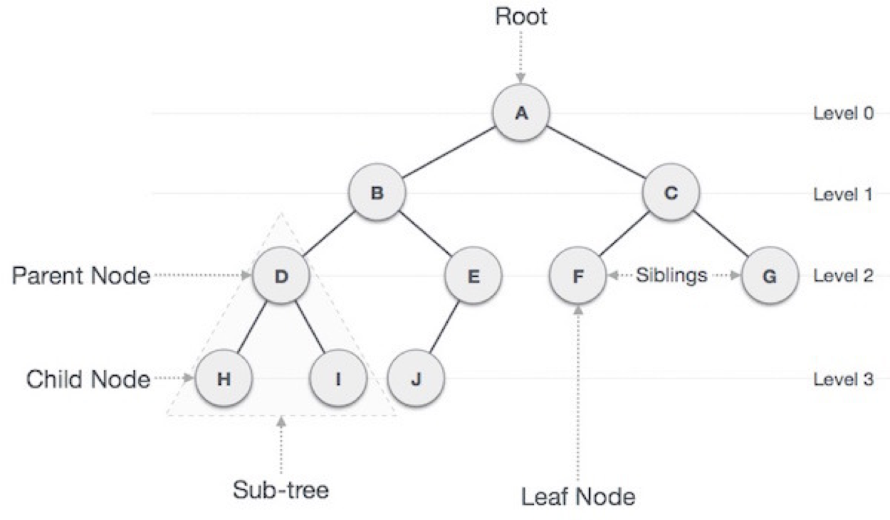

# 뷰
사용자에게 접근이 허용된 자료만을 제한적으로 보여주기 위해 하나 이상의 기본 테이블로부터 유도된, 이름을 가지는 가상 테이블
- 가상 테이블이기에 물리적으로는 구현되어있지 않음
- CREATE VIEW 뷰이름 [열이름] AS SELECT 문
```sql
-- 뷰 생성
CREATE VIEW vw_Book
AS SELECT *
FROM Book
WHERE bookname LIKE "%축구%"

-- 뷰 수정
CREATE OR REPLACE VIEW 뷰이름 (custid,name,address)
AS SELECT custid,name,address
FROM Customer
WHERE address LIKE '%영국%'

--- 뷰 삭제
DROP VIEW 뷰이름
```

# 파티션
대용량의 테이블이나 인덱스를 작으 논리적 단위인 파티션으로 나누는 것
- 데이터 처리는 `테이블 단위`, 데이터 저장은 `파티션 단위`
## 파티션의 종류
- 범위 분할(range partitioning)
  - 지정한 열의 값의 기준으로 분할
  - 분할 키 값이 범위 내에 있는지 여부로 구분
- 해시 분할(Hash partitioning)
  - 해시 함수의 값에 따라 파티션에 포함할지 여부 결정(해시 함수를 적용한 결과에 따라)
  - 데이터를 고르게 분할 할 때 사용
  - 특정 데이터가 어디에 있는지 찾을 순 없음
- 조합 분할(Composite partitioning)
  - 범위 -> 해시
--- 
## 분산 데이터베이스의 목표
1. 위치 투명성
   - 액세스 하려는 데이터 베이스의 물리적 위치 알 필요 x , 논리적 위치만 필요 
2. 중복 투명성
   - 동일 데이터가 중복이어도 하나만 존재는 것처럼 사용, 시스템은 자동으로 여러 자료에 대해 작업 
3. 병행 투명성
   - 분산 데이터와 관련된 다수의 트랜잭션들이 동시에 실현되더라고 그 트랜잭션의 결과는 영향을 받지 않음
    (db가 여러개라 하나의 db에 여라 사람이 들어가서 작업해도 이상이 없음)
4. 장애 투명성
   - 트랜잭션, dbms, 네트워크, 컴퓨터 장애에도 불고하고 트랜잭션을 정확히 처리

## RTO/RPO
RTO (recovery time objective): 비상사태 또는 업무 중단 시점으로부터 복구되어 가동될 때까지의 소요 시간( ex 장애 발생후 6시간 이내 복구 가능)
RPO (recovery point objective) : 비상사태 또는 엄무 중단 시점으로부터 데이터를 복구할 수 있는 기준점을 의미 (ex 장애 발생 전인 지난 주 금요일에 백업시켜 둔 복원 시점으로 복구 가능)  

# 암호화
암호화, 복호화 : 각각 평문을 암호로, 암호문을 평문으로
    - 개인키 암호 방식(private keyu encryption)
      - 
    - 공개키 암호 방식(public key encryption)
## 임의 접근통제DAC(Discretionary Access Control)
데이터에 접근하는 사용자의 신원에 따라 접근 권한을 부여 
- 임의란 말은 `소유자(중앙이 아님)`는 자신의 판단에 의해서 권할을 줄 수 있다는 의미
- 사용이 간편하여 윈도우등 대부분의 운영체제의 기본 접근 통제 모델
- 사용자의 권한을 탈취당하면 사용자가 모든 객체의 접근 권한을 가질 수 있게 되는 치명적인 문제
## 강제 접근통제MAC(mandatory access control)
주체와 객체의 등급을 비교하여 접근 권한을 부여하는 방식
- 양자의 보안 등급을 비교해 높은 보안을 요하는 객체가 낮은 수준의 보안을 가진 주체에게 노출되지 않도록 접근하는 방법
- 시스템이 접근통제 권한 지정
## 역할기반 접근통제RBAC(role based access control)
사용자의 역할에 따라 접근을 통제하는 방식
- 관리자는 사용자에게 특정한 권리와 권한이 정의된 역할을 할당한다.
- 역할할당은 중앙에서 관리
- 권한을 사용자 개인이 아닌 역할 그룹에 부여, 사용자에게 역할을 할당하여 접근 제어 한 방식
- 다중 프로그래밍 환경에 최적화
# 스토리지
대용량의 데이터를 저장하기 위해 저장장치를 연결하는 기술
- DAS(Direct Attached Storage)
   서버와 저장장치를 전용케이블로 직접 연결하는 방식  
   다른서버에서 접근하거나 파일을 공유할수 없음  
- NAS(Network Attached Storage)
  서버와 저장장치를 네트워크를 통해 연결
  - Ethernet 스위치를 통해 다른 서버에서도 스토리지에 접근할 수 있다.  
- SAN(Storage Area Network)
  DAS의 빠른 처리와 NAS 파일 공유 장점을 혼합한 방식, 서버와 저장장치를 연결하는 전용 네트워크를 별도로 구성하는 방식  
  - 여려개의 스토리지를 하나의 전용 네트워크로 연결시키는 방식  
  - SAN은 여러대의 스토리지, 서버들을 중계역할하는 장비, 광케이블을 통해 SAN 스위치와 연결하여 데이터를 주고 받는다.
  - 광케이블을 사용하여 데이터에 접근이 빠르다. 성능에 따라 용량 확장에 용이하다.     


# 자료구조
- 선형구조 : 배열, 선형 리스트(연속 리스트, 연결 리스트), 스택, 큐, 데크
- 비선형 구조 : 트리, 그래프
## **선형 구조**
## 배열
크기와 형(TYPE)이 동일한 자료들이 `순서대로` 나열된 자료의 집합
- 반복적인 데이터 처리 작업에 적합
- 기억장소의 추가가 어렵다.

## 스택
리스트의 한쪽 끝으로만 자료의 삽입, 삭제 작업이 이루어지는 자료구조
- 후입선출 방식
- 꽉찬 상태에서 저장할 시 오버플로 발생
- 삭제할 데이터가 없는 상태에서 삭제하면 언더플로 발생
## 큐
선입 선출, 한쪽에서는 삽입작업, 다른 한쪽에서는 삭제 작업
- 시작을 표시하는 `프런트 포인터`, 끝을 표시하는 `리어 포인터`
## **비선형 구조**
## 그래프
정점(노드 or vertex)과 간선(링크 or edge)의 두 집합으로 이루어지는 자료 구조 , 정점간의 관계를 나타내기도 함
- 사이클이 없는 그래프를 `트리`라고 함 ( 트리는 부모, 자식의 개념이 있음 즉, 순환하지 않음)
- 간선의 방향성 유무에 따라 `방향 그래프` or `무방향 그래프`
  - 방향그래프의 최대 간선 수: n(n-1) 방향을 구분하기 때문에 더 많다. 즉, 서로 이어진 간선이 방향에 따라 다른 것이니까
  - 무방향 그래프의 최대 간선 수 : n(n-1)/2 

## 트리
정점(node, 노드)과 선분(branch, 가지)를 이용하여 사이클이 없는 그래프

- 기억 공간을 `노드`라 하고 노드 사이를 연결하는 선을 `링크`라고 한다.
- 이진트리 : 각 노드의 차수가 2 이하인 트리
- 편향트리 : 모든 노드들이 하나의 자식만 가지는 트리 (왼쪽 편향트리, 오른쪽 편향트리 <- 자식을 가지는 방향에 따라)
- 관련용어
  - 노드 : 트리의 기본 요소, 키 값또는 하위 노드에 대한 포인터를 가지고 있음
  - 근 모드(root node) : 트리 맨위에 있는 노드
  - 디그리(degree, 차수) : 각 노드에서 뻗어나온 가지의 수
  - 단말 노드(terminal node) = 잎 노드 (리프노드, leaf node) : 자식이 하나도 없는 노드, 디그리가 0
  - 레벨(level) : 근 노드가 1, 그 의 자식노드는 L+1
  - 깊이(depth,height) : tree에서 노드가 가질 수 있는 최대의 레벨 ( 위 트리의 깊이는 4)
  - 숲(forest) : 여러 개의 트리가 모여 있는 것
  - 트리의 디그리 : 노드들의 디그리 중에서 가장 많은 수

  ## **트리의 운행법**   
  트리를 구성하는 노드들을 찾아가는 방법
  **이진트리 운행법**
  루트의 위치에 따라 명명(preorder, inorder, postorder -> 루트가 맨앞, 중간, 뒤)
  
  - Preorder 운행법 : Root -> Left -> Right  
    `12485367` 
  - Inorder 운행법 : Left -> Root -> Right  
    `84251637`
  - Postorder 운행법 : Left -> Right -> Root  
    `8456731`
    -> 자식노드의 부모를 맨 마지막으로 탐색    
  ### 산술식 계산
  산술식을 계산하기 위해 기억공간에 기억시키는 방법으로 이진 트리를 많이 사용한다. 이진트리로 만들어진 수식을 인오더 , 프리오더, 포스트오더로 운행하면 각각 중위(infix), 전위(prefix), 후위(postfix) 표기법이 된다.  
  - infix 표기를 prefix로 바꾸기
    1. 연산 우선순위에 따라 괄호로 묶고
    2. 해당 연산자를 해당 괄호의 바로 앞 으로 옮긴다.
    3. 필요없는 괄호를 제거한다.
  - infix 표기를 post 픽스로 바꾸기
    - 위 과정의 에서 괄호를 뒤로 옮긴다.
  - postfix로 표기된 수식을 infix로 바꾸기
    그냥 infix -> 에서 postfix로 바꾸는 방식을 리버스로 하면 된다.
    1. 인접한 피연산자 두 개와 외른쪽 연산자를 괄호로 묶는다.
    2. 연산자를 해당 피연자의 가운데로 기동시킨다
    3. 필요없는 괄호를 제거한다.         
     


  
    

