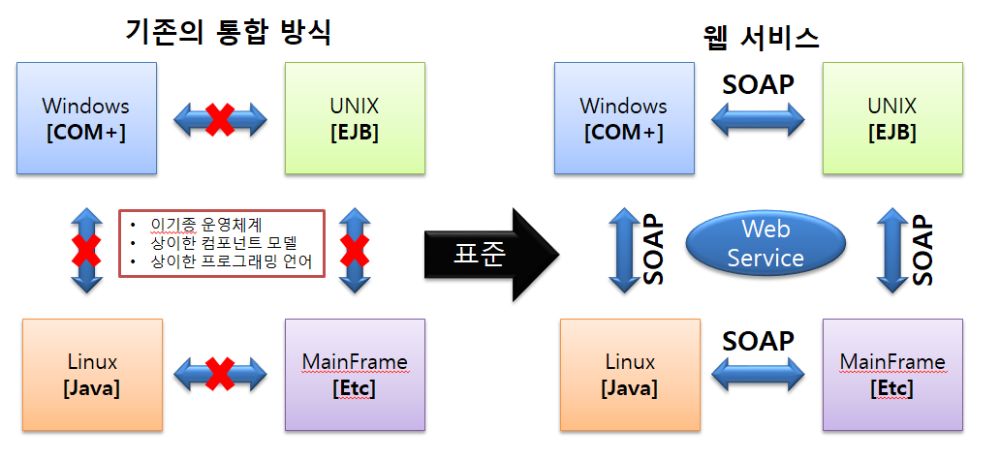
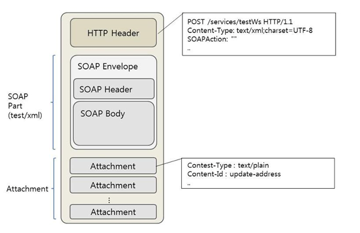

# 통합구현
단위 모듈간 연계와 통합을 통하여 사용자의 요구사항을 수용하고, 새로운 서비스 추가를 위한 절차

1. 송,수신 시스템과 모듈
2. 중계 시스템
3. 연계 데이터
4. 네트워크

## 연계 메커니즘
1. `송신 시스템`  : 데이터 생성, 전송
2. `수신 시스템` : 데이터 수신 및 운영 db반영  
으로 이루어짐

- 송, 수신 시스템 사이에는 송,수신과 송,수신 시스템 현황을 모니터링하는 중계 시스템을 설치 할 수 있다.
- 연계 매커니즘  
  - `송신 시스템 및 송신 모듈`   
   1. 연계 데이터 생성 및 추출 
      - 데이터베이스와 애플리케이션으로부터   
   2. 코드 매핑 및 데이터 반환
      - 수신 시스템의 코드로 매핑 및 반환, 데이터 타입이 상이하면 데이터 변환 작업을 수행 
   3. 인터페이스 테이블 또는 파일 생성(xml, csv, text 등으로)
   4. 연계 서버 또는 송신 어댑터
      - 송,수신 시스템 둘 중 한곳에만 설치, 연께 테이블의 데이터를 전송 형식 변환, 대상관리 등 송수신과 관련된 모든 처리를 수행
      - 연계 서버가 없으면 연계 데이터가 송수신 시스템의 운영 서버에 모듈을 구현하여 인터페이스 데이터를 전송 형식으로 변환, 송신 등의 역할을 수행한다.
   5. 전송
    - `수신 시스템 및 수신 모듈`
   6. 연계 서버 또는 수신 어댑터
       - 연계서버 : 데이터를 전송 형식에 맞게 변환, 송 수신을 수행하는 등 송, 수신과 관련된 모든 처리
   7. 인터페이스 테이블 또는 파일 생성
   8. 코드 매핑 및 데이터 변환
   9.  운영 db에 연계 데이터 반영  
    
    > 인터페이스 테이블? 중간 테이블로 데이터를 직접 다루는 것을 방지해준다. 인터페이스 테이블에서 변경된 데이터는 인증을 거쳐 베이스 테이블(실제 테이블)로 반영이 된다. 
## 연계 메커니즘의 연계 방식
- 직접 연계 방식
  - 중간 매개체 없이 송,수신 시스템이 직접 연계하는 방식
  - ex ) db link, api/open, db connection, jdbc
- 간접 연계 방식
  - 중간에 매개체가 있음
  - 연계 솔루션, esb, 소켓, 웹 서비스 등
## 연계 테스트
1. 연계 테스트 케이스 작성
2. 연계 테스트 환경 구축
3. 연계 테스트 수행
4. 연계 테스트 수행 결과 검증
## 연계 데이터 보안
- 연계 데이터는 보안에 취약 할 수 있다.
- 일반적인 보안 방식
  - `전송 구간 보안` : 암호화 기능이 있는 프로토콜을 사용  
  -` 데이터 보안` : 송신 시스템에서 연계 데이터 추출할 때와 수신 시스템에서 데이터를 반영 할 때 데이터를 암호화, 복호화 하는 것

## 웹서비스
웹서플리케이션 서비스와는 다르다. api서버와 유사하게 올바른 요청에 대한 답변을 준다. 웹서비스는 애플리케이션들이 플랫폼과 프로그래밍 언와는 독립된 방식으로 통신할 수 있도록 표준 xml 메세지를 통해서 네트워크로 접근될 수 있는 operation들을 기술하는 소프트웨어 인터페이스이다. soap나 wsdl 같은 표준으로 상호작용이 이루어 진다. 
- 네트워크 상에서 상호운용 가능한 기계 간의 통신을 지원하도록 설계된 소프트웨어 시스템 
 
## XML
특수한 목적을 갖는 마크업 언어를 만드는 데 사용되는 다목적 마크업 언어. 마크업언어를 만드는 데 쓰이기에 메타언어 이다.
- 웹브라우저간 html 문법이 호환되지 않는 문제와 sgml(옛날 마크업 언어의 복잡성 해결을 위해 만들어짐
- 사용자가 직접 태그 정의 가능, 다른 사용자가 정의한 태그 사용 가능
- 트리 구조, 상위 태그는 여러개의 하위 태그를 가질 수 있음
## SOAP(simple object access protocol)

네트워크 상에서 http/https, smtp 등을 이용하여 xml을 교환하기 위한 통신 규약
  
- 온라인 데이터 전송 방식 (api를 구축하는 방법을 정의)
- 웹 서비스에서 사용되는 메시지의 형식과 처리 방법을 지정
- 전송 매체로서 http를 사용 따라서, 프록시와 방화벽의 영향 x(즉, 전송 프로토콜이 http, stmp 등등)
- envelope/header/body 구조를 따라 xml 형식으로 메시지가 전달
- 최근에는 RESTful 프로토콜 사용 
 

 ## WSDL(Web Service Description Language)
웹서비스 간에 교환되는 메시지 포맷과 데이터 타입, 그리고 전송 방식에 대한 정보를 기술할 수 있는 언어
- 특정 비즈니스가 제공하는 서비스를 설명, 클라이언트가 서비스에 접근할 수 있는 방법을 제공
- xml로 작성 uddi의 기초
- soap, xml 스키마와 결합하여 인터넷에서 웹 서비스를 제공하기 위해 사용
- 클라이언트는 wsdl 파일을 읽어 서버에서 어떠한 조작이 가능한지 파악 가능
- 따라서 클라이언트는 wsdl 정보를 해석하면 soap를 통해 해당 서비스에 필요한 객체를 실행할 수 있음

   