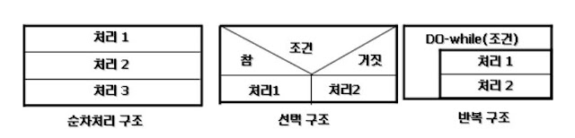
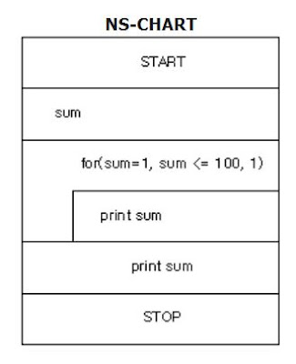
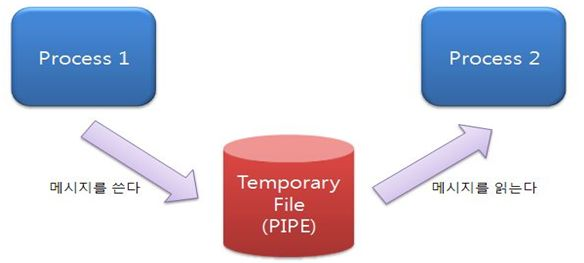

# 모듈

모듈화를 통해 분리된 시스템의 각 기능
- 서브루틴, 서브시스템, 소프트웨어 내의 프로그램, 작업 단위 등을 의미
- 독립성은 결합도와 응집도에 의해 측정 됨
 

## 결합도
모듈 간에 상호 의존하는 정도
- 결합도가 약할 수록 품질 good, 강할수록 품질 bad  
 
    <span style="color:orange">강함</span> 
1. 내용 결합도
   - 한 모듈이 다른 모듈의 내부 기능 및 그 내부 자료를 직접 참조하거나 수정 할 떄
   - 한 모듈과 다른 모듈이 일부를 공유하는 모듈 결합 방식
   - 다른 모듈 내의 외부에 선언되지 않은 데이터를 직접 참조하거나, 명령의 일부를 공유하는 경우
   ```java
    // Java program to illustrate
    // tight coupling concept
    class Subject {
        Topic t = new Topic();
        public void startReading()
        {
            t.understand();
        }
    }
    class Topic {
        public void understand()
        {
            System.out.println("Tight coupling concept");
        }
    }
   ```
    여기서 Subject 클래스는 Topic 클래스에 의존한다. Topic 클래스에 있는 understand()를 직접 참조하기 때문이다.  
    `만약 Topic 클래스의 understand()가 gotit()으로 이름이 바뀐다면?` Subject 클래스에 있는 startReading()을 수정해야 할 것이다. 강한 결합도의 문제점이다.  
    변수를 직접 참조하는 경우  getter와 setter를 통해 해결하기도 한다. 
    ```java
    public class CouplingExample {
    public static void main(String[] args) {
        ContentCoupling contentCoupling = new ContentCoupling();
        contentCoupling.setAge(20);
     }
    }
    public class ContentCoupling {
        private String ageLived;
        public int getAge() {
            return Integer.parseInt(ageLived);
        }
        public void setAge(int age) {
            this.ageLived = String.valueOf(age);
        }
    }
    ```
    위 코드에서는 ContentCoupling 클래스의 변수 ageLived의 이름을 바꾸더라고 CouplingExample의 코드는 바꾸지 않아도 된다. 단지 ContentCoupling의 메소드를 수정해야 할 뿐이다.
2. 공통 결합도
   - 공유되는 공통 데이터 영역을 여러 모듈이 사용할 때의 결합도
   - static 타입 사용은 캡슐화에 반하는 것
   ```java
   public class CommonCouplingA {
    private static int counter;

    public static int getCounter(){
        return counter;
    }

    public static void setCounter(int counter) {
        CommonCouplingA.counter = counter;
    }
   }

   public class CommonCouplingB{
    public void incrementCounter(){
        int counter = CommonCouplingA.getCounter();
        CommonCouplingA.setCounter(counter++);
    }
   }
   ``` 
위 코드에서는 CommonCouplingB 클래스가 CommonCouplingA 클래스의 변수인 counter를 증가시키고 있다. static변수이기에 인스턴스화 할 필요없이 CommonCouplingA 이용하여 counter에 접근하고 있다. 이렇게 되면 CommonCouplingA의 새로운 인스턴스를 만들더라도 그 인스턴트 자체에 바인딩된 데이터가 아니게 된다. 즉, 인스턴스만의 값을 가질 수 없게 된다.  
이를 해소 하기 위해 인스턴스화 된 클래스 객체를 던져줄 수있다
```java
public class CommonCouplingA {
    private int counter;

    public int getCounter() {
        return counter;
    }

    public void setCounter(int counter) {
        this.counter = counter;
    }
}

public class CommonCouplingB {
    private CommonCouplingA commonCouplingA;
    public CommonCouplingB(CommonCouplingA commonCouplingA) {
        this.commonCouplingA = commonCouplingA;
    } //생성자로 CommonCOuplingA의 인스턴스를 준다.
    public void incrementCounter() {
        int counter = commonCouplingA.getCounter();
        commonCouplingA.setCounter(counter++);
    }
   }

public class CouplingExample {
    public static void main(String[] args) {
        CommonCouplingA commonCouplingA = new CommonCouplingA();
        commonCouplingA.setCounter(10);
        CommonCouplingB b = new CommonCouplingB(commonCouplingA);
        b.incrementCounter(); // 
    }
}
```
   
3. 외부 결합도  
어떤 모듈에서 선언한 데이터(변수)를 외부의 다른 모듈에서 참조할 때의 결합도 
5. 제어 결합도
   - 어떤 모듈이 다른 모듈 내부의 논리적인 흐름을 제어하기 위해 제어 신호나 제어 요소를 전달하는 결합도 
```java
public class ClassA {
    public void method() {
    CouplingExample couplingExample = new CouplingExample();
        couplingExample.methodA("A");
    }
}

public class CouplingExample {
    public void methodA(String arg) {
        if (args[0].equals("A")) {
            PrintA printA = new PrintA();
            printA.print();
        } else {
            PrintB printB = new PrintB();
            printB.print();
        }
    }
}
```
- 위 코드에서는 ClassA가 CouplingExample 클래스의 메소드 흐름을 결정하고 있다.  
5. 스탬프 결합도
- 모듈에서 다른 모듈로 배열이나 레코드 등의 자료구조가 전달될 때(파라미터)   
```JAVA
public class StampCouplingA {
    private int[] array = {1, 2, 3, 4, 5};
    StampCouplingC c = new StampCouplingC();
    StampCouplingB b = new StampCouplingB();
    pulic void start(){
        b.callB(array,c);
    }
}

public class StampCouplingB {
    public void callB(int[] array, StampCouplingC c){
        System.out.println("Array length : " + array.length);
        System.out.println("Name : " + c.getName());
    }
}

public class StampCouplingC{
    private String name = "parikshith";
    public String getName() {
        return name;
    }
}
``` 
위 코드에서는 StampCouplingB 클래스에 array와 StampCouplingC 객체를 보냃 수 있다. 그러나 B에서는 length() 메소드와 C 클래스의 메소드를 사용 사용하고 있다.

```java
    public class StampCouplingA {
    private int[] array = {1, 2, 3, 4, 5};
    StampCouplingC c = new StampCouplingC();
    StampCouplingB b = new StampCouplingB();
    public void start() {
        b.callB(array.length, c.getName());
    }
}

public class StampCouplingB {
    public void callB(int length, String name ) {
        System.out.println("Array length: " + length);
        System.out.println("Name: " + name);
    }
}

public class StampCouplingC {
    private String name = "Parikshith";
    public String getName() {
        return name;
    }
}
```

위 코드는 스탬프 결합도를 해소한 것이다. 자료 구조가 아닌 필요한 원시 타입의 자료를 보내면서 callB()를 호출하고 있다. 즉, 파라미터가 많지 않을 경우 최소한의 형태로 데이터를 넘겨야 한다.  

6. 자료 결합도  
  모듈 간의 인터페이스가 자료 요소로만 구성될 때의 결합도
```java
public class DataCoupling {
    int numberA = 1;
    int numberB = 2;
    int numberC = 3;
    boolean allNumbersSet = true;
    Printer printer = new Printer();
    public void caller() {
        printer.print(numberA,numberB,numberC,allNumberSet);

    }
}

public class Printer{
    public void print(int numberA, int numberB, int numberC, boolean allNumberSet){
        System.out.println("Number A:" + numberA)
        System.out.println("Number B:" + numberB)
        System.out.println("Number C:" + numberC)
        System.out.println("All numbers set?" + allNumbersSet)
    }
}

```

위 코드에서는 네 개의 파라미터가 전달 된다. 이렇게 전달되는 파라미터가 많은 경우 배열을 이용하여 스탬프 결합도로 만드는 것이 바람직 할 수도 있다. print() 메서드를 잘게 나누어 받는 파라미터 수를 줄이는 것도 방법이다.
> 내공외제스자  


## 응집도
- 모듈 내부 요소들이 서로 관련 되어 있는 정도
- 응집도가 강할수록 좋다.  
`강함` 
1. 기능적 응집도(Functional Cohesion)
   - 모듈 내의 기능 들이 하나의 기능과 연간되어 있을 때 
2. 순차적 응집도(sequential Cohesion)
   - 모듈 내 하나의 활동으로부터 나온 출력 데이터를 그 다음 활동의 입력 데이터로 사용할 경우
   - 하나의 컴포넌트에서 나온 출력이 다음 컴포넌트의 입력이 될 때
   - ex 데이터를 데이터베이스에서 가저오는 과정
     1. sql을 사용해 결과 셋을 얻는다
     2. 결과 셋을 prepare 한다.
     3. 결과 셋을 return 한다.  
     -> 이 모든 과정이 순차적으로 앞 과정의 출력을 이용하여 이루어지고 있음, 순차적으로 진행되어야 성공적으로 실행이 되는 것   
3. 교환적 응집도(Communication Cohesion)
    동일한 입력과 출력을 사용하여 서로 다른 기능을 수행하는 구성 요소들이 모였을 경우 응집도
    - 각각의 컴포넌트가 같은 출력과 입력 정보를 사용하여 다른 기능을 하는 것이다.
    - 예를 들면, 기본 키를 이용하여(입력) 책 정보를 검색을 할 때, 책의 가격, 작가, 타이틀 등 여러 정보를 얻을 수 있다. 하나의 데이터 (기본 키)를 이용하여 책의 가격을 얻던지, 작가 정보를 얻던지 등등 여러가지 기능을 할 수 있달 이럴 경우 같은 데이터(기본 키)를 사용하여 각각 다른 작업을 할 수 있는 요소들이 모여 있는 것이다.
5. 절차적 응집도(Procedural Cohesion)
모듈이 다수의 관련 기능을 가질 때 모듈 안의 구성 요소들이 그 기능을 순차적으로 수행할 경우
   - <sapn style="color : green">sequential cohesion과 다른점? 순차적 응집도에서는 한 컴포넌트의 결과 데이터를 이용하여 다음 컴포넌트를 실행한다. 즉, 앞의 컴포넌트의 결과를 사용하기 때문에 순서가 지켜지지 않으면 기능이 성공적으로 실행되지 못한다.반면, 절차적 응집도의 경우는 기능의 순서이다. 앞선 컴포넌트에서 나온 데이터를 활용하는 것이 아닌, 어떤 작업을 수행하려면 실행되어야하는 기능들이 순차적으로 연결되 있는 것이다. 데이터를 매개로 서로 묶여 있나, 아니면 기능을 매개로 서로 묶여있나의 차이인 것이다.</span>
    <span style="color:orange">하나의 기능을 위해 데이터들이 순차적으로 움직이냐 or 여러 기능들이 순차적으로 실행되어 어떤 기능을 하느냐</span>
   
7. 시간적 응집도(temporal cohesion)  
특정 시간에 처리되는 몇 개의 기능을 모아 하나의 모듈로 만든 것   
   - 대표적으로 initialization, stop, clean 메소드가 있다. 위 메소드들는 특정 시점에 실행되는 메소드들이다. 이 메소드에서 수행 되는 기능들은 시간적 응집도를 가진다.

1. 논리적 응집도  
다른 기능을 가지더라도 같은 유형의 문제를 처리하는 컴포넌트들, 특정 형태로 분류되는 요소들이 하나로 묶임.기능이 다르더라도 논리적으로 봤을 때 공통점이 있는 것들 끼리 묶이는 것   
예를 들면 `수학 연산`이 있다. 수학의 기호들은 다양한 기능을 하지만 수학이라는 하나의 클래스로 묶인다.
11. 우연적 응집도  
    - 랜덤으로 요소들이 결합 한것   
 `약함` 


## 팬인/ 팬아웃
- 팬인(Fan-In) : 어떤 모듈을 제어하는 모듈의 수
- 팬아웃(Fan-Out) : 어떤 모듈에 의해 제어되는 모듈의 수
- 팬인은 높게, 팬아웃은 낮게

## N-S 차트
- 논리의 기술에 중점을 두고 도형을 이용해 표현하는 방법  


- goto나 화살표를 사용하지 않음
- 연속,선택 및 다중 선택, 반복의 3가지 제어 논리 구조로 표현
- 조건이 복합되어 있는 곳의 처리를 시각적으로 명확하게 식별하는데 적합ㅓㅓ

## 단위 모듈
소프트웨어 구현에 필요한 여러 동작 중 한 가지 동작을 수행하는 기능을 모듈로 구현한 것
- 단위 기능 명세서 작성 -> 입,출력기능 구현 -> 알고리즘 구현

## IPC(Inter-Process Communication)
모듈 간 통신 방식을 구현하기 위해 사용되는 대표적인 프로그래밍 인터페이스 집합
- 복수의 프로세스를 수행, 이뤄지는 프로세스 간 통신까지 구현 가능
- 운영체제 상에서 실행 중인 프로세스 간에 정보를 주고받는 것
- 운영체제는 자기 프로세스에 할당 메모리에만 접근하도록 강제하기 때문에 서로 다른 프로세스의 데이터를 공유하기 위해 쓰이는 것
- ipc의 대표메서드
  1. 공유 메모리
     - 프로세스간 공유되는 메모리 영역을 만들어 사용 
  2. 소켓
  3. 세마포어 (Semaphores)
     - 공유 메모리를 사용하는 프로세스에게 동작의 순서를 지정 해줌
       
  4. 파이프와 네임드 파이프(Pipes& named Pipes)
     - 파이프는 여러개의 프로세스가 공통으로 사용하는 임시공간 
     - 통신을 위한 공통 메모리 공간(버퍼)를 생성
      
  5. 메세지 큐잉 
     - 커널에서 전역적으로 관리(전역변수 형태)
     - 생산자 컴포넌트가 메시지를 메시지 큐에 남기고 그것을 소비자가 사용하는 형태
     - 하나의 소비자에 의해 한번만 처리가능 


## 테스트 케이스
구현된 소프트웨어가 사용자의 요구사항을 정확하게 준수했는지를 확인하기 위한 테스트 항목에 대한 명세서 이다.
- ISO/IEC/IEEE 29119-3 표준에 따른 테스트 케이스의 구성요소
  - 식별자: 항목 식별자, 일련번호
  - 테스트 항목 : 테스트 대상(모듈 또는 기능)
  - 입력 명세 : 테스트 데이터 또는 테스트 조건
  - 출력 명세 : 테스트 실행시 예상되는 결과
  - 환경 설정 : 필요한 하드웨어나 소프트웨어의 환경
  - 특수 절차 요구 : 테스트 케이스 수행 시 특별히 요구되는 절차
  - 의존성 기술 : 테스트 케이스간 의존성 

## 공통 모듈 명세 기법의 종류
공통 모듈? 여러 프로그램에서 공통으로 사용할 수 있는 모듈 따라서 정확한 사용법을 안내해야 한다.
- 정확성(Correctness) : 시스템 구현 시 해당 기능이 필요하다는 것을 알 수 있도록 정확히 작성함
- 명확성(Clarity) : 해당 기능을 이해할 때 중의적으로 해석되지 않도록 명확히 작성
- 완전성(Completeness) : 시스템 구현을 위해 필요한 모든 것을 기술
- 일관성(COnsistency) : 공통 기능들 간 상호 충돌이 발생하지 않도록 작성
- 추적성(Traceability) : 기능에 대한 요구사항의 출처, 관련 시스템 등의 관계를 파악할 수 있도록 작성
> 정명완 일추

## 재사용
이미 개발된 기능들을 새로운 개발에 사용하기 위해 최적화하는 작업
- 재사용 규모에 따른 분류
  - 함수와 객체 : 클래스나 메소드 단위의 소스 코드 재사용
  - 컴포넌트 : 컴포넌트 자체에 대한 수정 없이 인터페이스를 통해 통신하는 방식으로 재사용
  - 애플리케이션 : 공통된 기능들을 제공하는 애플리케이션을 공유하는 방식으로 재사용

## 코드의 주요기능
코드는 자료의 분류, 조합, 집계, 추출을 용이하기 위해 사용하는 기호
    - 식별 기능 : 데이터 간의 성격에 따라 구분이 가능함
    - 분류 기능 : 특정 기준이나 동일한 유형에 해당하는 데이터를 그룹화 할 수 있음
    - 배열 기능 : 의미를 부여하여 나열 가능
    - 표준화 기능 : 다양한 데이터를 기준에 맞추어 표현 가능
    - 간소화 기능 : 복잡한 데이터를 간소화할수 있음

## 코드의 종류
1. 순차 코드  
   일정 기준에 따라 일련번호 부여 

2. 블록 코드
   공통성이 있는 것끼리 블록으로 구분, 각 블록 내에서 일련 번호 부여  
   ex) 사번 : [부서코드] + [입사 일련번호]   
   1001~1100 : 총무부, 1101 ~ 1200 : 영업부
3. 10진 코드  
    ex) 1000 공학, 1100 소프트웨어 공학, 1110 소프트웨어 설계
5. 그룹 분류 코드
    일정 기준 따라 대,중,소 분류등으로 구분하고 각 그룹안에서 일련번호 부여  
    ex )1-01-001 : 본사 총무 인사계, 2-01-001 : 지사 - 총무부 - 인사계
7. 연상 코드
   - 코드화 대상 항목과 관계있는 숫자나 문자를 이용하여 코드 부여  
   - tv-40 : 40인치 티비, l-15-220 : 15w 220v의 램프(lamp) 
8. 표의 숫자 코드
   - 대상 항목의 성질, 물리적 수치를 코드에 적용(유효 숫자 코드)
   -  120-720-1500 : 두께x폭x길이가 120x720x1500 인 강판 
9.  합성 코드
    - 2개 이상의 코드를 합침
    - 연상코드 + 순차 코드 : ke - 711 대한항공 711 기 , ac -253 에어캐나다 253기   
