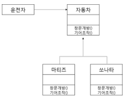

# 개발 환경 구축
개발 프로젝트를 이해하고 소프트웨어 및 하드웨어 장비를 구축하는 것
## 하드웨어 환경
**클라이언트** : 사용자와의 인터페이스 역할 (ex. pc,스마트폰 등)  

**서버** : 클라이언트와 통신하여 서비스를 제공하는 서버
- 웹서버
- 웹 애플리케이션 서버(was)
- 데이터베이스 서버
- 파일 서버


## 소프트웨어 환경
- 시스템 소프트웨어 종류 : 운영체제, 웹서버 및 was운용위한 프로그램, dbms
- 개발 소프트웨어(개발 할때쓰는) : 요구사항 관리 도구, 모델링 도구, 구현 도구, 빌드 도구, 테스트 도구, 형상 관리도구 등등


## 웹 서버의 기능
- http,https 지원
- 통신 기록(communication log)
- 정적 파일 관리(managing static files) : html , css, 이미지 등 파일 관리
- 대역폭 제한 (bandwidth throtting) : 트래픽 포화 방지위한 응답 속도 제한
- 가상 호스팅(virtual hosting) : 하나의 서버로 여러 개의 도메인 이름 연결
- 인증 ( authentication) : 사용자가 합적적인 사용자인이 확인

## 개발 언어 선정기준
1. 적정성(개발하려는 소프트웨어의 목적에 적합)
2. 효율성(코드 작성 및 구현이 효율적이여야함)
3. 이식성(다양한 환경 적용 가능)
4. 친밀성(개발자들의 이해도와 활용도가 있어야함)
5. 범용성(다른 개발 사례가 존재하고 여러 분야에서 쓰여야함)

# 소프트웨어 아키텍쳐
소프트웨어를 구성하는 요소들 간의 관계를 표현하는 시스템의 구조 또는 구조체
- 애플리케이션의 분할 방법과 분할된 모듈에 할당될 기능, 모듈 간의 인터페이스 등을 결정
- 기본 원리는 `모듈화, 추상화, 단계적 분해, 정보은닉` 이 있다.
## 모듈화
재사용, 유지관리, 성능향상 목표로 시스템의 기능들을 모듈 단위로 나누는 것. `모듈 간 결합도 최소화, 모듈 내 요소들의 응집도 최대화`
## 추상화
전체적이고 포괄적인 개념부터 먼저 설계 이 후 세분화하여 구체화 시켜나가는 것

- 과정 추상화 :  자세한 단계를 고려하지 않고 상위 수준에서 `수행 흐름`만 먼저 설계
- 데이터 추상화 : 데이터 구조를 대표할 수 있는 표현으로 대체하는 것(ex. 날짜 구조를 단순히 `날짜`로 추상화)
- 제어 추상화 : 3-a 와 3-b를 `3.윤년 여부에 따라 요일 계산을 수행한다`로 추상화 하는 것

## 단계적 분해
하향식 설계 전략, 문제를 상위의 중요 개념으로부터 하위의 개념으로 구체화시키는 분할 기법

- 탑다운 방식, 상위 개념 부터 더 구체적인 단계로 분할
- 문제를 하위 수준을 독립된 단위로 나눈다
- 구분된 문제의 자세한 내용은 가능한 뒤로 미룬다
- 점증적으로 구체화 작업을 계속한다.
- 추상화를 위에서 아래로 계속 반복하는 것이라고 볼 수 있다.

## 정보 은닉
한 모듈 내부에 포함된 절차와 자료들이 정보가 감추어져 다른 모듈이 접근하거나 변경하지 못하도록 하는 기법  
- 추상화 > 단계적 분해 > 정보은닉
- 각각의 모듈이 서로 인터페이스를 통해서만 접근 할 수 있도록 허락한다.
- 예를들어 실제 메소드는 어떻게 작동하는지 그 코드는 숨긴체 인터페이스를 이용하여 사용한다. 어떻게 작동하는지 원리를 몰라도 사용할 수 있다.
- 모듈을 독립적으로 수행할 수 있다.
- 하나의 모듈이 변경되더라도 다른 모듈에 영향을 주지 않으므로 수정 시험 유지보수가 용이하다.
- 자바에서 private과 public 

## 상위 설계와 하위 설계
- 상위 설계
    - 아키텍처 설계, 예비 설계
    - 시스템 수준에서의 소프트웨어 구성 컴포넌트 간의 관계로 구성된 시스템의 전체적인 구조
    - 시스템 구조도, 외부파일 및 db설계도 ( 레코드 레이아웃, erd), 화면 및 출력물 레이아웃(인터페이스) 등이 포함
    
- 하위 설계  
  - 모듈 설계, 상세 설계
  - 시스템의 각 구성 요소들의 내부 구조, 동적 행위 등을 결정
  - 각 구성 요소 제어와 데이터들간의 연결에 대한 구체적인 정의를 하는 것 ( 컴포넌트, 자료 구조, 알고리즘)     
    - 설계 방법
      - 절차 기반, 자료 위주, 객체 지향  
## 소프트웨어 아키텍처의 품질 속성
소프트웨어 아키텍처가 이해 관계자들이 요구하는 수준을 충족하게끔 설계되었는지 확인하게 위한 평가 요소들
- 시스템 측면
  성능, 보안, 가용성,기능성, 사용성, 변경 용이성, 확장성 
- 비즈니스 측면
  시장 적시성, 비용과 혜택, 예상 시스템 수명, 목표 시장, 공개 일정 
- 아키텍처 측면  
  개념적 무결정, 정확성, 완결성, 구축 가능성, 변경성, 시험성 

## 협약(Contract)에 의한 설계
- 협약에 의한 설계는 컴포넌트를 설계할 때 클래스에 대한 여러 가정을 공유할 수 있도록 명세한 것
- 컴포넌트에 대한 정확한 인터페이스를 명세한다.
- 명세에 포함 될 조건
  - 선행 조건(precondition) : 오퍼레이션이 호출되기 전에 참이 되어야 할 조건
  - 결과 조건(postcondition) : 오퍼레이션 수행된 후 만족되어야 할 조건
  - 불변 조건 (invariant) : 오퍼레이션이 실행되는 동안 항상 만족되어야할 조건

# 아키텍처 패턴
아키텍처를 설계할 때 참조 할 수 있는 전형적인 해결 방식 또는 예제
- 레이어 패턴, 클라이언트-서버 패턴, 파이프-필터 패턴, 모델-뷰-컨트롤러 패턴

## 레이어 패턴
시스템을 계층화하고 하위 레이어가 제공하는 기능을 상위 레이어가 이용함으로써 각 레이어의 구조를 단순화 한다는 발상  
`각 레이어는 해당 레이어가 의존하는 직접적인 하위 레이어만 알면 됨` <span style="color:orange">즉, 서로 마주보는 두 개의 계층 사이에만 상호작용이 우러어짐</span>
- 대표적으로 osi 참조 모델이 있다.
**일반적인 웹 애플리케이션에 적용한 레이어 패턴** 
```
프리젠테이션 레이어
      V
 비즈니스 레이어
      V
데이터 액세스 레이어
``` 
프레젠테이션 레이어 : 웹 브라우저에서 사용자 입력을 받아 비즈니스 레이어에 전달, 처리 된 결과를 다시 응답  
비즈니스 레이어 : 애플리케이션에서 해야할 작업을 처리  
데이터 액세스 레이어 : 비즈니스 로직 레이어와 데이터베이스를 중개하기 위한 레이어

## 클라이언트-서버 패턴
하나의 서버 컴포넌트와 다수의 클라이언트 컴포넌트로 구성되는 패턴
- 클라이언트가 서버에 요청하면 서버는 해당 컴포넌트에 서비스를 제공
- 사용자가 클라이언트에 요청, 클라이언트는 서버로부터 받은 응답을 사용자에게 제공
## 파이프-필터 패턴

데이터 스트림 절차의 각 단계를 필터로 캡슐화하여 파이프를 통해 전송하는 패턴
- 데이터 스트림을 생성하고 처리하는 싵스템에서 사용
- 각 처리 과정은 필터 컴포넌트를 통해 이루어짐
- `파이프(pipes)`를 통해 데이터가 흐름
- 버퍼링 or 동기화 or 데이터 변환 목적으로 사용될 수 있음 
- unix의 쉘
## 모델 - 뷰 - 컨트롤러 패턴
사용자의 요청을 받으면 핵심 기능과 데이터를 가지고있는 모델을 이용하여 뷰에 정보를 출력
## 마스터 - 슬레이브
슬레이브 컴포넌트에서 처리된 결과물을 다시 돌려받는 방식으로 작업을 수행하는 패턴
- `마스터`와 `슬레이브`, 두 부분으로 구성 `슬레이브는 마스터와 동등한 역할을 함ㅓ`
- 마스터가 슬레이브 컨포넌트로 작업을 분산, 슬레이브가 반환한 값으로 최종 결과값을 계산
- 장애 허용 시스템(서비스의 실행을 여러 개의 복제된 구현들에 위임하여 각 서비스는 독립되어 장애가 생겨도 영향을 끼지지 않을 수 있음), 병렬 컴퓨팅 시스템( 복잡한 태스크를 병렬로 실행되는 일정 개수의 동일한 서브태스크로 분할, 서브태스크 처리 결과들을 마스터가 취합하여 최종결과 획득) 

## 브로커 패턴
- 컴포넌트들로 이루어진 분산 시스템에 사용
- 사용자가 브로커에 요청 -> 브로커는 그에 맞는 컴포넌트를 연결해줌
- 분산 환경 시스템


## 피어-투-피어 패턴
피어(peer)라 불리는 하나의 컴포넌트가 클라이언트가 될수도, 서버가 될 수도 있는 패턴

## 이벤트 버스 패턴

소스가 특정 채널에 이벤트 메시지를 발행하면 publish
그 채널을 구독한 subscriber 들이 메세지를 받아 이벤트를 처리
- 알림 서비스
- 주로 이벤트 소스, 이벤트 리스너, 채널, 이벤트 버스 4가지 주요 컴포넌트를 가짐
- 소스는 이벤트 버스를 통해 publish, listener는 특정 채널 subscribe

## 블랙보드 패턴
모든 컴포넌트들이 공유 데이터 저장소와 블랙보드 컴포넌트에 접근이 가능한 패턴

- 특별한 해결 전략이 알려지지 않은 문제에 유용 
- 블랙보드 : 솔루션의 객체를 포함하는 구조화된 전역 메모리
- 지식 소스 - 자체 표현을 가진 특수 모듈
- 제어 컴포넌트 (control component) : 모듈 선택, 설정 및 실행 담당
- 음성인식, 차량 식별 및 추적

## 인터프리터 패턴
프로그램 코드의 각 라인을 수행하는 방법을 지정, 기호마다 클래스를 갖도록 수성된 패턴
- 특정 언어로 작성된 프로그램을 해석하는 컴퐅넌트 설계시 주로 사용
- 문법적 규칙을 클래스화

# 객체지향
소프트웨어 각 요소들을 객체로 만든 후 객체들을 조립해서 소프트웨어를 개발하는 기법
- 구성요소 : 객체, 클래스, 메시지
- 특징 : 캡슐화, 상속, 다형성, 연관성
## 객체
데이터와 이를 처리하기 위한 함수를 묶어 놓은 소프트웨어 모듈
## 클래스
`공통된 속성과 연산을 갖는 객체의 집합`
- 각각의 객채들이 갖는 속성과 연산을 정의하고 있는 틀

> 객체 vs 클래스 vs 인스턴스?  
> 클래스는 `설계도` , 객체는 `설계도로 구현한 모든 대상` , 인스턴스는 `클래스 타입으로 선언되었을 때는 객체, 그 객체가 메모리에 할당되어 실제 사용 될때는 인스턴스`
> 객체는 현실 세계에 가깝고, 인스턴스는 소프트웨어 세계에 가깝다.

## 메시지
객체들 간의 상호작용을 위한수단, 객체의 동작이나 연산을 일으키는 외부의 요구 사항ㅓ
- 클래스를 사용하는 측에서 객체를 이용해서 코드를 호출하려는 행위를 `메세지를 보낸다` 라고 할 수 있고, 그 메세지를 수신할 방법을 정의해놓은 것이 `메소드`이다  
<span style="color:green">메세지를 수신하는 방법?</span>  다음과 같은 Person 클래스가 있고 가정해보자.
```java
public abstract class Person {
    public abstract void sleep();
}
```
이들은 구현체이다.
```java
public class Baby extends Person {
    @Override
    public void sleep() {
        System.out.println("엄마 품에서 잔다.");
    }
}

public class Student extends Person {
    @Override
    public void sleep() {
        System.out.println("책상에 엎드려 잔다.");
    }
}
```

```java
public class Main {
    public static void main(String[] args) {
        Person student = new Student();        
        student.sleep();
    }
}
```
이 클래스를 사용하는 코드이다. 우리 입장에서는 참조변수 student 가 Student 클래스를 할당 받았기에 Student 클래스의 sleep()메소드를 사용할 것이라고 알 수 있다  
하지만 컴파일러 입장에서는 Person 타입으로 업캐스팅 되었기에 컴파일러 시점에서는 어떤 sleep()을 실행 해야할지 모른다.  
런타임 시점이 되어서야 Student의 sleep() 메소드를 실행해야 한다는 것을 알게 된다.  
`즉 student 에게 sleep()이라는 메세지를 전달 했고, student의 타입인 Person 클래스는 sleep()이라는 메소드를 가지고 있으므로 메세지를 수신 할수 있고, 수신된 메세지는 런타임에 자식클래스인 Student 클래스의 sleep()이 호출 되는 것!  `  
`만약 Person 크래스에 정의되지 않은 메소드를 요청하는 메세지를 보내면 Person 클래스에는 인터페이스가 정의 되어있지 않기에 메세지를 수신할 수 없고, 컴파일러는 에러가 난다.`
> 여기서 인터페이스는 객체 간의 소통을 위한 public method를 뜻한다.
> 즉, 메시징은 객체의 구체적인 메서드를 부르는 것이 아닌 인터페이스를 통해 `추상적인 명령을 전달` 하는 것! 그리고 `runtime`에 구현된 코드를 실행 하는 것


## 캡슐화
외부에서 접근을 제안하기 위해 인터페이스를 제외한 세부 내용을 은닉하는 것
- 캡슐화 되면 외부 변경에 파급이 적다
- 객체들 간에 메시지를 주고받을 때 상대 객체의 내용은 알 필요가 없으므로 인터페스가 단순해지고 객체 간의 결합도가 낮아 진다.

## 상속
상위 클래스의 모든 속성과 연산을 하위 클래스가 물려 받는 것
- 그대로 사용하거나 overriding 하거나

## 다형성
`하나의 메시지에 대해 서로 다른 처리를 할 수있는 것 ` 
위 메시지의 예에서 Student 클래스의 sleep() 메소드를 호출한 것이 다형성이다. 같은 sleep()을 요청하는 메시지이지만 다른 방식으로 응답할 수 있다.
## 연관성  
두 개 이상의 객체들이 상호 참조하는 관계 의미
- 연관성의 종류
1. is member of  
   - 연관화  
   - 2개 이상의 객체가 상호 관련되어 있음을 의미함
   - 클래스와 객체의 참조 및 이용 관계
   - 상호의존성
   - 의미적 연결
2. is instance of
   - 분류화  
   - 동일한 형의 특성을 갖는 객체들을 모두 모아 구성하는 것  
3. is part of  
   - 집단화
   - 관련 있는 객체들을 묶어 하나의 상위 객체를 구성하는 것  
   - 상위클래스 성질이 하위클래스로 상속 x
1. is a  
   - 일반화 - 공통적인 성질들로 추상화한 상위 객체를 구성하는 것  
   - 특수화 / 상세화 - 상위 객체를 구체화하여 하위 객체를 구성하는 것


# 객체지향 분석(OOA; Object Oriented Analysis)
- 사용자의 요구사항과 관련된 객체, 속성, 연산, 관계 등을 정의하여 모델링 하는 것
- 클래스를 식별하는 것이 주요 목표

## 객체지향 분석의 방법론
- 럼바우 방법  
분석 활동을 객체 , 동적 , 기능 모델로 나누어 수행
- 부치 방법
미시적 개발 프로세스와 거시적 개발 프로세스를 모두 사용하며, 클래스와 객체들을 분석 및 식별하고 클래스의 속성과 연산을 정의]
- jacobson
유스케이스를 강조하여 사용
- Coad와 Yourdon 방법
E-R 다이어 그램 사용하여 객체의 행위를 모델링하며, 객체 식별, 구조 식별, 주제 정의, 속성과 인스턴스 연결 정의, 연산과 메시지 연결 정의 드으이 과정으로 분석함
- Wirfs-Brock 방법  
분석과 설계 간의 구분이 없고, 고객 명세서를 평가해서 설계 작업까지 연속적으로 수행


## 럼바우 분석기법
모든 소프트웨어 구성 요소를 그래픽 표기법 사용하여 모델링
- 객체 모델링 기법(OMT, Object-Modeling Technique)라고도 불림
- 분석 활동은 객체 모델링 -> 동적 모델링 -> 기능 모델링 순
    - 1. 객체 모델링
      정보모델링이라고도 함, 시스템에서 요구되는 객체를 찾아내 속성과 연산 식별 및 객체들 간의 관계를 규정하여 `객체 다이어그램`으로 표시
      2. 동적 모델링
      `상태 다이어그램 이용`, 시간의 흐름에 따른 객체들 간의 제어 흐름 상호작용 동작 순서 등의 동적인 행위를 표현 
      3. 기능 모델링
      `자료 흐름도(DFD)를 이용`, 다수의 프로세스들 간의 자료 흐름을 중심으로 처리 과정을 표현   


## 객체지향 설계 원칙(SOLID 원칙)
1. 단일 책임 원칙(SRP;Single Responsibility Principle) : 객체는 단 하나의 책임만을 가져야 함, 한 가지의 역할 만을 가져야 함
2. 개방 폐쇄 원칙(OCP;Open Closed Principle) : 자신의 확장에는 열려있고 주변의 변화에는 닫혀 있어야 함   
    
  자동차가 자동이냐, 수동이냐에 따라 행위가 변경 됨 이렇게 되면 자동차의 종류 `변화` 할때마다 영향을 받게 됨  
    
  이렇게 중간에 인터페이스를 두면 다양한 자동차가 생기더라도 운전자는 영향을 받지 않음( 기존의 메소드를 사용하면 되기때문, 그 구현은 자동차마다 다르니 알아서 다르게 동작함)  
  새로운 자동차가 추가되면 자동차를 구현하면 되기때문에 확장에도 열려 있음
  - 즉, 기존의 코드를 변경하지 않고 기능을 추가하거나 수정 할 수있도록 설계해야 하는 것이다
 
3. 리스코프 치환 원칙(LSP;Listov Substitution Principle) :
   - 자식 클래스는 부모 클래스에서 가능한 행위를 수행할 수 있어야 한다. 
   - 하위 클래스 is a kind of 상위 클래스 - 하위 클래스는 상위 클래스의 한 종류다
   - 예를 들어 사각형의 클래스는 도형 클래스를 상속 받는다. 도형 클래스에 정의된 내용은 다음과 같다
   ```
   1. 도형은 둘레를 가지고 있다.
   2. 도형은 넓이를 가지고 있따.
   3. 도형은 각을 가지고 있다
   ``` 
   도형 대신에 '사각형'을 넣어보아도 이상하지 않다. 도형과 사각형은 `일반화 관계이다.`  
   다만 사각형 대신 도형을 상속받는 원을 넣어보면 일반화 관계가 성립하지 않는다.  
   따라서 상위 클래스인 `도형`은 LSP를 만족하지 않는다고 할 수 있다. 일반화 관계가 성립하도록 수정되어야 한다.

4. 인터페이스 분리 원칙(ISP;Interface Segregation Principle) :
   한 클래스는 자신이 사용하지 않는 인터페이스는 구현하지 말아야 한다. **하나의 일반적인 인터페이스보다는, 여러 개의 구체적인 인터페이스가 낫다**(인터페이스는 무조건 다 구현을 해야하는데 인터페이스를 너무 추상적으로 정의하면 사용하지 않는 기능들도 다 구현을 해야하기에)  
   - 즉, 자신이 사용하지 않는 기능에는 영향을 받지 말아야 한다.
 

5. 의존 역전 원칙(DIP;Dependecy Inversion Principle)
    의존 관계를 맺을 때, `변화하기 쉬운것` 보단 `변화하기 어려운 것`에 의존해야 한다.
    변화 하기 쉬운 것은 구체적인 것이고, 변화하기 어려운 것은 추상적인 것을 뜻한다.  
    즉, 의존 관계를 맺을 때 인터페이스나 추상 클래스와 맺어야 한다.
   - 의존성 주입도 인터페이스와 관계를 맺는 것이다. 


