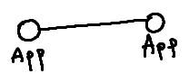
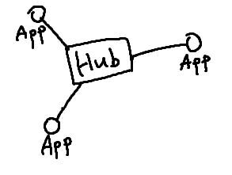
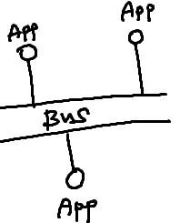
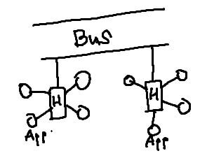

# 인터페이스

## 인터페이스 요구사항 검증
- 순서
- 1. 1. 요구사항 검토 계획 술힙 -> 검토 및 오류 수정 -> 베이스라인 설정

## 요구사항 검토(Requirements Review)
- 요구사항 명세서 오류 확인 및 표준 준수 여부 등의 결합 여부를 검토 담당자들이 수작업으로 분석하는 방법
- 동료 검토 (Peer Review) : 
- 워크 스루(Walk Through) : 검토 회의 전에 요구사항 명세서를 미리 배포하여 사전 검투 후에 회의 통해 결함 발견하는 형태
- 인스펙션(Inspection) : 작성자 제외한 다른 전문가들이 확인하는 것
- 프로토타이핑(Prototyping) : 요구사항을 정확히 파악하기 위해 실제 개발될 프로그램의 견본품 제작
- 테스트 설계 : 요구 사항의 테스트 케이스 작성 
- CASE 도구 활용 : 일관성 분석(Consistency Analysis) : 요구사항 변경 추적, 분석, 관리, 표준 준수 여부 확인

## 인터페이스 요구사항 검증의 주요항목
1. 완전성 : 사용자의 모든 요구사항히 완벽히 반응되어 있나?
2. 일관성 : 요구사항끼리 모순되거나 충돌이 없나?
3. 명확성 : 모든 참여자가 요구사항을 명확히 히해하고 있나?
4. 기능성 : 요구사항이 `how` 보다 `What(무엇을)`에  초점을 두고 있나?
5. 검증 가능성 : 요구사항이 사용자의 요구를 모두 만족하고, 개발된 소프트웨어가 사용자의 요구 내용과 일치하는지 테스트 할 수 있는가 ?
6. 추적 가능성 : 요구사항 명세서와 설계서를 추적할 수 있는가?
7. 변경 용이성 : 요구사항 명세서의 변경이 쉽도록 작성되어 있는가?

## 인터페이스 방법 명세화
내,외부 시스템이 연계하여 작동할 때 인터페이스별 송,수신 방법, 송 , 수신 데이터등의 처리방안을 문서로 정리하는 것

## 시스템 연계 기술
- Db Link
- api
- 연계 솔루션 (EAI 서버 사용)
- 소켓
- web service : wsdl , uddi, soap 프로토콜
> EAI ? Enterprise Architecture Integration 기업 애플리케이션 통합 - 각종 어플리케이션간 상호 연동이 가능하도록 통합하는 솔루션

## 인터페이스 통신 유형
1. 단방향 : 요청에 응답 x
2. 동기 : 요청하고 응답 올 때까지 대기
3. 비동기 : 요청하고 응답까지 대기하지 않고 응답이 오면 처리하는 방식 (Send-Receive, Send-Receive-Acknowledge,publish-subscribe)

## 인터페이스 처리 유형
1. 실시간 방식 : 사용자의 요청을 바로 처리하는 방식
2. 지연 처리 방식 데이터를 매건 단위로 처리할 경우 많이 발생 할 떄 사용하는 방식
3. 배치 방식  : 대량의 데이터를 ㅓㅊ리할 때 사용

# 미들웨어
운영체제와 응용프로그램 or 서버와 클라이언트 사이에서 실행되어 서비스를 제공하는 소프트웨어
- 표준화된 인터페이스를 제공하여 시스템간 데이터 교환 일관성을 보장
## 미들웨어 종류
1. DB(DataBase)
    - 데이터베이스 벤더에서 제공하는 클라에서 원격의 데이터베이스와 연결하는 미들웨어
    - 이를 사용하는 시스템은 보통 2-Tier 아키텍쳐라고 불흠

2. RPC(Remote Procedure call, 원격 프로시저 호출)
   - 응용 프로그램의 프로시저를 사용하여 원격 프로시저를 마치 로컬 프로시저처럼 호출하는 미들웨어
   - 일반적으로 프로세스는 `자신의 주소공간 안에 존재하는 함수만 호출하여 실행 가능` but RPC는 다른 주소공간의 프로세스 함수를 싱행할 수 있게 해줌
   - 네트워크를 통한 메시징을 수행하기 때문
3. MOM(Message Oriented Middleware, 메시지 지향 미들웨어)
    - 메시지 기반의 비동기형 메시지를 전달하는 미들 웨어ㅓ
    - 온라인 업무보단 이기종 분산 데이터 시스템의 데이터 동기를 위해 많이 사용
    - 메시지 전달방식 : Message Queue 기반, Publish - subscribe 패턴
4. TP-Monitor(Transaction Processing Monitor,트랜잭션 모니터)
    - 온라인 트랜잭션 업무에서 트랜잭션을 처리 및 감시하는 미들웨어
    - 서버 등에서 트랜잭션이 프로세스 내의 한 단계로부터 다음 단계로 잘 넘어가는지 감시하는 프로그램
    - 항공기나 철도 예약 업무 등 사용자 수가 증가해도 빠른 응답속도를 유지해야 하는 업무에 주로 사용
    - TP monitor의 목적은 트랜잭션 처리가 완전하다는 것을 보장, 에러가 발생하면 적절한 조치를 취하기 위한것
5. ORB(Object Request Broker,객체 요청 브로커)
    - 코바(CORBA) 표준 스펙을 구현한 객체 지향 미들웨어
    - 최근에는 TP-Monitor의 장점인 트랜잭션 처리와 모니터링 등을 추가로 구현한 제품도 있음
    - 객체를 식별하여 찾고 연결 관리를 처리, 데이터를 전달하고 통신을 요청하는 데 필요한 인프라를 제공함
> 코바? 어플 서버는 표준 프로토콜을 지원하여 상호 운용성을 보장하는데 이 프로토콜 중 일부는 CORBA에서 정의

## 모듈 연계
- EAI 
- ESB(Enterprise Service Bus)
  - SOA + EAI 
  - 표준 기반의 인터페이스 제공
  - 서비스 중심의 통합을 지향
  - 어플과의 결합도를 약하게 유지
- 웹 서비스

## EAI
기업 내 각종 어플, 플랫폼 연동 솔루션

- Point-to-Point  

  - 1대1 연결
  - 변경 및 재사용 어려움 

- Hub & Spoke  
  
    - 허브 시스템을 단일 접점으로 둔 중앙 집중적 방식
    - 확장 및 유지보수 용이
    - 허브 장애시 전체 시스템에 영향
- Message Bus(ESB)   
    
  - 어플 사이에 미들웨어를 두어 처리하는 방식
  - 확장성 뛰어남, 대용량 처리 가능

- Bus Hydrid  

- Hub& Spoke 와 Message Bus의 혼합 방식
- 그룹 별로는 Hub & Spoke 를 사용 그룹 간에는 Message Bus 방식 사용
- 데이터 병목 현상 최소화 가능

## 웹 서비스
- SOAP : HTTP, HTTPS, SMTP 등을 이용하여 XML 기반 메시지를 넷 상에서 교환하는 프로토콜
- UDDI : WSDL을 등록하여 서비스와 서비스 제공자 검색하고 접근하는데 사용
    자신들의 서비스를 인터넷상으로 등록하는 곳  
    이 등록처에 WSDL 등록
- WSDL : 해당 웹서비스에 관련된 설명과 접근방법,  프로토콜 등을 표준 방법으로 기술 (XML로 기술)

## 인터페이스 구현
- 데이터 통신을 이용한 인터페이스 구현
  - 어플 영억에서 데이터 포맷을 인터페이스상으로 전송하면 수신 측에서 Parsing 하여 사용 하는 방식
  - Json,XML 형식의 데이터 포맷을 주로 사용
- 인터페이스 엔티티를 이용한 인터페이스를 구현
  - 인터페이스가 필요한 시스템 사이에 별도의 인터페이스 엔티티를 두어 상호 연계하는 것
  - 인터페이스 테이블을 보통 엔티티로 활용

## JSON
- 속성 - 값 으로 데이터를 표현

## AJAX
클라이언트와 서버 간 XML 데이터를 주고 받는 비동기 기술

## 인터페이스 보안 기능 적용

- 네트워크 영역
  - 인터페이스 송,수신간 스니핑을 방지하기 위해 네트워크 트래픽에 대한 암오화를 설정
  - 아키텍쳐에 따라 IPSec, SSL, S-HTTP
- 애플리케이션 영역
  - 코드 상의 보안 취약점을 보완하는 방식으로 보안
- 데이터베이스, 스키마, 엔티티의 접근 권한가 프로시저, 트리거 등 데이터베이스 동작 객체의 보안 취약점에 보안 기능 적용

- IPSec (IP Security) - 네트워크 계층에서 IP 패킷 단위의 데이터 변조 방지 및 은닉 기능을 제공하는 프로토콜
- SSL(Secure Sockets Layer) : TCP/IP 꼐층과 애플리케이션 계층 사이에어 인증, 암호화, 무결성을 보장하는 프로토콜
- S-HTTP(Secure Hypertext Transfer Protocol) : 클라이이ㅓㄴ트와 서버 간에 전송되는 모든 메시지를 암호화

## 데이터 무결성 검사 도구
- 인터페이스 보안 취약점 분석에 사용되는 도구
- 시스템 파일 변경 유무를 확인하고, 변경 시 관리자에게 알려줌
- Tripwire , AIDE, Samhain, Claymore, Slipwire, Fcheck

## 인터페이스 구현 검증 도구
- 인터페이스 단위 기능, 시나리도 등을 기반으로 `통합 테스트`시에 필요
- 이를 위한 자동화 도구
    1. xUnit
       - 같은 테스트 코드를 여러번 작성하지 않게 도와주며, 테스트마다 예상 결과를 기억할 필요가 없는 자동화된 해법을 제공하는 단위 테스트 프레임워크
       - java 용 jUnit, c 용 CppUnit, .NET용 NUnit
    2. STAF
       - 서비스 호출 및 컴포넌트 재사용 등 다양한 환경을 지원
       - 크로스 플랫폼이나 분산 소프트웨어에서도 테스트환경 조성 지원
       - 분산 소프트웨서의 경우 각 분산 환경에 설치된 데몬(Daemon)이 프로그램 테스트에 대한 응답하며, 테스트가 완료되면 이를 통합하고 자동화하여 프로그램 완성
    3. FitNesse
        - 웹 기반 테스트 케이스 설계, 실행,결과 확인 등을 지원하는 테스트 프레임 웨크
    4. NTAF
        - FitNesse의 장점인 협업 기능 STAF의 장점인 재사용성 및 확장성을 통합한 NHN(naver)의 테스트 자동화 프레임 워크

    5. Selenium
       - 다양한 브라우저 및 개발 언어를 지원 
    6. watir
       - Ruby를 사용
## APM
- 어플의 성능 관리를 위해, 접속자, 자연 현황등 다양한 모니터링 기능 제공
- 두 가지 유형
  1. 리소스 방식
     - 서버측 성능 측정(어플 서버, db서버)
       - Nagios,Zbbix,cactidf 
  2. 엔드투엔드 방식 ( 최종사용자 성능 관리) : 최종 사용자가 체감하는 성능을 측정
     - visualVM, 제니퍼, 스카우터  

## 인터페이스 구현 감시 도구
- 인터페이스 동작 감시 상태 (APM)을 통해 모니터링 가능
- 데이터베이스와 웹 어플의 트랜잭셕, 변수 값, 호출 함수, 로그 및 시스템 부하 등 종합적인 정보를 조회, 분석 가능
    - 스카우터 : 어플 및 OS 자원 모니터링 기능 제공하는 오픈소스
    - 제니퍼 : 어플 개발부터 테스트, 오픈, 운영, 안정화까지 전 단계 성능 모니터링, 분석

