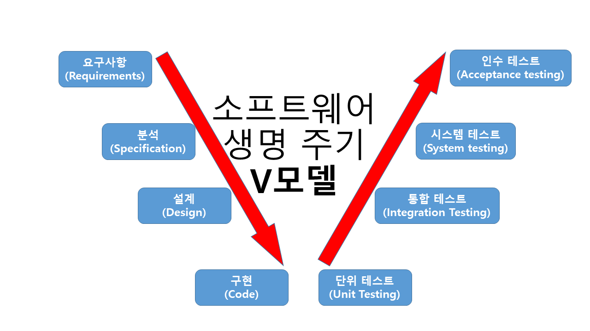

# 어플리케이션 테스트
어플에 잠재되어 있는 결함을 찾기 위한 것
-확인, 검증

## 애플리케이션 테스트의 기본 원리
- 파레토 법칙(Pareto Principle) : 애플리케이션의 20%에 해당하는 코드에서 전체 결함의 80%가 발견된다는 법칙
- 살충제 패러독스(Pesticide Paradox) : 동일한 테스트 케이스로 동일한 테스트를 반복하면 더 이상 결함이 발견되지 않는 현상
- 오류-부재의 궤변(Absence of Errors Fallacy) : 소프트웨어의 결함을 모두 제거해도 사용자 요구사항을 만족 시키지 못하면 해당 소프트웨어는 품질이 높다고 말할 수 없는 것.

## 프로그램 실행 여부에 따른 테스트
- 정적테스트
  - 프로그램을 실행하지 않고 명세서나 소스 코드를 대상으로 분석하는 테스트
  - 종류 : 워크스루, 인스펙션, 코드 검사
- 동적 테스트
  - 프로그램을 실행하여 오류 찾는 테스트
  - 종류 : 블랙박스 테스트 , 화이트 박스 테스트
## 테스트 기반에 따른 테스트
- 명세 기반 테스트
  - 사용자의 요구사항에 대한 명세를 빠짐없이 테스트 케이스로 만들어 구현하고 있는지 확인하는 테스트
  - 종류 : 동등 분할, 경계 값 분석
- 구조기반 테스트
  - 소프트웨어 내부 논리 흐름에 따라 테스트 케이스 작성하고 확인하는 테스트
  - 종류 : 구문 기반, 결정 기반, 조건 기반
- 경험기반
  - 유사 소프트웨어에 대한 테스터의 경험을 기반으로 수행
  - 사용자 요구사항 명세가 불충분하거나 테스트 시간이 부족할 때
  - 종류 : 에러 추정, 체크 리스트, 탐색적 테스팅
## 시각에 따른 테스트
- 검증 테스트
  - `개발자의 시각`에서 제품의 생산 과정을 테스트 하는것
  - 제품이 명세대로 완성됐는지
- 확인 테스트
  - `사용자의 시각`에서 제품 결과 테스트
  - 사용자의 요구사항을 반영 했는지, 제품이 정상적으로 동작하는지

## 목적에 따른 테스트
1. 회복 테스트
   - 시스템에 여러 가지 결함을 주어 `실패하도록 한 후 올바르게 복귀되는지` 확인
2. 안전 테스트 
   - 시스템에 설치된 `보호 도구가 보호할 수 있는지` 테스트 
3. 강도 테스트(stress test)
   - 시스템에 과도한 정보량, 빈도 등을 부과하여 `과부하시에도 소프트웨어가 정상적인지` 확인
4. 성능 테스트(Performance test)
   - 소프트웨어의 실시간 성능, 전체적인 효율성 진단
   - `처리량,응답시간` 등
5. 구조 테스트
   - 소프트웨어 내부의 논리적인 경로, `소스코드 복잡도` 테스트 
6. 회귀(Regression)테스트
   - 소프트웨어 변경 또는 수정된 코드에 새로운 결함이 없음을 확인
6. 병행(Parall) 테스트
   - 변경된 소프트웨어와 기존 소프트웨어에 동일한 데이터를 입력하여 결과 비교하는 테스트

# 동적 테스트
# 화이트박스 테스트 
  - 모듈의 원시코드 (Source Code) 를 오픈시킨 상태에서 원시 코드의 논리적인 모든 경로를 테스트하여 테스트 케이스를 설계
  - 모듈 안의 작동을 직접 관찰 가능
  - 원시 코드의 모든 문장을 한 번이상 실행
## 화이트박스 테스트 종류
- 기초 경로 검사(대표적)
  - 테스트 케이스 설계자가 절차적 설계의 논리적 복잡성을 측정할 수 있게 해주는 테스트 기법
  1. 설계나 원시 코드로 흐름도 작성
  2. 흐름도 논리 복잡도 측정

- 제어 구조 검사(Control Structure Testing)
  - 조건 검사(Condition Testing) : 모듈 내의 논리적 조건을 테스트하는 테스트 케이스 설계 기법
  - 루프 검사(Loop Testing) : 반복문에 초점을 맞춰서 테스트 케이스 설계
  - 데이터 흐름 검사(Data Flow Testing) : 변수의 정의, 변수 사용 위치에 초점

## 화이트박스 테스트의 검증 기준
1. 문장 검증 기준(Statement Coverage)
   - 소스코드의 모든 구문이 한 번 이상 수행
2. 분기 검증 기준(Branch Coverage)`결정 검증 기준(Decision Coverage)`
   - 조건문에서 true인 경우 false인 경우 한 번 이상 수행 
3. 조건 검증 기준(Condition Coverage)
   - 조건문에 있는 조건식에 포함된 결과가 True인 경우 False인 경우 한 번 이상 수행 
   > 이 경우 분기 검증 기준의 경우 그저 if문이 참인지 거짓인지만 구분하여 케이스를 구성하지만
    조건 검증 기준의 경우 x>y, i==j의 조건을 따로 구분하여 각각 테스트 케이스를 구성합니다.  
    (참참,참거짓,거짓참,거짓거짓의 4가지 경우가 나오겠죠)
4. 분기/조건 기준(Branch/Condition Coverage)
   - 분기 검증 기준과 조건 검증 기준을 모두 만족하는 케이스 설계 

# 블랙박스 테스트
- 소프트웨어가 수행할 특정 기능을 알기 위해 `각 기능이 완전히 작동되는 것을 입증하는 테스트`
- 기능 테스트라고도 함
- 사용자 요구사항 명세를 보며 테스트
- 주로 구현된 기능을 테스트
- 소프트웨어 인터페이스를 통해 실시

## 블랙박스 테스트의 종류
- 동치 분할 검사(Equivalence Partitioning Testing)
  - 여러 인풋 중 , 아웃풋으로 동일한 값이 나타나는 경우의 인풋은 하나의 그룹으로 볼 수 있다
  - 이것을 이용하여 입/출력값 영역을 상호 독립적인 집합으로 만들어 집합 내 대표를 하나 선택하여 테스트 케이스를 선정하는 방식
  - 가능한 모든 경우의 수에서 테스트 개수를 줄여줌
  - 입력 조건에 타당한 인풋과 아닌 인풋의 개수를 균등하게하여 테스트 케이스를 정하고, `해당 인풋에 맞는 결과가 출력되는지 확인`
  - 동등 분할 기법 또는 동치 클래스 분해
  - 
- 경계값 분석(Boundary Value Analysis)
  - 입력 조건의 경계값에서 테스트 케이스로 선정
- 원인-효과 그래프 검사(Cause-Effect Graphing Testing)
  - 인풋 간의 관계와 아웃풋에 미치는 상황을 체계적으로 분석한 다음 효용성이 높은 테스트 케이스를 선정하여 검사
- 오류 예측 검사
  - 과거의 경험이나 직감으로 검사
- 비교 검사
  - 여러 버전의 프로그램에 동일한 인풋 제공하여 동일한 아웃풋인지 테스트 검사

# 애플리케이션 테스트
## 개발 단계에 따른 애플리케이션 테스트
- 개발 단계에 따라 단위 테스트, 통합 테스트, 시스템 테스트, 인수 테스트로 분류 <- `테스트레벨`으로 불림

애플리케이션 테스트와 소프트웨어 개발 단계를 연결하여 표현한  v-모델

## 단위 테스트
- 코딩 직후 최소 단위인 `모듈`이나 `컴포넌트`에 초점을 맞춰 테스트
- 인터페이스, 외부적I/O, 자료 구조, 독립적 기초경로, 오류 처리경로, 경계 조건등 검사
- 사용자 요구사항을 기반으로 한 기능성 테스트를 최우선
- 구조 기반 테스트, 명세 기반 테스트로 나뉘지만 주로 구조 기반 테스트

## 통합 테스트(Integration Test)
- 단위 테스트가 완료 된 모듈들을 결합하여 하나의 시스템으로 만드는 과정에서의 테스트
- 모듈 간, 통합된 컴포넌트 간의 상호 작용 오류는 테스트
- 비점진적 통합 방식
  - 단계적 통합 절차  없이 모든 모듈이 미리 결합되어 있는 프로그램 전체 테스트
  - 종류 : 빅뱅 통합 테스트 방식
- 점진적 통합 방식
  - 모듈 단위를 단계적으로 통합하면서 테스트하는 방법
  - 종류: 하향식 통합 테스트, 상향식 통합 테스트, 혼합식 통합 테스트

### 하향식 통합 테스트
- 상위 모듈 -> 하위 모듈 방향으로 통합하며 테스트
- 주요 제어 모듈을 기준
1. 주요 제어 모듈은 작성된 프로그램으로 사용 , 그의 종속 모듈은 스텁(Stub)으로 대체
2. 깊이 우선 or 넓이 우선 등의 방식에 따라 스텁들이 한 번에 하나씩 실제 모듈로 교체 됨
3. 새로운 오류가 발생하지 않음을 보증하기 위해 회귀 테스트 진행

### 상향식 통합 테스트
- 하위 모듈 -> 상위
1. 하위 모듈을 클러스터(Cluster)로 결합
2. 상위 모듈에서 데이터 입/출력을 확인하기 위해 더미 모듈인 드라이버 작성
3. 통합된 클러스터 단위로 테스트
4. 테스트 완료되면 클러스트는 프로그램 구조의 상위로 이동하여 결합, 드라이버는 실제 모듈로 대체

### 혼합식 통합 테스트
- 하위수준에서는 상향식 통합, 상위 수준에서는 하향식 통합 ㅊ뢰적의 테스트 지원하는 방식
- 샌드위치식 통합테스트 방법이라고도 함

>회귀테스트> 통합 테스트로 인해 변경될 모듈이나 컴포넌에 새로운 오류있는지 확인 하는 것  
이미 테스트된 프로그램의 테스팅을 반복하는 것
## 시스템 테스트
- 개발된 소프트웨어가 해당 컴퓨터 시스템에서 완벽히 수행되는가 점검
- 기능적 요구사항, 비기능적 요구사항으로 나누어 테스트

## 인수 테스트(Acceptance Test)
- 사용자의 요구사항을 충족하는지에 중점을 둔 테스트
- 사용자가 직접 테스트
- 종류
  - 알파테스트
    - 개발자의 장소에서 사용자가 개발자 앞에서 행하는 테스트 기법
    - 테스트는 통제된 환경에서 이뤄짐. 오류와 사용상의 문제를 사용자와 개발자가 함께 확인하며 기록
  - 베타테스트
    - 선정된 최종 사용자가 여러 명의 사용자 앞에서 행하는 테스트
    - 실업무를 가지고 사용자가 직접 테스트

## 테스트 케이스
- 사용자의 요구사항을 정확하게 준수했는지를 확인하기 위해 설계된 입력 값, 실행 조건, 기대 결과 등으로 구성된 테스트 항목에 대한 명세서

## 테스트 시나리오
테스트 케이스를 적용하는 순서에 따라 여러 개의 테스트 케이스를 묶는 지합]
- 테스트 케이스를 적용하는 구체적인 절차 명세
- 테스트 순서에 대한 구체적 절차, 사전 조건, 입력 데이터등이 설정

## 테스트 오라클
- 테스트 결과가 올바른지 판단하기 위해 사전에 정의된 참값을 대입하여 비교하는 기법
- 예상 결과를 생성하는 프로세스
- 테스트 예상 결과를 결정하는 근거
- 특징 : 제한된 검증, 수학적 기법, 자동화 기능
- 종류
  - 참(True) 오라클 
    - 모든 테스트 케이스의 입력 값에 대해 기대하는 결과를 제공하는 오라클
    - 발생된 모든 오류 검출 가능
  - 추정(Heuristic) 오라클
    - 몇몇 입력에 대해 정확한 결과를 제공
    - 나머지는 추정으로 처리
  - 샘플링(Sampling) 오라클
    - 특정한 몇몇 테스트 케이스의 입력 값에 대해서만 결과 제공
    - 전수조사가 불가할 때
  - 일관성 검사(Consistent) 오라클
    - 현재 실행 결과를 이전 실행 결과에 비추어 검증(회귀 테스트)

## 테스트 자동화 도구
### 정적 분석 도구(Static Analysis Tools)
- 프로그램을 서ㅣㄹ행하지 않고 분석하는 도구
- 소스코드에 대한 코딩 표준, 코딩 스타일 드읃ㅇ을 발견 위해

### 테스트 실행 도구
- 스크립트 언어를 사용하여 테스트 실행
- 테스트 데이터와 테스트 수행 방법 등이 포함된 스크팁트 작성 후 실행

### 성능 테스트 도구
- 애플리케이션 처리량, 응답 시간, 경과 시간, 자용 사용률 등을 가상의 사용자를 만들어 테스트 수행함으로써 목표 달성 여부 확인

### 테스트 통제 도구
- 테스트 계획 및 관리, 수행, 결함 관리등을 수행하는 도구

### 테스트 하네스 도구
- 테스트가 실행될 환경을 시뮬레이션 하여 컴포넌트 및 모듈이 정상적으로 테스트되도록 하는 도구
- `테스트하네스` : 컴포넌트 및 모듈을 테스트하는 환경의 일부분, 테스트를 지원하기 위해 생성된 코드와 데이터(ex 드라이버,스텁)
- 테스트 하네스 구성요소
  - 테스트 드라이버
  - 테스트 스텁
  - 테스트 슈트(Suites)
    - 테스트 대상 컴포넌트나 모듈, 시스템에 사용되는 테스트 케이스의 집합
  - 테스트 케이스
  - 테스트 스크립트 
    - 자동화된 테스트 실행 절차에 대한 명세서
  - 목 오브젝트
    - 사전에 사용자의 행위를 조건부로 입력해 두면, 그 상황에 맞는 예정된 행위를 수행하는 객체

## 결함
소프트웨어가 설계한 것과 다르게 동작 or 다른 결과 발생
- 예상 결과와 실행 결과 간의 차이나 업무 내용과 불일치 등으로 변경 필요한 부분도 결함으로 포함

## 결함 상태 추적
결함은 지속져ㅓㄱ으로 상태 변화를 추적하고 관리 필요
- 결함 관리 측정 지표의 속성 값들을 분석하여 잠재적 결함 모듈, 컴포넌트 추정 가능
- 결함 관리 측정 지표
  - 결함 분포 : 모듈 or 컴포넌트의 특정 속성에 해당하는 결함 수 측정
  - 결함 추세 : 테스트 진행 시간에 따른 결함 수의 추이 분석
  - 결함 에이징 : 특정 결함 상태로 지속되는 시간 측정

## 결함 분류
- 시스템 결함 : 어플 환경이나 db 처리에서 발견된 결함
- 기능 결함 : 어플의 기획, 설계, 업무 시나리오 등의 단계에서 유입된 결함
- gui 결함: 사용자 화면 설계에서 발생된 결함
- 문서 결함 : 기획자 사용자 개발자 간의 의사소통 및 기록 원활하지 않아 발생된 결함

## 결함 심각도
- <High , Medium ,Low >or< Major , Normal, Minor, simple> 등으로 분류

## 결함 우선순위
- 결함 처리에 신속성 나타내는 척도
- (critical, high, medium low) or 즉시 해결, 주의 요망, 대기, 개선 권고 등으로 분류

# 어플리케이션 성능 지표
- 처리량(Throughput) : 일정 시간 내에 애플리케이션이 처리하는 일의 양
- 응답 시간(Response Time) : 어플이 요청을 전달한 시간 부터 응답 까지 걸린 시간
- 경과 시간(Turn Around Time) : 어플이 작업을 의로한 시간부터 처리가 완료 될떄까지 시간
- 자원 사용률(Resource Usage) : 의뢰한 작업 처리하는 동안 cpu,메모리 등의 자원 사용률

## 성능 테스트 도구
부하나 스트레스를 가하여 어플의 성능 측정 지표 점검 도구
- jMeter : HTTP, FTP 등 다양한 프로토콜 지원하는 부하 테스트 도구
- LoadUI : 서버 모니터링 , Drag&Drop 등 사용자 편리성이 강화된 부하 테스트 도구, HTTP, JDBC 등 다양한 프로토콜 지원
- OpenSTA : HTTP, HTTPS 프로토콜에 대한 부하 테스트 및 생산품 모니터링 도구

## 시스템 모니터링 도구
- 애플이 실행되었을 때 자운 사용량 확인, 분석
- Scouter : 단일 뷰 통합/ 실시간 모니터링
- Zabbix : 웹기반 서버, 서비스, 애플리케이션

## 복잡도/시간 복잡도
## 복잡도
  - 시스템이나 시스템 구성 요소 또는 소프트웨어의 복잡한 정도 의미
  - 어느 정도의 수준까지 테스트해야 하는지 또는 개발하는 데 어느 정도의 자원이 소요되는지 예측하는데 사용
  - **시간 복잡도**
    - 알고리즘을 위해 프로세스가 수행하는 연산 횟수를 수치화 한것
    - 낮을 수록 실행시간이 짧음
    - 빅오 표기 법 : 실행시간 최악일 때를 표기하는 방법

## 빅오 표기법
- 0(1)
  - 입력값에 관계 없이 일정하게 문제 해결에 하나의 단계만 거침
  - 스택의 삽입(Push), 삭제(Pop)
- 0(log n)
  - 문제 해결에 필요한 단계가 입력값 또는 조건에 의해 감소
  - 이진트리, 이진 검색
- 0(n)
  - 문제 해결에 필요한 단계가 입력값과 1:1 관계를 가짐
  - for문
  - 모든 입력값을 적어도 한 번 이상은 살펴봐야함
- 0(nlog n)
  - 문제 해결에 필요한 단계가 n(log n)번 만큼 수행됨
  - 예) 힙 정렬, 2-way 합병정렬
- 0(n^2)
  - 문제 해결에 필요한 단계가 입력값의 제곱만큼 수행됨
  - 예) 삽입 정렬, 쉘 정렬, 선택 정렬, 버블 정렬, 퀵 정렬
  - 중첩 for 문
- 0(2^n)
  - 문제 해결에 필요한 단계가 2의 입력값 제곱만큼 수행 됨

## 순환 복잡도
- 한 프로그램의 논리적인 복잡도 측정
- 맥케이브 복잡도라고도 함
- 제어 흐름도 G에서 순환 복잡도 V(G)는 다음과 같은 방법으로 계산 가능
- 영역의 수를 계산
- 화살표의 수 - 노드의 수 + 2

## 소스 코드 최적화
나쁜 코드(Bad Code)를 배제, 클린 코드(Clean Code)로 작성
- 클린 코드(Clean Code) : 누구나 쉽게 이해하고 수정 추가 할 수 있는 단순 명료한 코드
- 나쁜 코드 (Bad Code) : 프로그램의 로직이 복잡하고 이해하기 어려운 코드
    - 스파케티 코드 : 코드의 로직이 서로 복잡하게 얽혀 있는 코드
    - 외계인 코드 : 아주 오래되거나 참고문서 또는 개발자가 없어 유지보수 작업이 어려운 코드

## 클린 코드 작성 원칙
1. 가독성
2. 단순성 -> 코드를 간단하게, 한 번에 한 가지를 처리, 클래스/메소드/함수 등을 최소 단위로 분리
3. 중복성 최소화
4. 추상화

## 소스 코드 품질 분석 도구
코딩 스타일, 코딩 표준, 코드의 복잡도, 메모리 누구 현상, 스레드 결함
- 정적 분석(Static Analysis) 도구
  - 실행하지 않고 분석
  - Pmd, cppcheck, SonarQube, checkstyle,ccm,cobertura
- 동적 분석(Dynamic Analysis) 도구
  - 코드 실행하여 메모리 누구, 스레드 결함 분석
  - Avalanche, Valgrind

