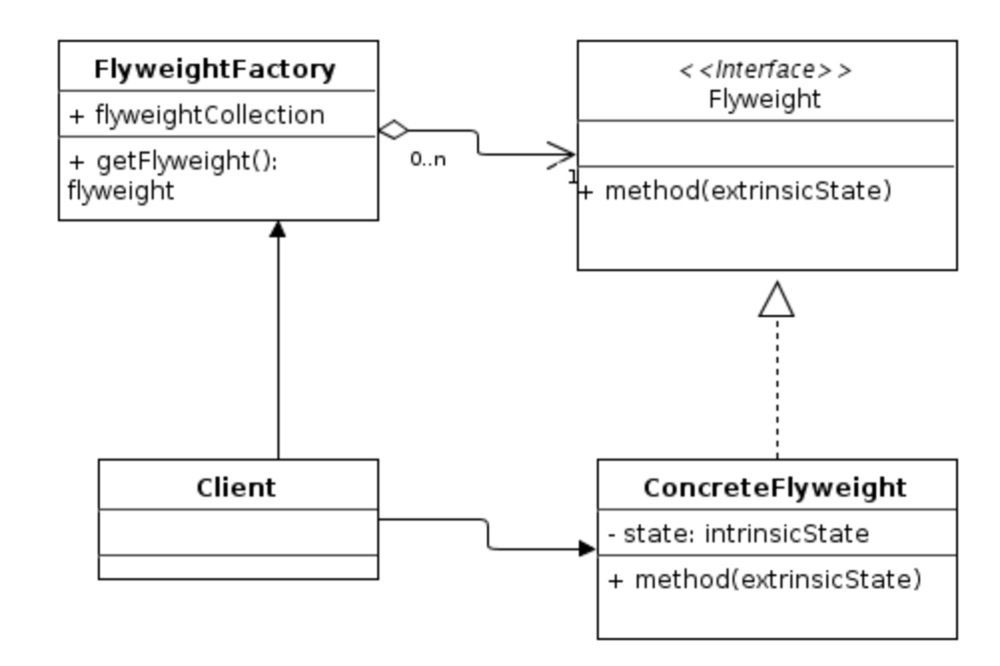

# 생성 패턴 (Creational Pattern)
클래스나 객체의 생성과 참조과정에 대한 패턴
## 추상 팩토리(Abstract Factory)
- 구체적인 클래스에 의존하지 않고 서로 연관되거나 의존적인 객체들의 조합을 만드는 인터페스를 제공하는 패턴
```java
public class WhiteCarFactory extends DefaultCarFactory{
    @Override
    public Car createCar(){
        // 흰색 차를 만드는 메소드이다.
        Car car = new Car();
        car.setHandle(new WhiteHandle()); 
        car.setWheel(new WhiteWheel());// 만약 차 규격이 바뀌어 WhiteHandle,WhiteWheel 이 아니라 다른 제품으로 바뀐다면?
        return car
    }
}
``` 

```java
//추상 팩토리 패턴 적용하여 규격 변경 문제를 해결 할 수있다.
    public interface CarPartsFactory
    Handle createHandle();
    Wheel createWheel();
    //클라이언트 코드 부분의 수정은 휠과 핸들을 바꾸는 부분에서 생긴다. 따라서 각 파트를 만들어 반환하는 인터페이스를 정의한다.
```

```java
public class WhiteCarPartsFactory implements CarPartsFactory{
    @Override
    public Handle createHandle(){
        return new WhiteHandle();
    }
    @Override
    public Wheel createWheel(){
        return new WhiteWheel();
    }
}
// carPartsFactory를 implements 하여 구체화 한다.
```

```java
//클라이언트 코드
public class WhiteCarFactory extends DefaultCarFactory{
    private final CarPartsFactory carPartsFactory;

    public whiteCarFactory(CarPartsFactory carPartsFactory){
        this.carPartsFactory = carPartsFactory;
    }//생성자로 carPartsFactory 클래스를 구체화한다.
    
    @Override
    public Car createCar(){
        // 흰색 차를 만드는 메소드이다.
        Car car = new Car();
        car.setHandle(carPartsFactory.createHandle()); 
        car.setWheel(carPartsFactory.createWheel());//다른 규격으로 바뀌어도 클라이언트의 코드들(현재 이 코드)이 변경될 필요는 없다.
        return car
    }
}

//만약 WhiteProHandle, WhiteProWheel을 사용하는 걸로 바뀐다면?
//그냥 CarPartsFactory를 구현하는 WhiteCarProPartsFactory를 만들어주면 된다.
//클라이언트 코드에는 생성자를 통해 WhiteCarProPartsFactory의 인스턴스만 넣어주면 된다.
```


## 빌더(Builder)
- 작게 분리된 인스턴스를 건축 하듯이 조합하여 객체를 생성하는 패턴
- 객체의 생성 과정과 표현 방법을 분리하여 동일한 생성 절차에서 서로 다른 표현 결과를 만들 수 있다.
 ```java
public class Computer { //setter없이 getter만 존재한다. setting은 빌더 클래스가 진행한다.ㅓㅓ
	
    //required parameters
    private String HDD;
    private String RAM;
	
    //optional parameters
    private boolean isGraphicsCardEnabled;
    private boolean isBluetoothEnabled;
	
 
    public String getHDD() {
        return HDD;
    }
 
    public String getRAM() {
        return RAM;
    }
 
    public boolean isGraphicsCardEnabled() {
        return isGraphicsCardEnabled;
    }
 
    public boolean isBluetoothEnabled() {
        return isBluetoothEnabled;
    }
	
    private Computer(ComputerBuilder builder) { //생성자가 private 하기 때문에 객체를 얻으려면 ComputerBuilder클래스를 통해서만 가능하다.
        this.HDD=builder.HDD;
        this.RAM=builder.RAM;
        this.isGraphicsCardEnabled=builder.isGraphicsCardEnabled;
        this.isBluetoothEnabled=builder.isBluetoothEnabled;
    }
	
    //Builder Class
    public static class ComputerBuilder{ //Computer의 내부 클래스로서 빌더 클래스이다.
 
        // required parameters
        private String HDD;
        private String RAM;
 
        // optional parameters
        private boolean isGraphicsCardEnabled;
        private boolean isBluetoothEnabled;
		
        public ComputerBuilder(String hdd, String ram){
            this.HDD=hdd;
            this.RAM=ram;
        }
 
        public ComputerBuilder setGraphicsCardEnabled(boolean isGraphicsCardEnabled) {
            this.isGraphicsCardEnabled = isGraphicsCardEnabled;
            return this;
        }
 
        public ComputerBuilder setBluetoothEnabled(boolean isBluetoothEnabled) {
            this.isBluetoothEnabled = isBluetoothEnabled;
            return this;
        }
		
        public Computer build(){
            return new Computer(this);
        }
 
    }
 
}
 ```

 ```java
 public class TestBuilderPattern {
 
    public static void main(String[] args) {
        Computer comp = new Computer.ComputerBuilder("500 GB", "2 GB")
                .setBluetoothEnabled(true)
                .setGraphicsCardEnabled(true)
                .build();
    }
 
}
 ```
## 팩토리 메소드(Factory Method)
- 객체 생성하는 인터페이스는 미리 정의, but 객체 생성은 서브 클래스로 위임
- 추상 팩토리 패턴과 `구체적인 객체 생성 과정을 추상화한 인터페이스를 제공한다`는 점에서 공통점이지만
- `팩토리 메서드 패턴`은 `팩토리를 구현하는 방법`에 초점
- `추상 팩토리 패턴`은 `팩토리를 사용하는 방법`에 초점
- `추상 팩토리 패턴`은 특정 특정 그룹에 속하는 여러 객체들을 하나의 팩토리로 묶어서 생성할수 있음
## 프로토 타입(Prototype)
- 원본 객체를 복사하는 방법
- 객체를 생성하는데 비용이 많이 드는 경우에 사용
## 싱글톤(Singleton)
- 하나의 객체를 생성하면 그 객체를 어디서든 참조할 수 있다. 여러 프로세스가 동시에 참조할 수는 없다
- 클래스 내에 인스턴스가 하나임을 보장하여 불필요한 메모리낭비를 방지한다.
```java
public class Singleton{
    private static Singleton instance = New singleton();

    private Singleton(){
        // 생성자는 외부에서 호출 못하게 private로 지정
    }
    public static Singleton getInstance(){
        return instance; // 이미 생성되어 있는 인스턴스를 반환 한다.
    }
    public void say(){
        System.out.println("hi,there");
    }
}
``` 


# 구조 패턴
구조가 복잡한 시스템을 개발하기 쉽도록 클래스나 객체들을 조합하여 더 큰 구조로 만드는 패턴
 ## 어댑터(Adapter)
 호환성이 없는 클래스들의 인터페스를 다른 클래스가 이용할 수 있도록 변환
 - 기존의 클래스를 이용하고 싶지만 인터페이스가 일치하지 않을 때  
 `duck 인터페이스와 duck을 구현하는 MallardDuck 클래스`
 ```java
 //
 public interface Duck {
    public void quack();
    public void fly();
}
```
```java
public class MallardDuck implements Duck {
    @Override
    public void quack() {
        System.out.println("Quack");
    }

    @Override
    public void fly() {
        System.out.println("I'm flying");
    }
}
 ``` 
 `turkey 인터페이스와 Turkey 인터페이스를 구현하는 WildTurkey 클래스`
 ```java
 public interface Turkey {
    public void gobble();
    public void fly();
}
 ```
 ```java
 public class WildTurkey implements Turkey{
    @Override
    public void gobble() {
        System.out.println("Gobble gobble");
    }

    @Override
    public void fly() {
        System.out.println("I'm flying a short distance");
    }
}
 ```

 `Duck으로 Turkey 객체를 생성하고 싶을 때? 어댑터 구조 사용`

 ```java
 public class TurkeyAdapter implements Duck {

    Turkey turkey;

    public TurkeyAdapter(Turkey turkey) { //생성자로 turkey 구현 클래스를 받음
        this.turkey = turkey;
    }

    @Override
    public void quack(){
        turkey.gobble();
    }

    @Override
    public void fly() {
        turkey.fly();
    }
}
 ```
실사용 클래스
 ```java
 public class TurkeyAdapterTest {

    public static void main(String[] args) {

        MallardDuck duck = new MallardDuck();

        WildTurkey turkey = new WildTurkey();

        Duck turkeyAdapter = new TurkeyAdapter(turkey); //Duck 타입으로 turkey 인스턴스를 생성

        System.out.println("The turkey says...");
        turkey.gobble();
        turkey.fly();

        System.out.println("The Duck says...");
        testDuck(duck);

        System.out.println("The TurkeyAdapter says...");
        testDuck(turkeyAdapter);
    }

    public static void testDuck(Duck duck){ //Duck 클래스의 기능을 사용가능
        duck.quack();
        duck.fly();
    }
}
 ```


## 브리지(Bridge)
- 구현부에서 추상층을 분리하여, 서로가 독립적으로 확장 할 수 있도록 즉, 추상적 개념과 구체적 구현을 서로 다른 두개의 인터페이스로 구현
- `기능과 구현을 두 개의 별도 클래스`로 구현
```java
// 통물이 가져야할 기본적인 사냥방식에 대한 인터페이스
public interface Hunting_Handler {
    public void Find_Quarry();
    public void Detected_Quarry();
    public void attack();
}
```

`사냥 방식의 구현체(기능)`

```java
public class Hunting_Method1 implements Hunting_Handler {
    public void Find_Quarry()
    {
        System.out.println("물 위에서 찾는다");
    }
    public void Detected_Quarry()
    {
        System.out.println("물고기 발견!");
    }
    public void attack()
    {
        System.out.println("낚아챈다.");
    }
}
```

```java
public class Hunting_Method2 implements Hunting_Handler {
    public void Find_Quarry()
    {
        System.out.println("지상에서 찾는다");
    }
    public void Detected_Quarry()
    {
        System.out.println("노루 발견");
    }
    public void attack()
    {
        System.out.println("물어뜯는다.");
    }
}
```

```java
public class Animal {
    //Hunting_handler의 인스턴스를 이용하여 Hunting_Handler 메서드 호출
    private Hunting_Handler hunting;
    
    public Animal(Hunting_Handler hunting)
    {
        this.hunting=hunting;
    }
    public void Find_Quarry()
    {
        hunting.Find_Quarry();
    }
    public void Detected_Quarry()
    {
        hunting.Detected_Quarry();
    }
    public void attack()
    {
        hunting.attack();
    }
    public void hunt()
    {
        Find_Quarry();
        Detected_Quarry();
        attack();
    }
}
```
`애니멀을 확장한 클래스들`
```java
public class Tiger extends Animal
{
    public Tiger(Hunting_Handler hunting)
    {
        super(hunting);
    }
    public void hunt()
    {
        System.out.println("호랑이의 사냥방식");
        Find_Quarry();
        Detected_Quarry();
        attack();
    }
}
```

```java
public class Bird extends Animal 
{
    public Bird(Hunting_Handler hunting)
    {
        super(hunting);
    }
    public void hunt()
    {
        System.out.println("새의 사냥방식");
        Find_Quarry();
        Detected_Quarry();
        attack();
    }
}
```

```java
public class Main {
    
    public static void main(String argsp[])
    {    
        Animal tiger = new Tiger(new Hunting_Method2());
        Animal bird = new Bird(new Hunting_Method1());
        
        tiger.hunt();
        System.out.println("--------------");
        bird.hunt();
    }
}
```


## 컴포지트(composite)
- 여러 객체를 가진 복합 객체와 단일 객체를 구분 없이 다루고자 할 때 사용
- 객체들을 트리 구조로 구성하여 디렉터리 안에 디렉터리가 있듯이 복합 객체 안에 복합 객체가 포함되는 구조
`폴더 안에 파일을 저장하는 기능 클래스 예제` 
```java
public abstract class Entry { // File과 Directory의 상위 클래스
    String name;
    public Entry(String name)
    {
        this.name = name;
    }
    
    public abstract void add(Entry entry); // 하위 자식객체 추가하는 메서드
    public abstract void PrintList(String path); // 디렉토리 정보를 보여주는 메서드
}
``` 

```java
public class File extends Entry {
    public File(String name)
    {
        super(name);
    }
    public void add(Entry entry){
        //파일은 안에 다른 객체를 포함 할 수 없기에 비워 둠
    }
    public void PrintList(String path)        
    {
        System.out.println(path +"/" +this.name);
 
    }
}
```

`그릇 객체`
```java
public class Directory extends Entry {
    
    ArrayList<Entry> directory = new ArrayList();    //자식 객체를 담기 위한 ArrayList
    
    public Directory(String name)
    {
        super(name);
    }
    public void add(Entry entry)                    //자식 객체 추가
    {
        directory.add(entry);
    }
    public void PrintList(String path)        //디렉토리 목록을 보여줍니다.
    {
        path += "/" +this.name;
        System.out.println(path);
        for(int i=0; i<directory.size();i++)
        {
            directory.get(i).PrintList(path );
        }
    }
}
```

`실제사용`
```java
public class Main {
 
    public static void main(String argsp[])
    {    
        Directory root = new Directory("root");
        Directory bin = new Directory("bin");
        Directory Lkt = new Directory("Lkt");
        File file1 = new File("file1");
        File file2 = new File("file2");
        File file3 = new File("file3");
        File file4 = new File("file3");
        
        root.add(file1);    //루트 디렉토리에 file1 포함
        bin.add(file2);        //bin 디렉토리에 file2 포함
        bin.add(file3);        //bin 디렉토리에 file3 포함
        Lkt.add(file4);        //Lkt 디렉토리에 file4 포함
        root.add(Lkt);        //root 디렉토리에 Lkt 디렉토리 포함
        root.add(bin);        //root 디렉토리에 bin 디렉토리 포함
        
        root.PrintList("");
    }
}
```


## 데코레이터(Decorator)
- 객체 간의 결합을 통해 능동적으로 기능들을 확장할 수 있는 패턴
- 임의의 객체에 부가적인 기능을 추가하기 위해 다른 책체들을 덧붙이는 방식으로 구현
```java
public abstract class Hamburger {
    //장식 할 대상과 장식자가 공통으로 가져야 할 인터페이스를 정의합니다.
    public abstract String get_Current_Ingredient();
}
```
`장식 대상인 빵 클래스`
```java
public class Bread extends Hamburger{
    public String Current_Ingredient = "기본 빵";
    public String get_Current_Ingredient()
    {
        return Current_Ingredient;
    }
}
```
`장식자 클래스`
```java
public abstract class Ingredient extends Hamburger { // 장식자가 가져야 할 인터페이스 정의, 장식자 또한 장식을 당할 수 있기에 Hamburger 클래스를 참조(extend)
    
    public Hamburger hamburger; //장식 대상 Bread의 상위 클래스를 참조
    public Ingredient(Hamburger hamburger)
    {
        this.hamburger = hamburger; //생성자 인자로 들어온 Hamburger를 참조
    }
}
```
`장식자 구현 클래스`
```java
public class Bulgogi_Patty extends Ingredient{
    
    public Bulgogi_Patty(Hamburger hamburger)
    {
        super(hamburger);
    }
    public String get_Current_Ingredient()
    {
        return hamburger.get_Current_Ingredient() + "+" +"불고기 패티";
    }
}
 
public class Shrimps_Patty extends Ingredient{
    
    public Shrimps_Patty(Hamburger hamburger)
    {
        super(hamburger);
    }
    
    public String get_Current_Ingredient()
    {
        return hamburger.get_Current_Ingredient() + "+" + "새우 패티";
    }
}
```
`실제로 구현하는 클래스, 기본 빵을 시작으로 동적으로 장식을 추가 할 수 있다.`
```java
public class Main {
 
    public static void main(String argsp[])
    {    
        Hamburger hamburger = new Bread();
        System.out.println(hamburger.get_Current_Ingredient());    //아무런 장식이 더해지지 않은 빵만 있는 형태
        
        Hamburger hamburger2 = new Bulgogi_Patty(hamburger);
        System.out.println(hamburger2.get_Current_Ingredient()); //기본빵에 불고기패티를 추가하는 형태
        
        Hamburger hamburger3 = new Bulgogi_Patty(hamburger2);
        System.out.println(hamburger3.get_Current_Ingredient()); //기본빵+불고기패티에 불고기 패티를 추가
        
        Hamburger hamburger4 = new Shrimps_Patty(hamburger3);
        System.out.println(hamburger4.get_Current_Ingredient()); //기본빵+불고기패티+불고기패티에 새우패티 추가
        
    }
}
```


## 퍼싸드(Facade)
- 본래는 건물의 `건물의 정면`을 의미하는 단어, 어떤 소프트웨어의 다른 커더란 코드 부분에 대하여 간략화된 인터페이스를 제공해주는 디자인 패턴
- 만약 어떤 사람이 영화를 보고자 하면? 음료준비 , tv 키기 , 영화 검색 , 영화 결제, 영화 재생 의 복잡한 과정을 거쳐야한다
- 이를 코드로 구현하면 음료 객체, 리모컨 객체, 영화 객체를 따로 만들어야 한다.
```java
public void view()
{
     Beverage beverage = new Beverage("콜라");
     Remote_Control remote= new Remote_Control();
     Movie movie = new Movie("어벤져스");
       
     beverage.Prepare();  //음료 준비
     remote.Turn_On();   //tv를 켜다
     movie.Search_Movie();  //영화를 찾다
     movie.Charge_Movie();  // 영화를 결제하다
     movie.play_Movie();   //영화를 재생하다
}

```

`이 복잡한 과정을 하나로 만들어주는 인터페이스를 만드는게 facade 패턴`  
`복잡한 클래스들 movie, beverage, remoteController`
```java
// 음료 클래스
public class Beverage {
    
    private String name="";
    
    public Beverage(String name)
    {
        this.name = name;
    }
    
    public void Prepare()
    {
        System.out.println(name+" 음료 준비 완료 ");
    }
 
}
// 영화 클래스
public class Movie {
    
    private String name="";
    
    public Movie(String name)
    {
        this.name = name;
    }
    
    public void Search_Movie()
    {
        System.out.println(name+" 영화를 찾다");
    }
    
    public void Charge_Movie()
    {
        System.out.println("영화를 결제하다");
    }
    public void play_Movie()
    {
        System.out.println("영화 재생");
    } 
}
// 리모컨 클래스

public class Remote_Control {
    
    public void Turn_On()
    {
        System.out.println("TV를 켜다");
    }
    public void Turn_Off()
    {
        System.out.println("TV를 끄다");
    } 
}


```
`복잡한 서브 클래스에 대한 인스턴스를 가지며 복잡한 호출 방식을 Facade 클래스 내에서 구현`
```java
public class Facade {
    
    private String beverage_Name ="";
    private String Movie_Name="";
    
    public Facade(String beverage,String Movie_Name)
    {
        this.beverage_Name=beverage_Name;
        this.Movie_Name=Movie_Name;
    }
    
    public void view_Movie()
    {
        Beverage beverage = new Beverage(beverage_Name);
        Remote_Control remote= new Remote_Control();
        Movie movie = new Movie(Movie_Name);
        
        beverage.Prepare();
        remote.Turn_On();
        movie.Search_Movie();
        movie.Charge_Movie();
        movie.play_Movie();
    }
}

```

`사용자 입장에서 사용`

```java
public class Facade {
    
    public void view()
    {
        Facade facade = new Facade("콜라","어벤져스");
        facade.view_Movie();
    }

```

사용자는 더이상 서브 클래스에 대해 알 필요가 없다. 단지 view_Movie() 메서드를 호출하면 Facade가 복잡한 기능들을 내부에서 처리해준다.


## 플라이웨이트(Flyweight)
- 인스턴스를 가능한한 공유하여 불필요한 메소리 낭비 줄이는 방식

- Flyweight : 공유에 사용되는 클래스의 인터페이스
- ConcreteFlyweight : Flyweight를 구현하며 실제 공유될 객체
- FlyweightFactory : Flyweight의 인스턴스를 생성 또는 공유해주는 역할
```java
public interface Shape { // 공유할 클래스의 인터페이스
    void draw();
}
```

```java 
public class Circle implements Shape { // 공유할 클래스를 구현, 실제 공유될 객체
    private String color;
    private int x;
    private int y;
    private int radius;

    public Circle(String color){ //생성자로 색을 지정
        this.color = color;
    }

    public void setX(int x) {
        this.x = x;
    }

    public void setY(int y) {
        this.y = y;
    }

    public void setRadius(int radius) {
        this.radius = radius;
    }

    @Override
    public void draw() {
        System.out.println("Circle: Draw() [Color : " + color + ", x : " + x + ", y :" + y + ", radius :" + radius);
    }
}
```


```java
public class ShapeFactory { //인스턴스를 공유, 생성 해주는 Factory 클래스
    private static final HashMap<String, Shape> circleMap = new HashMap(); // 키 : 색 밸류 : 도형 객체

    public static Shape getCircle(String color) {
        Circle circle = (Circle) circleMap.get(color); //그 색을가진 객체가 있는지 있으면 그 객체를 뽑아옴

        if (circle == null) { // 만약 없으면 새로 생성
            circle = new Circle(color);
            circleMap.put(color, circle);// 생성한 것을 맵에 저장
            System.out.println("Creating circle of color : " + color);
        }
        return circle;
    }
}
```

`메인 클래스`
```java
public class CircleMain {
    private static final String colors[] = {"Red", "Green", "Blue", "White", "Black"};

    public static void main(String[] args) {

        for (int i = 0; i < 20; ++i) {
            Circle circle = (Circle) ShapeFactory.getCircle(getRandomColor()); // 같은 색의 도형이 있으면 재사용
            circle.setX(getRandomX());
            circle.setY(getRandomY());
            circle.setRadius(100);
            circle.draw();
        }
    }

    private static String getRandomColor() {
        return colors[(int) (Math.random() * colors.length)];
    }

    private static int getRandomX() {
        return (int) (Math.random() * 100);
    }

    private static int getRandomY() {
        return (int) (Math.random() * 100);
    }
}
```


## 프록시 패턴
- 접근이 어려운 객체와 여기에 연결하려는 객체 사이에서 인터페이스 역할을 수행하는 패턴(ex,운격 시스템에 있는 객체는 접근이 어렵다.)
- 네트워크 연결, 메모리의 대용량 객체로의 접근등에 주로 사용
- 실제 기능을 수행하는 대신 가상 객체를 사용해 로직의 흐름을 재현
- 어떤 클래스의 객체 생성이 오래걸릴 때 그 일을 분업하여 프록시 클래스에서 처리 할 수 있는 부분은 처리하고 프록시 클래스가 처리를 못하는 작업에 대해서만 실제 클래스의 인스턴스를 만들어 위임
 
1. Subject  
Proxy 와 RealSubject가 구현해야하는 인터페이스.  
두 객체를 동일하게 다루기 위해 존재한다.

2. Proxy  
RealSubect 와 Client 요청 사이에 존재하는 객체.  
Subject를 구현함으로써 클라이언트는 RealSubject 사용하는 것과 별 차이가 없어야 한다.

3. RealSubject  
실질적으로 요청에 대해 주된 기능을 수행하는 객체.  
Proxy 객체는 내부적으로 이 객체를 로직에 맞게 사용한다. (위임)


```java
public interface Subject {
    void showName();

    void setName(String name);

    void complicatedWork();
}
```

```java
public class SubjectProxy implements Subject { //프록시 클래스, RealSubject 클래스의 기능 중에서 일부 기능을 위임 받아 처리한다.

    public RealSubject subject;
    public String name;

    public void setName(String name) {
        System.out.println("proxy가 대신해서 처리 할 수 있어요.");
        if (subject != null) {
            subject.setName(name);
        }
        this.name = name;
    }

    public void showName() {
        System.out.println("proxy가 대신해서 처리 할 수 있어요.");
        System.out.println("my name is " + name);
    }

    public void complicatedWork() { //Realsubject 클래스가 해야하는 복잡한 일은 그 객체를 생성해서 처리
        subject = new RealSubject();
        subject.complicatedWork();
    }
}
```

```java
public class RealSubject implements Subject { // 실제 분업의 대상이 되는 클래스

    private String name;

    public void setName(String name) {
        this.name = name;
    }

    public void showName() {
        System.out.println("my name is " + name);
    }

    public void complicatedWork() {
        System.out.println("proxy가 처리 못하는 작업을 수행합니다.");
    }
}
```

`메인 클래스`
```java
public class SubjectMain {
    public static void main(String args[]) {
        SubjectProxy proxy1 = new SubjectProxy();

        proxy1.setName("김하영");
        System.out.println("================");

        proxy1.showName();
        System.out.println("================");

        proxy1.complicatedWork();
    }
}
```


# 행위 패턴
## 책임 연쇄
- 요청을 처리할 수 있는 객체가 여러개 존재 할 때, 한 객체가 처리하지 못하면 다음 객체로 넘어가는 패턴
- 처리할 때까지 그 책임 을 넘김

## 커맨드
- 요청 이나 메소드을 객체의 형태로 캡슐화 하여 재이용하거나 취소할 수 있도록 정보를 저장하거나 로그에 남기는 패턴
- 요청에 사용되는 명령어들을 추상클래스와 구체클래스로 분리하여 단순화 한다
ex ) Command 클래스 HeaterOnCommand , LampOnCommand 는 구현 클래스 
OKGoogle 클래스 에서는 생성자로 Command의 구현 클래스를 받고 이를 이용하여 기능을 실행

## 인터프리터
- 언어에 문법 표현을 정의하는 패턴
- SQL이나 통신 프로토콜과 같은 것을 개발할 때 사용


## 반복자(iterator)
- 자료 구조와 같이 접근이 잦은 객체에 대해 동일한 인터페이스를사용하도록 하는 패턴
- 내부 표현 방법 노출없이 순차적 저근 가능

## 중재자(Mediator)
- 수많은 객체들 간의 복잡한 상호작용을 캡슐화하여 객체로 정의하는 패턴
- 객체간 의존도 감소 효과
- M:N 관계를 M:1 관계로 만들수 있다.


## 메멘토(Memento)
- 객체의 상태 정보를 가지는 클래스를 따로 생성하여 객체의 상태를 저장하거나 이전 상태로 복원할 수 있게 하는 패턴
- 원하는 시점의 상태 복원이 가능하다.


## 옵서버(Observer)
- 한 객체의 상태 변화에 따라 다른 객체의 상태도 연동되도록 일대다 객체 의존 관계를 구성하는 패턴
- 데이터의 변경이 발생했을 경우 상대 클래스나 객체에 의존하지 않으면서 데이터 변경을 통보하고자 할 때 유용
- 분산된 시스템 간에 이벤트 생성,발행(publish), 이를 수신(subscribe)할 때
- 옵서버 클래스는 구독한 클래스를 가지고 있다가 신호를 받으면 알려줌

## 상태(State)
- 객체의 상태에 따라 동일한 동작을 다르게 처리해야 할 때 사용하는 패턴
- 객체의 내부 상태에 따라 스스로 행동을 변경할 수 있게 허가하는 패턴
- 자신이 직접 상태를 체크하여 상태에 따라 행위를 호출하지 않고, 상태를 객체화 하여 상태가 행동 할 수 있도록 위임하는 패턴

## 템플릿 메소드(Template Method)
- 상위 클래스에서 골격을 정의하고, 하위 클래스에서 세부 처리를 구체화하는 구조
- 유사한 서브클래스를 묶어 공통된 내용을 상위 클래스에서 정의함으로써 코드의 양을 줄이고 유지보수를 용이하게 해줌
- 여러 작업들이 완전히 동일한 단계를 갖지만, 일부 동작은 각각 다르게 구현해야할 때 사용되는 패턴
  1. 실행 과정을 구현한 상위 클래스 (추상 클래스) - `흐름 제어의 주체가 됨`
  2. 실행 과정의 일부 단계를 구현한 하위 클래스

## 방문자(Visitor)
- 각 클래스들의 데이터 구조에서 처리 기능을 분리하여 별도의 클래스로 구현
